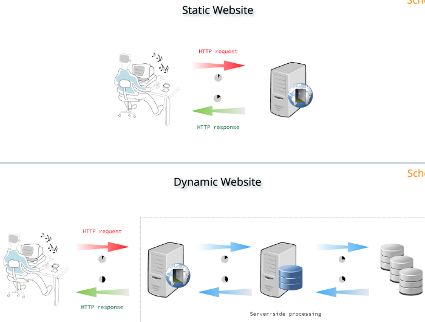

**Main Source :**

- **[What is a web server? - MDN](https://developer.mozilla.org/en-US/docs/Learn/Common_questions/Web_mechanics/What_is_a_web_server)**
- **[Apache vs NGINX - IBM Technology](https://youtu.be/9nyiY-psbMs?si=awdYABj62-vySNKk)**

When we attempt to access a website using a [web browser](/frontend-web-development/web-browser), the browser initiates communication by sending a message to a [server](/computer-networking/server) through an [HTTP request](/computer-networking/http-https).

A server that is responsible for responding to client requests, specifically for delivering web pages, is known as a **web server**. Web server will respond to client request (e.g. web browser request) by delivering web pages resources such as [HTML documents](/frontend-web-development/html).

A web server is typically hosted in dedicated computer equipped with specialized hardware to reduce downtime and system troubles.

#### Static vs Dynamic Web Server

After receiving client request, the web server will search for the required file and sends it back to the client. There are two types of web server, **static** and **dynamic**.

A static web server will deliver static content, these are simple web pages which doesn't need more server-side processing and will be same to all client.

Dynamic web server, on the other hand, will deliver dynamic content. These content can change based on user input, and the server will generate content on-the-fly.

  
Source : https://about.gitlab.com/blog/2016/06/03/ssg-overview-gitlab-pages-part-1-dynamic-x-static/

#### Web Server Feature

The previous explanation explain about a simple web server, in reality a web server is provided with much more complex feature. Some of them are :

- **[Reverse Proxy](/computer-networking/proxy#reverse-proxy)** : A technique which forwards client requests to the appropriate backend servers on behalf of the clients. This is useful for [load balancing](/computer-networking/server#server-optimization) and improving security by hiding the server's IP address.
- **[Other server optimization technique](/computer-networking/server#server-optimization)** : Other technique such as caching, CDN, and load balancing.

Most popular example of web server are Apache and NGINX. Apache follows a process-based model where each incoming request is handled by a separate process. Nginx uses an event-driven model, where a small number of processes can handle multiple connections simultaneously.
