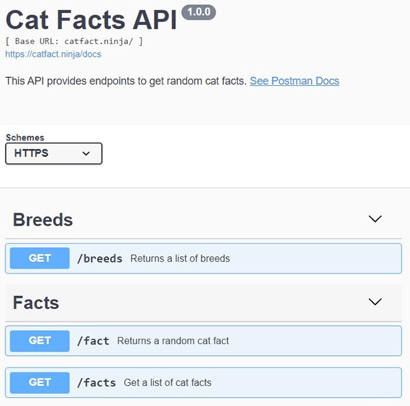

**Main Source :**

- **[APIs for Beginners 2023 - How to use an API (Full Course / Tutorial) - freeCodeCamp](https://youtu.be/WXsD0ZgxjRw?si=IJAjV5WMFpiaT8n0)**
- **[What Is Middleware? - AWS](https://aws.amazon.com/what-is/middleware/)**

### What is API

**Application Programming Interface (API)** is a contract between two component in a systems, the contract has rules that define how these two component can interact with each other. We can think API as the bridge that connects between software component.

The purpose of API is to add a layer of abstraction and hide all the implementation details, making the client that interact with it only access the necessary functionality. API is something a programmer really use most of the time, calling function, classes, or modules is considered as calling an API.

#### APIs Types

Some types of APIs are :

- **Library API** : Library is a collection of pre-written ready-to-use code, this includes function, classes, methods, constants, and other code components. Libraries are used to make programmers develop their application without needing to build everything from scratch. An example of library include graphics API like OpenGL that lets you render 2D or 3D computer graphics.

- **OS API** : Operating system APIs is considered as low-level API, this includes accessing necesarry function or classes that interact directly with OS component such as file system, memory management, task manager, process management, and etc. Example of OS level API can be a class that access internal storage in Android OS.

- **Web API** : Web API is an API accessed over the internet using protocols like [HTTP](/computer-networking/http-https#http). Web APIs can be used if the code we are interacting to is stored on the internet. Common Web APIs include Google maps API that let you know about geolocation information, Spotify API that allows developers to search for songs, albums, and artists, retrieve user playlists.

Here is an example of API in Kotlin :

```kotlin
logOutput("Calling an API")
```

Let's say a programmer wanted to log some string, he expect the log to be stored in some list and the log should be printed to the console with current time. The programmer expect everything to be handled by the `logOutput` just by passing string in the parameter, because an API should hide implementation details.

```kotlin
import java.time.LocalTime

val logs = mutableListOf<String>()

fun logOutput(out: String) {
    val currentTime = LocalTime.now()
    logs.add(out)
    println("Log : $out - at $currentTime")
}
```

Code above shows actual implementation of the `logOutput` function. Inside `logOutput`, it does all the work including saving the log and printing it out on the console. Even the `logOutput` function still uses an API, it gets current time through some java API which is the `java.time.LocalTime` (and that API calls again another system-level API that access the default time).

API is considered as a contract because the caller and the API needs to agree what they must provide and what they will return. In this scenario, the caller must provide a string as the log and the API must print it out on console for the caller.

### Middleware

In backend, **Middleware** is a software that bridges between application and server. It is an intermediary that takes incoming requests from application and pass it into server. Middleware is not restricted to a single component, multiple middleware can be connected with other middleware or with other application logic before it is connected into the server.

The purpose of middleware is to pre-process incoming request before passing it into server to make the server can focus only on the actual logic. For example, middleware can check if user has logged in or not, checking for cookies (file that stores basic user information), add additional data or configuration, and handling request error.

  
Source : https://medium.com/@seymarslan/what-ismiddleware-fdb2ad163388

### Routing & Endpoint

When the client sends a request to the server, the request must be handled with the appropriate actions. **Routing** is the mechanism of handling specific request specified by request's URL and [HTTP method](/computer-networking/http-https#http-request--method) to the appropriate codes that should handle them.

The request's URL can vary depending on the request, a URL must contain some component including scheme, domain name, and etc (find more about url [here](/frontend-web-development/web-url)). A web url typically have a starting point or the root of all URL, it represents the primary address that clients use to communicate with the server. The primary address is called **base URL**.

When making request to the base URL, the server will typically respond by returning the default page of the website. If we want to do certain operations or access specific resources, we need to add additional path, this is called **endpoint**. Endpoint is typically concatenated to the base URL and is separated by `/`.

For example, the `https://jsonplaceholder.typicode.com` is an online web API we can use. The `https://jsonplaceholder.typicode.com/` is the base URL or the root of all page the site has, accessing the base URL directly will give you the an [HTML](/frontend-web-development/html) file which is then rendered by the browser to display the website's content.

The website provides some endpoint including `/posts`, `/comments`, `/albums`, and some other. Accessing the base URL concatenated with the `/posts` endpoint `https://jsonplaceholder.typicode.com/posts` will give us a [JSON](/frontend-web-development/json) file containing some user posts.

Overall, routing and endpoint determines how the server should respond to different requests by mapping them to specific endpoints or routes. The behavior of accessing specific endpoints will depend on the web API.

  
Source : https://apipheny.io/api-endpoint/

### API Gateway

todo

cache, load balance, rate limit
