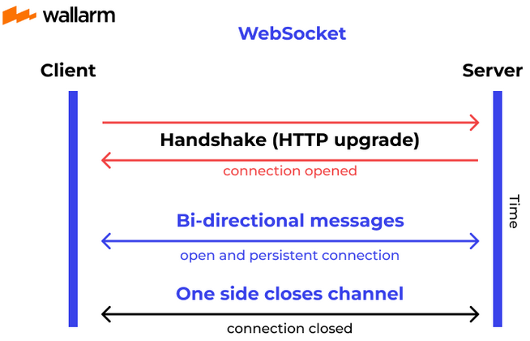

**Main Source :**

- **[WebSockets in 100 Seconds - Fireship](https://youtu.be/1BfCnjr_Vjg?si=tsOQg9sFSVmgc3vZ)**
- **[Differences between webhook and websocket? - stackoverflow](https://stackoverflow.com/questions/23172760/differences-between-webhook-and-websocket)**

**WebSocket** is a communication protocol that allows full-duplex communication, meaning it allows simultaneous data flow in both direction at the same time. WebSocket establish a persistent connection over a single [TCP](/computer-networking/tcp-protocol) connection, it doesn't need to make request to server like [HTTP](/computer-networking/http-https#http) everytime it want to send new data. WebSocket is suited for real-time communication that needs frequent update such as live dashboard or chat application.

WebSocket is an alternative to [pooling](/backend-development/webhook#polling) for real-time communication. Using pooling means we need to make request periodically to check for new data, this can be wasteful if the application is real-time meaning an update happens often.

WebSocket has different use case with [Webhook](/backend-development/webhook#webhook). WebSocket is typically used for client-server communication such as interactive communication in a chat app. Webhook, on the other hand, typically used for server-server communication or to integrate systems. The use case can be data sync between different system or notify external server.

### WebSocket Process

1. **Handshake** : The WebSocket process begins with a handshake between the client and the server. The client sends an HTTP request to the server with WebSocket version included to initiate a communication using WebSocket. If the server supports WebSocket, it responds with an HTTP 101 status code indicating the switch to the WebSocket protocol from HTTP protocol.

2. **Data Exchange & Events** : After connection is established, both the client and the server can start sending data to each other in real-time. Client or server may receive events or callbacks such as connection open, message received, error, and connection close events.

3. **Connection Termination** : When the client or the server decides to close the WebSocket connection, a close message is exchanged, indicating the intention to terminate the connection. Once both sides have acknowledged the close message, the connection is closed, and the WebSocket session ends.

  
Source : https://www.wallarm.com/what/a-simple-explanation-of-what-a-websocket-is
