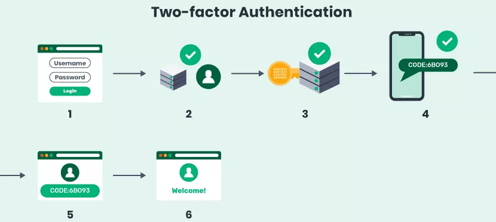

**Main Source :**

- **[Authentication factor - definition & overview - sumo logic](https://www.sumologic.com/glossary/authentication-factor/)**
- **[authentication factor - TechTarget](https://www.techtarget.com/searchsecurity/definition/authentication-factor)**

**Authentication** is the process of verifying the identity of a user or system attempting to access a resource or perform an action. User's identity are typically stored in the system local storage such as database in a server or owned by the user itself in some authentication technique. The system will verify user's credentials by checking it if it's available in the storage.

The process of establishing user's identity in the system is called **register** or **sign up**. Common identity required are username, email, and password. The process of accessing the system with previously established identity is called **sign-in**. Last but not least, **logout** or **sign-out** which is the process of ending current access to the system.

### Authentication Factor

The charateristics of someone's identity can be categorized into 5, these are called **authentication factor** :

- **Knowledge Factors** : Knowledge factors rely on something the user knows, such as a password, passphrase, PIN, or answers to security questions.

- **Possession Factors** : Involve something the user possesses, typically physical object or devices such as smart cards or mobile devices.

- **Inherence Factors** : Also known as **biometric factors**, these are unique physical or behavioral characteristics of the user. Biometric authentication factors include fingerprint scans, iris or retinal scans, voice recognition, facial recognition, or even typing patterns.

- **Location Factors** : Location factors takes account the geographic location or network information associated with the user. For example, a system may authenticate a user based on their [IP address](/computer-networking/ip-address), GPS location, or proximity to a specific [Wi-Fi](/computer-networking/wi-fi) network.

- **Behavior Factors** : Behavior factors focus on the user's patterns and habits such as user's typing speed, mouse movements, navigation patterns, or even the timing and frequency of their interactions.

### Authentication Factor Number

Authentication may also include more than just one evidence from the user, there can be more than one factor of consideration, this is called **authentication factor number**.

- **Single-Factor Authentication (SFA)** : This involves just a single authentication factor, typically a password or PIN.

- **Two-Factor Authentication (2FA)** : 2FA requires the user to provide two different authentication factors to verify their identity. For example, the first factor is password and the system may generate some number which is sent to user's mobile device as the second factor.

- **Multi-Factor Authentication (MFA)** : MFA is the use of two or more authentication factors. It can include a combination of all authentication factor including the 5 listed above (knowledge, possession, inherence, location, behavior).

### General Authentication Process

1. **User Request / Login** : The authentication process begins when a user sends a request to access a protected resource or initiate a login operation, the user will also enter their credentials.

2. **User Identification** : The backend system receives the user request and verify it against the stored credentials. Based on the verification, the system decide whether to grant access to the user or not.

3. **Additional Factors (optional)** : Depending on the auth factor number used, the system may need additional credentials.

4. **Session Establishment** : Upon successful authentication, the system establishes a session for the authenticated user. A session is a period of time the user has been actively authenticated in a system, typically the user will receive their own session identifier, which will be used for subsequent access and is limited in time (expirable).

5. **Authorization & Access Grant** : The system decide whether the user has appropriate permission to do certain actions, if the user is allowed, the system will grant access to the user's requested resource or operation. The user can proceed to interact with the system or perform the desired actions.

6. **Session Termination** : After the user is done with their activity, the session can be terminated, whether explicitly through a logout operation, or automatically by the system after a period of inactivity or upon reaching the session expiration time.

  
Source : https://swoopnow.com/user-authentication/
