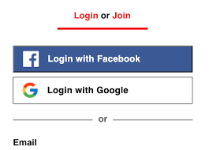
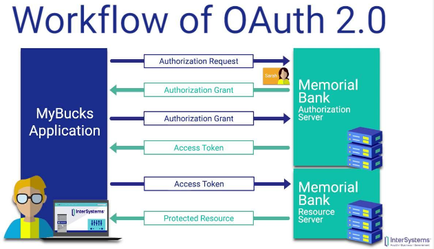

**Main Source :**

- **[What is Authorization? - auth0](https://auth0.com/intro-to-iam/what-is-authorization)**
- **[OAuth - what it is and how it works - jengolbeck](https://youtu.be/SXDce0e3Ue4?si=IYiiXPVhEyBRWtfu)**
- **[OAuth 2.0: An Overview - InterSystems Learning Services](https://youtu.be/CPbvxxslDTU?si=lmOoLjg4k9dzW-_j)**

**Authorization** is the process of granting or denying access to specific resources, functionalities, or actions based on a user's identity, permissions, and privileges. Authorization is typically done after the user has succesfully authenticated.

Here are two common types of authorization strategies :

- **Role-based Authorization (RBAC)** : In this strategy, users are assigned with specific roles. Each roles has its own permission to perform an action

- **Attribute-based Authorization (ABAC)** : ABAC considers specific characteristics or properties of users, resources, and the environment to decide whether to allow or deny access to a particular resource or action. These attributes can include things like user roles, department, location, time of access, resource sensitivity, and other relevant factors.

For example, in a blog app that uses role-based authorization, there could be 3 different roles, each has its own access and permission.

- **Admin** : The admin may be able to create, edit, and delete anyone blog posts; manage user accounts, and access analytics dashboard.
- **Author** : Authors are able to create, edit, and delete their own blog posts.
- **Reader** : Reader is the lowest level, they are only allowed to view published blog posts.

### OAuth

**Open Authorization (OAuth)** is an open-standard authorization protocol used to allow users to grant access to their resource on their application without sharing their credentials directly to the application by involving third-party application.

When we are trying to register on some application, often times they provide a way to register using a Google or Facebook account, this is an example of OAuth. Instead of giving credentials directly to the app by registering and obtaining the permission, the application ask another trusted app whether to give permission to the user. With OAuth, the application we are accessing can access our information in the third party app used to authorize.

In other word, OAuth enables us to log in to an application using our existing accounts from other platforms (e.g. Google or Facebook) without needing to enter our credentials to the application. Under the hood, they are not sharing our credentials, instead, they uses something called **access tokens**. The access token can be thought as the proof of permission given by the user to access their own resource.

  
Source : https://thedailybeast.freshdesk.com/support/solutions/articles/43000627842-how-do-i-add-google-facebook-login-for-one-step-sign-in-

This is the process of OAuth :

1. **User initiates the process** : The user wants to access a service or application that requires authorization. They initiate the OAuth process by clicking on a "Sign in with [Provider]" button or a similar action.

2. **Redirect to the authorization server** : The user is redirected to the authorization server (e.g., Google, Facebook) that holds their account and controls access to their resources.

3. **User authentication** : The user is prompted to enter their login credentials (username and password) on the authorization server's login page to verify their identity.

4. **User authorization** : After successful authentication, the authorization server presents the user with a consent screen. The screen explains what information the requesting application wants to access and asks the user to grant or deny permission.

5. **Authorization grant** : If the user grants permission, the authorization server generates an authorization grant in the form of **authorization code**. An authorization code is a short-lived token that represents the user's consent to grant access to their protected resources.

6. **Redirect back to the client application** : The authorization server redirects the user back to the client application (the application that requested access) and includes the authorization code as a parameter in the redirect URL.

7. **Token exchange** : The client application takes the authorization code and sends a request to their authorization server to exchange it for an access token. **Access token** is the actual token used to access the user's protected resources.

8. **Access Granted** : With the access token, the client application can make requests to the resource server (the server that holds the user's resources) on behalf of the user. The access token acts as proof of authorization.

9. **Token expiration & refresh token** : The token have a limited lifespan, the authorization server may issue a refresh token along with the access token. The refresh token can be used to obtain a new access token when the current one expires without requiring the user to go through the entire authentication process again.

     
   Source : https://youtu.be/CPbvxxslDTU?si=2EZK6waoD46nbE8U&t=251
