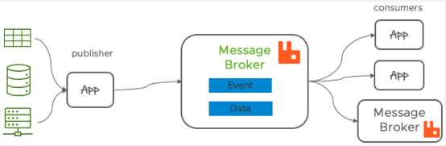
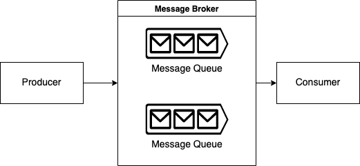
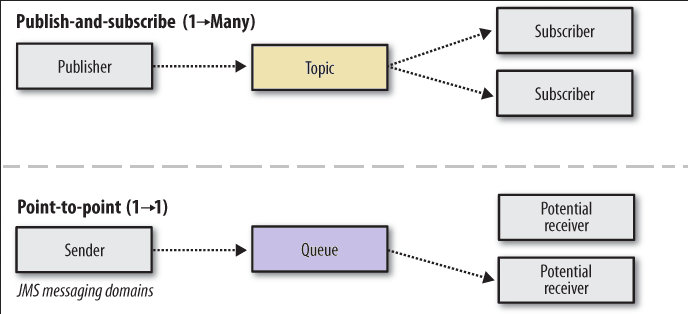
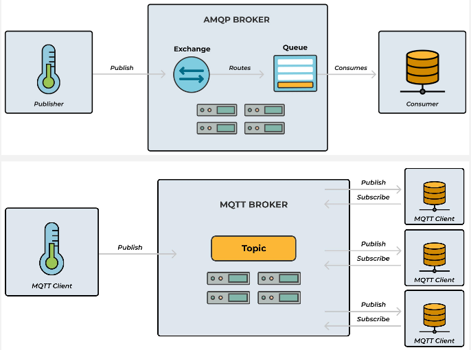
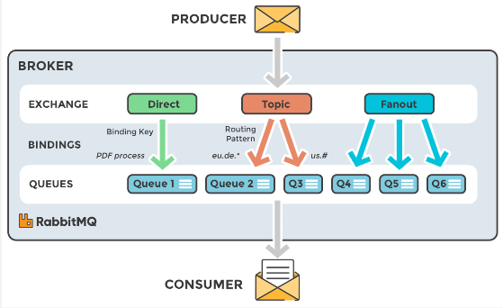
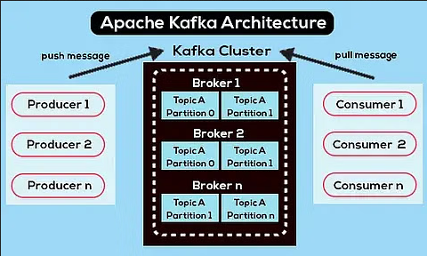

**Main Source :**

- **[Introduction to Message Brokers - Ciaran O'Donnell](https://youtu.be/57Qr9tk6Uxc?si=15e0ZO1DEojThNbE)**
- **[What are message brokers? - IBM](https://www.ibm.com/topics/message-brokers)**
- **[AMQP vs MQTT: Messaging protocols compared by Nyior Clement - CloudAMQP](https://www.cloudamqp.com/blog/amqp-vs-mqtt.html)**
- **[RabbitMQ in 100 Seconds - Fireship](https://youtu.be/NQ3fZtyXji0?si=DT53wVxB3ISfKh2Q)**
- **[Kafka in 100 Seconds - Fireship](https://youtu.be/uvb00oaa3k8?si=ffpDezF-OvA7MRwk)**

**Message Broker** is a software that bridges communication and data exchange between different applications, services, or components within a distributed system. A unit of data exchanged is called a **message**, it consists of headers, body, and metadata.

An example use case of message broker is to decouple between APIs and backend services. Consider an e-commerce app, when a user place an order, the message brokers send a message to the order processing service. The message contains information about the order such as customer's information, product ID or quantity. After processing the order, the service sends a message back to the message broker containing the result of the order.

The use of message broker here is not just as an interface to the service, more uses are :

- **Load Balance** : It can provide load balancing technique, the messages received may be distributed among servers.
- **Protocol Translator** : When a service uses different messaging protocol with the client, the message broker can act as a bridge, receiving messages using one protocol and translating them into another protocol.

    
   Source : https://www.vmware.com/topics/glossary/content/message-brokers.html

### Message Queue

Message broker may store messages received from the client in something called **message queue**, which is a queue data structure that is used to store messages until they can be processed by the intended service. By using queue, this ensure the messages are processed in appropriate request order.

Another benefits of message queue :

- **Asynchronous Communication** : Message queues also enable asynchronous communication patterns, where the sender and receiver do not need to be active at the same time. For example, the messages can be held while the user or the service is down.
- **Fault Tolerance** : Message queues can provide fault tolerance by storing messages persistently. If the service fails, the messages in the queue remain, ensuring that no data is lost. Once the failed component becomes available again, it can resume processing messages from the queue.

    
   Source : https://ademcatamak.medium.com/what-is-message-broker-4f6698c73089

### Message Brokers Model

There are several pattern used to define how messages are processed in message brokers :

- **Publish-Subscribe (one to many)** : In the publish-subscribe pattern, a message sender (publisher) sends messages to the message broker and the recipients (subscribers) express interest in receiving messages from specific criteria. They both don't know who sent and who receipt the message, all message are handled by the message broker.

- **Point-to-Point Messaging (one to one)** : In the point-to-point pattern, messages are sent from a sender to a specific recipient. The sender puts messages into a message queue, and the broker ensures that each message is delivered to exactly one recipient. Once a message is consumed by a recipient, it is removed from the queue.

- **Request-Reply (one to one)** : The request-reply pattern involves a sender (requester) sending a request message to a recipient (replier) and expecting a response in return. The message broker acts as a mediator, routing the request message to the appropriate recipient and forwarding the response back to the requester.

    
   Source : https://medium.com/tech-sauce/introduction-to-message-queuing-4a7ab8968b59

### Messaging Protocol

Messaging protocol is a set of rules that define how message brokers deliver messages. It involves the structure of a message, message broker model, and the network transport layer used. Two common protocols are **Advanced Message Queuing Protocol (AMQP)** and **Message Queue Telemetry Transport (MQTT)**. AMQP is designed to be flexible that allows any pattern to be implemented on top of it while MQTT only supports the publish-subscribe pattern. MQTT is more lightweight than AMQP, typically used for Internet of Things (IoT).

As explained before, the message brokers can be used as converting one protocol to another, such as converting [REST API](/backend-development/rest-api) from application call to desired messaging protocol like AMQP.

  
Source : https://www.cloudamqp.com/blog/amqp-vs-mqtt.html

### RabbitMQ

RabbitMQ is an open-source message broker, it follows the similar traditional message broker system. It uses the AMQP protocol and provide features like message queuing, publish-subscribe, and request-reply patterns.

Messages from producers are received by **exchanges**, these will be held in **queue** until it will be consumed by the consumers. Exchanges and queue are connected together by a **binding**, it will determine how message should be delivered from exchanges to queue, which is called **routing**. Each message will have a **routing key** to determine which queue should receive the message.

There are types of exchange to determine the routing process :

- **Direct Exchange** : Use the exact match between the routing key of a message and the routing key specified in the binding of the exchange and the queue.
- **Topic Exchange** : Routes messages to queues based on matching patterns in the routing key.
- **Fanout Exchange** : Routes messages to all queues that are bound to it.

The consumer will then receive a message from a queue.

  
Source : https://halovina.com/konfigurasi-rabbitmq-untuk-message-broker/

### Apache Kafka

Apache Kafka on the other hand, is designed to be more scalable for real-time data streaming and processing. A unit of data produced by producers consisting of key-value pair, timestamp, and additional metadata is called a **record**. These records are organized into **topics** and topics are further divided into **partitions**, record are distributed within the partitions. Each partitions is an ordered, immutable sequence of records. These topics are handled by a **broker** which is responsible for receiving records from producers and serve records to consumers. A group of broker are then grouped together to form a **Kafka Cluster**, the cluster act as the entry point for producers and consumers to interact with the messaging system.

  
Source : https://www.projectpro.io/article/apache-kafka-architecture-/442
