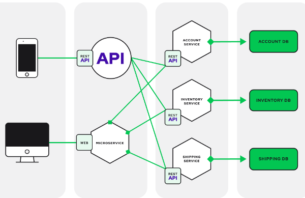
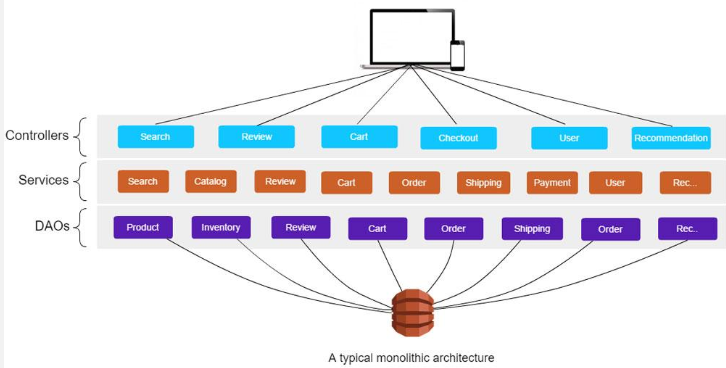

**Main Source :**

- **[Introduction to Monolithic Architecture and MicroServices Architecture by Siraj ul Haq - Medium](https://medium.com/koderlabs/introduction-to-monolithic-architecture-and-microservices-architecture-b211a5955c63)**
- **[Monolithic Architecture. Advantages and Disadvantages - Oleksii Dushenin](https://datamify.medium.com/monolithic-architecture-advantages-and-disadvantages-e71a603eec89)**

### Backend Architecture

In software, architecture is the overall design and structure of a software system. Defining an architecture provide a principle of how one component talk to each other. This way we can achieve better organization, modularity, and reusability of our software.

In backend, architecture refers to the design and organization of the server-side components, it focuses on how different backend components interact, handle data, process requests, and provide services to the frontend or client-side of an application.

There are many backend architecture, the example are [monolithic](/backend-development/monolithic#monolithic), [microservices](/backend-development/microservices), [SOA](/backend-development/soa), and [serverless](/backend-development/serverless).

Source : https://stackoverflow.com/questions/76415176/explain-microservice-architecture

### Monolithic

In monolithic architecture, the entire application is built as a single, indivisible unit. In the context of backend, the backend application handles various actions such as data access, business logic, user interface, and third-party integrations within a single runtime process.

This mean all the code and dependencies are packaged and deployed together, and any changes or updates to one part of the application require redeploying the entire monolith.

An example usecase of monolithic architecture is when each component are tightly coupled to each other, in other word, one component is really dependant on the other.

For example, monolithic architecture may be used for an e-commerce platform that allows customers to browse products, add them to a shopping cart, and complete the checkout process. All the component are interconnected, using a unified codebase would simplify the development process.

#### Advantages & Disadvantages

Advantages :

- **Simplicity** : Straightforward to develop, debug, test, deploy, and manage since all the components are bundled together within a single codebase.
- **Ease of Development** : Developers can work on the entire application without worrying about complex inter-component communication or integration.

Disadvantages :

- **Unflexibility** : When a small changes or updates in one component often require redeploying the entire application, causing longer release cycles and limiting the ability to adopt new technologies. This will also make the application hard to test considering
- **Reliability** : A failure in one component of a monolithic application can potentially bring down the entire system, as there is no isolation between components.
- **Technology Limitations** : Monolithic architectures often require using a single technology stack or programming language throughout the application, limiting the ability to leverage the best tools and frameworks for specific components. Migrating them would mean to migrate the entire codebase.
- **Scalability** : Considering the application is tightly coupled, having more server means we need to distribute the entire monolithic app to these server. This will make these server interdependent, they will rely on shared resources and data, making synchronization of the shared resources becomes complex.

Overall, monolithic architecture is typically suited for smaller applications with simpler requirements, limited scalability needs, and smaller development team which are familiar with the codebase.

  
Source : https://techaffinity.com/blog/microservices-architecture-vs-monolithic-architecture/
