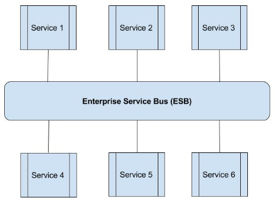
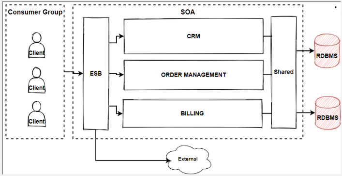
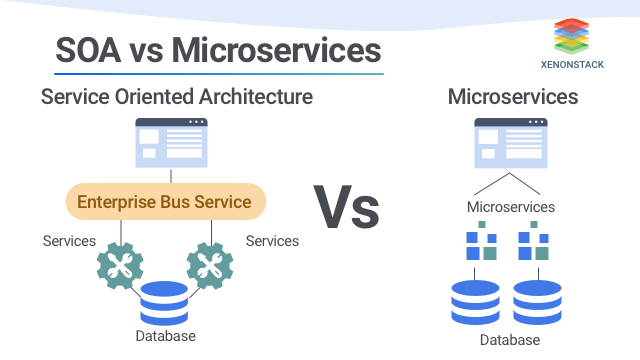

**Main Source :**

- **[What Is SOA (Service-Oriented Architecture)? - AWS](https://aws.amazon.com/what-is/service-oriented-architecture/)**
- **[What’s the Difference Between SOA and Microservices? - AWS](https://aws.amazon.com/compare/the-difference-between-soa-microservices/)**

**Service-Oriented Architecture (SOA)** is an architecture where software systems are built using loosely coupled, independent, and self-contained service, each with their own business capability. They need to have minimal dependencies as minimal as possible and changes to one service shouldn't require changes in other services.

Services are designed to be reusable making them need to provide a well-defined interface to talk with other service. In SOA, the communication between servicse are facilitated using an **Enterprise Service Bus (ESB)**. ESB is an architecture where it acts as a [middleware](/backend-development/apis-server-logic#middleware) platform which provide integration in a bus-like infrastructure. ESB is used to handle message routing, transformation, and mediation between different services and applications.

  
Source : https://www.mulesoft.com/resources/esb/what-esb

SOA differ with [microservice](/backend-development/microservice) in terms of scope, SOA is more like an enterprise scope architecture rather than an microservice which is an application scope architecture. SOA typically talk to each other using ESB rather than using RPC for inter-service communication like microservice.

SOA architecture can be implemented in a travel booking app. Similar to microservice, each service have their own use case. It could have user management service including authentication process, flight booking service that communicates with smaller use case service including flight search, viewing available flight, retrieving flight data from external API, and many more services.

  
Source : https://medium.com/design-microservices-architecture-with-patterns/service-oriented-architecture-1e4716fbca17

### Advantages & Disadvantages

Advantages :

- **Flexibility** : SOA breaks down complex systems into smaller, independent services. These services can be developed, tested, deployed, and maintained separately, allowing for easier code reuse and increased flexibility.

- **Interoperability** : Services communicate with each other using standard protocols and predefined interface. It will be easy to integrate new services without disrupting the entire architecture.

- **Scalability** : SOA allows to distribute services across multiple servers, they can be scaled independently based on demand without needing to improve entire server just for scaling a heavyweight service.

- **Reusability** : SOA architecture that consists of smaller services make it possible to utilize available services combined to create new functionalities.

Disadvantages :

- **Complexity** : Implementing SOA introduces additional complexity due to the requirement to have proper coordination and integration among services.

- **Performance Overhead** : Services that talks to each other using message routing, serialization, and network latency can introduce performance overhead.

- **Increased Development Effort** : Implementing SOA requires additional effort in designing service contracts, defining interfaces, and maintaining service repositories. It may involve more development effort compared to traditional monolithic architectures.

Overall, SOA architecture are suitable for complex application where it needs to be decomposed into smaller service to help manage complexity and promote code reuse. When performance is critical, SOA can be optimized by increasing server and applying load balancing technique.

  
Source : https://www.integrate.io/blog/soa-vs-microservices/
