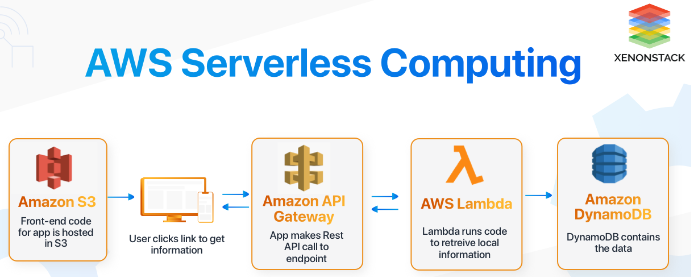
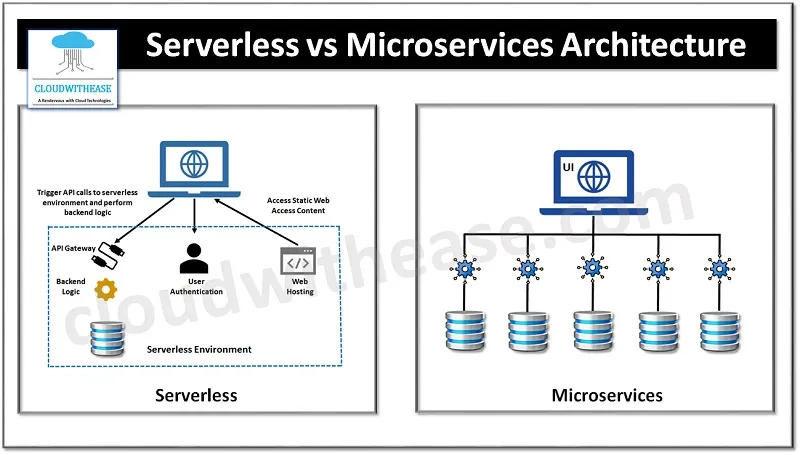

**Main Source :**

- **[Serverless Computing in 100 Seconds - Fireship](https://youtu.be/W_VV2Fx32_Y?si=wXaUo9KP5bPSaYf4)**
- **[Why use serverless computing? | Pros and cons of serverless - Cloudflare](https://www.cloudflare.com/learning/serverless/why-use-serverless/)**

**Serverless** is an architecture where developers build and run application without needing to manage servers. This is done by letting cloud provider that host our server handles and manages it. The provider will also handle the scaling of our server architecture as the number of request increase, the payment will be based on the resources consumed by our application.

Serverless is also known as [Function as a Service platforms (FaaS)](/cloud-computing-and-distributed-systems/cloud-models#more-models), and it relies on cloud provider, such as AWS Lambda, Azure Functions, or Google Cloud Functions. They provide place to run a self-contained function that performs specific task or operation. Functions in FaaS are event-driven, so whenever a specific event occurs in our application, the function will be triggered.

For example, in an authentication process in a web app, when a user registers, the registration form will be sent to specific API endpoint, and it will trigger a serverless function that receives the registration data. The function will validate the form and store it in database, the function used to store to database may also trigger actions such as sending confirmation email to the user.

  
Source : https://www.xenonstack.com/blog/aws-serverless-computing/

### Advantages & Disadvantages

Advantages :

- **Reduced Operational Overhead** : With serverless architectures, developers are relieved from the burden of managing servers and infrastructure. The cloud provider handles tasks such as server provisioning, scaling, and maintenance and developers can focus more on writing code.
- **Scalability** :The cloud provider able to scale the infrastructure automatically based on the incoming workload. As the number of requests or events increases, the provider provisions the necessary resources to handle the load.
- **Cost Efficiency** : Serverless architectures payment is often based on pay-per-use pricing model. You only pay for the actual execution time and resources consumed by your functions. This allows for cost optimization since you don't incur costs for idle resources.

Disadvantages :

- **Limited Execution Time** : Serverless platforms often limits execution time on functions. For example, AWS Lambda has a default maximum execution time of 15 minutes.
- **Vendor Lock-In** : Serverless platforms relies a lot on cloud provider, we need to suit with their APIs, making it challenging to migrate to a different provider.
- **Debugging & Monitoring** : Application which is distributed in functions and the lack of direct access to underlying infrastructure can make it difficult to troubleshoot issues and gather comprehensive monitoring data.
- **Limited Control** : Serverless architectures abstract away much of the infrastructure management, which means developers have limited control and customization options. Certain low-level optimizations, specialized configurations, or integration with specific libraries might not be possible in a serverless environment.

Serverless can be beneficial for inconsistent app that have little or no traffic as it uses pay-per-use pricing model. It is suitable for developers who don't want to be burdened with managing servers and infrastructure.

  
Source : https://pueblerino.info/serverless-functions-vs-microservices
