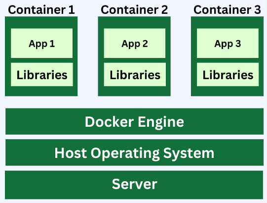

This is the same notes as :

- **[Cloud Computing > Containerization & Virtualization](/cloud-computing/containerization-virtualization)**
- **[Operating System > Containerization & Virtualization](/operating-system/containerization-virtualization)**

**Main Source :**

- **[Virtualization Explained - PowerCert](https://youtu.be/UBVVq-xz5i0?si=kHYnrYGPjpTsiqYv)**
- **[Virtual Machines vs Containers - PowerCert](https://youtu.be/eyNBf1sqdBQ?si=j4eCUEMDn42GwEpQ)**
- **[Levels of Virtualization Implementation in Cloud Computing - YourTechDiet](https://yourtechdiet.com/blogs/levels-of-virtualization-implementation-in-cloud-computing/)**
- **[Levels of Virtualization Implementation - BrainKart](https://www.brainkart.com/article/Levels-of-Virtualization-Implementation_11329/)**
- **[Containers - Explained in 4 Minutes - Accelerate Rediscover In 4 Minutes](https://youtu.be/pR-cGS6IGvI?si=LOqZkrsmbzDJE7l9)**
- **[What Is Containerization? - AWS](https://aws.amazon.com/what-is/containerization/)**

### Virtualization

**Virtualization** is the process of creating a virtual (rather than physical) version of something, such as an operating system, a server, a storage device, a network resource, or a software system. Virtualization emulate the functionality of a physical computer system by creating virtual machines (VMs) or virtual environments. Virtual machine (VM) has its own memory, CPU, storage, file system, configuration just like a physical machine.

  
Source : https://www.techtarget.com/searchitoperations/definition/virtualization

#### Hypervisor

**Hypervisor** is the software that made virtualization possible that creates and manages virtual machine. In virtualization, it is possible that a single machine could run 3 different OS and each of the OS run 3 different application which can't be run on other OS expect itself.

The primary use of hypervisor is to abstract and virtualize the physical hardware, presenting it to the virtual machines as if they were running on dedicated hardware. It provides a layer of software that sits between the physical hardware and the virtual machines, allowing the virtual machines to operate independently and securely.

There are two types of hypervisor :

- **Type 1 Hypervisor (Bare-Metal Hypervisor)** : This hypervisor runs directly on the host computer's hardware, without the need for an underlying operating system. Examples include VMware ESXi, Microsoft Hyper-V, and Citrix XenServer.
- **Type 2 Hypervisor (Hosted Hypervisor)** : This hypervisor runs on top of an existing operating system. Examples include VMware Workstation, Oracle VirtualBox, and Microsoft Virtual PC.

  
Source : https://superuser.com/questions/1553794/are-hardware-drivers-needed-to-be-installed-on-the-management-os-of-a-type-1-hyp

#### Benefits of Virtualization

- **Improved hardware utilization** : Rather than having 3 machine to run 3 distinct operating system, virtualization allows us to utilize a single machine to run it all. This will reduce required hardware and energy costs.

- **Flexibility** : Virtualization provides the ability to quickly provision and deploy virtual machines.

- **Testing in development** : Virtualization creates isolated test environments, allowing developers to test applications and configurations on different system without affecting the production environment.

#### Virtualization Implementation

Virtualization can be implemented in three ways :

- **Full Virtualization** : In full virtualization, the virtualization layer (hypervisor) provides complete hardware abstraction, it can run multiple virtual machines to run simultaneously on a single physical host. Each virtual machine operates as if it has its own dedicated hardware resources, including CPU, memory, storage, and network interfaces. Examples of full virtualization hypervisors are VMware ESXi and Microsoft Hyper-V.

- **Para-virtualization** : In full virtualization, the OS is not aware that it is running in a virtualized environtment, **para-virtualization** instead modifies the guest operating system to be aware of the virtualization layer. The operating system and the hypervisor (or the virtualization layer) can communicate directly to perform tasks such as memory management and I/O operations.

- **Hardware-assisted Virtualization** : Hardware-assisted virtualization enables full virtualization with the help of hardware capabilities such as Intel VT-x or AMD-V. This will allow for better performance as it is supported directly by the hardware.

- **Operating System-level Virtualization/Containerization** : Operating system-level virtualization, also known as containerization, is a lightweight form of virtualization where the virtualization layer runs on a single host operating system. Instead of virtualizing an operating system, it creates multiple virtual machines (VMs) isolated in the OS. Each of the component is called **container**, and they share the host operating system's kernel, libraries, and other resources. (explained more below)

#### Virtualization Level

Virtualization level is the level of how depth is virtualization implemented in an environtment.

- **Instruction Set Architecture Level (ISA)** : This is the lowest level implementation that emulates the low-level operations that a processor can perform, such as arithmetic, logic, and memory operations.

- **Hardware Abstraction Level (HAL)** : This level implement the abstraction of hardware components to higher-level interface for software. It implements the device drivers and APIs that allow software to interact with hardware.

- **Operating System Level** : This level implement the operating system (OS). The OS manages system resources, provides services to applications, and facilitates communication between software and hardware. It includes components such as the kernel, file system, memory management, process management, and device drivers.

- **Library or API Level** : This level implements software libraries and frameworks that provide pre-built functions and modules to simplify application development.

- **Application Level** : Also known as **process-level virtualization**, this level focuses on virtualizing specific applications or software frameworks. It allows applications to run in isolated environments, separate from the underlying operating system and other applications.

    
   Source : https://www.brainkart.com/article/Levels-of-Virtualization-Implementation_11329/

### Containerization

During application development, developers often use various libraries and modules, each with its own dependencies, this can become complex as the app gets larger. The server will need all the required dependencies, including libraries, frameworks, runtime environments, packages, and operating system requirements in order to run the application, managing them can be challenging. Another conflict called **dependency conflict** may arise when different libraries require different versions of the same dependency. For example, library A may need version 2.0 of library C, while library B requires version 1.0.

**Containerization** is a technique used to bundle an application along with all its required packages into a single unit known as a **container**. A container is isolated and self-contained, which helps prevent dependency conflicts. All the necessary dependencies are specified within a **container image** (not an actual image file).

These containers are executed in isolated instances using a **container engine**. The container engine is responsible for managing and running containers on a system. It achieves this by leveraging virtualization techniques, where the container engine sits on top of the operating system (OS) and provides OS-level virtualization.

Multiple virtual machines (VMs) are created, with each VM associated with the dependencies of the application. These VMs are isolated, meaning each VM has its own file system, networking, and storage. The container engine will then interact with the OS to execute the libraries and application in the container.

  
Source : https://bito.ai/blog/containerization-a-beginners-guide-to-its-impact-on-software-development/

In summary, when an application has alot of dependencies, they can be bundled together within a container. A container encapsulates all the necessary dependencies and runtime environment required for the application to run consistently across different environments. To manage and run containers, a container engine is used. The container engine, such as [Docker](/backend-development/docker-kubernetes#docker), utilizes virtualization techniques to create and manage isolated instances of containers on a host system. Inside the VM, the required dependencies are installed based on the specifications in the container image. The container engine interacts with the OS to facilitate the execution of libraries and applications within the container.

  
Source : https://medium.com/hackernoon/what-is-containerization-83ae53a709a6
