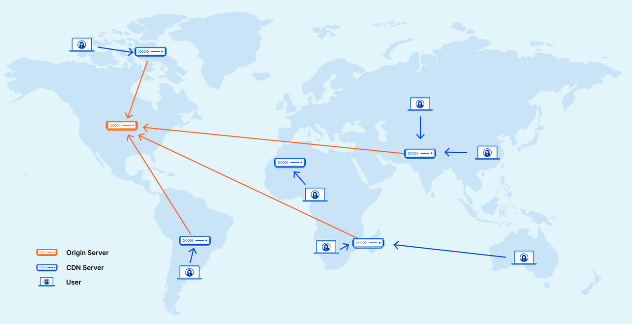
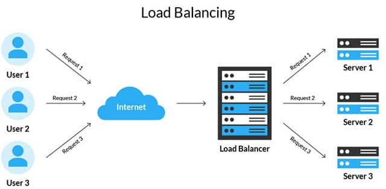
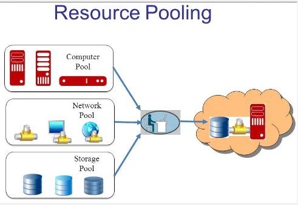

**Main Source : Various source from Google and Articles**

This includes the technique of optimization in general for a backend server in 3 aspect including networks, server, and resource optimization.

### Horizontal vs Vertical Scaling

Backend architecture can be scaled to handle increased traffic and load. They can be scaled in two ways :

- **Horizontal** : Horizontal scaling involves adding more server to distribute the load
- **Vertical** : Vertical scaling involves upgrading the server hardware (e.g. CPU, RAM, storage).

### Network Optimization

- **Minimize Requests** : Combine multiple requests into a single request or use techniques like [HTTP/2](/computer-networking/http-https#http2) multiplexing to reduce the overhead of establishing multiple connections. Minify responses file, compress or resizing image can reduce amount of data transferred over the network especially for large file.

- **Content Delivery networks (CDN)** : Distribute static content, such as images, CSS, and JavaScript files, to a CDN. CDN is distributed servers that are strategically placed in different locations worldwide to reach user faster.

    
  Source : https://www.cloudflare.com/learning/cdn/what-is-a-cdn/

### Server Optimization

- **Server Caching** : Implement caching mechanisms like [Redis caching](/backend-development/caching#type-of-caching) or [reverse proxies](/computer-networking/proxy#reverse-proxy) to store frequently accessed data closer to the server.

- **Load Balancing** : Distribute incoming traffic across multiple servers using load balancers, this will reduce the burden of a single server.

    
  Source : https://herza.id/blog/load-balancing-pengertian-cara-kerja-jenis-metode-kelebihan-dan-kekurangan/

### Resource Optimization

- **Efficient Database Queries** : Optimize database queries by ensuring proper [indexing](/database-system/index), avoiding unnecessary joins or subqueries, and optimizing data retrieval.

- **Efficient Algorithms and Data Structures** : Use algorithms and data structures that provide efficient operations for your application's use cases. For example, if you frequently search or write data, consider using [hash map](/data-structures-and-algorithms/hash-table).

- **Resource Pooling** : Which is the technique of reusing resources by creating a shared repository of resources rather than creating a new resource for each request. This includes sharing database connections, network sockets, or other expensive resources.

    
  Source : https://www.thecrazyprogrammer.com/2022/01/resource-pooling-in-cloud-computing.html
