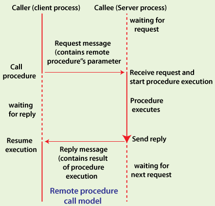

**Main Source :**

- **[What is RPC? - Valentin Despa](https://youtu.be/MdaGuP6-bKs?si=dG0FRHjE415_s9no)**
- **[What is RPC? gRPC Introduction - ByteByteGo](https://youtu.be/gnchfOojMk4?si=JaNEHWB8mTH6j4ot)**

### RPC

**Remote Procedure Call (RPC)** is a communication protocol that allows a computer program to run procedure on a remote server. By procedure, it is a sequence of instruction that such as codes, it will be executed as if it were a local function call.

Function invocation can be achieved through a contract called IDL (Interface Definition Language) or a schema definition. This definition is used to specify which function or procedures that can be called remotely. The IDL is designed to be language-agnostic, this mean even if the client requested a function call on a server that uses different programming language, the server still know what to do.

#### RPC Process

The RPC framework will generate language-specific code for the client and the server to use to communicate. The function or procedure used may also include argument to pass additional data.

1. **Serialization** : Serialization is the process of transforming data into something that can be transmitted over the network. The RPC framework will generate code following the IDL definition and will serialize the code into format like [JSON](/digital-media-processing/json), [XML](/digital-media-processing/xml), or Protocol Buffers. The generated code is called **client stub**.

   The serialized request will be transmitted over the network using protocol like [TCP](/computer-networking/tcp-protocol) or [UDP](/computer-networking/udp) and the server will receive it.

2. **Deserialization** : The RPC framework in the server will deserialize the data received and transform it into the language the server use, this is called **stub decoding**.

3. **Execution & Responses** : The server will execute the function with its parameters and will generate the response. The response can be the result data or an error information including its error code and message. The response will be sent to the client following the similar step that includes serialization and deserialization as before.

     
   Source : https://www.javatpoint.com/what-is-rpc-in-operating-system

RPC provide a way for client to communicate with the server with code or function call instead of communicating by specifying specific operation like GET or POST request in [REST API](/backend-system/rest-api).

### gRPC

**Google Remote Procedure Call (gRPC)** is an implementation of RPC that can run in any environment. gRPC utilize [HTTP/2](/computer-networking/http-https#http2) as the transport protocol, it gained performance advantages of HTTP/2 including multiplexing, single TCP connection, and concurrent request.

#### Protocol Buffers

gRPC uses protocol buffers as the default Interface Definition Language (IDL) for data serialization and deserialization. Protocol buffers is a binary serialization format developed by Google designed to be language-agnostic which mean it can be used by any language.

The protocol buffer is what makes RPC able to bridge between the difference of the language used, it provide a contract for both client and server language.

Here is an example of protobuf message definition :

```protobuf
message Person {
  string name = 1;
  int32 age = 2;
  repeated string emails = 3;
}
```

In the example, we are defining a `Person` type of message. It has 3 fields and each of it has unique field number as identifier. The `repeated` keyword indicate it can have multiple values.

When the client make an gRPC call, the function executed will be serialized into binary format based on the protobuf definition and will be transmitted over the network. On the receiving end, it will be deserialized with the same definition.

For example, the `Person` type defined above can be generated in kotlin code :

```kotlin
data class Person(
    val name: String,
    val age: Int,
    val emails: List<String>
)
```
