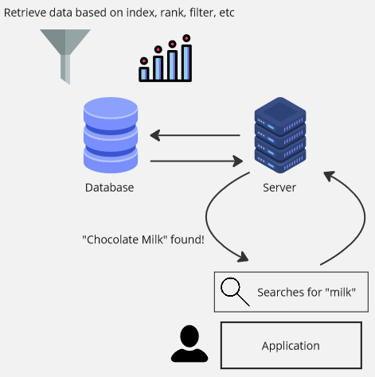

**Main Source: Various source from Google & Youtube**

**Search Engine** is a tool used by user to find relevant websites, documents, images, videos, and other types of content based on their search queries. In the context of backend, search engine is used in an application by user to retrieve data from the server stored on the database.

For example, in an e-commerce app, all the product are stored in a database. When a user searches for a product, they type the product name in the search bar, this is called **search query**. Search query is specific words or sentences the user entered into the search engine to find a relevant information. The search engine will send a request to the server to retrieve the product based on the search query.

  
Source: https://elogic.co/blog/how-ecommerce-search-engine-improves-business-and-customer-experience/

### Search Engine Techniques

Search engine is a vital component in an application, it should be fast and accurate to provide a positive user experience. Below are key techniques used in search engine:

- **[Indexing](/database-system/database-index)**: Indexing is a fundamental technique where data is structured to allow for quick retrieval of relevant information. Indexing maps the data to specific search terms or keywords, making it easier and faster to locate. For example, if the search query starts from letter "A", we can just skip anything that doesn't start with letter "A".

- **Tokenization**: Tokenization is the process of breaking down a content into smaller units, known as tokens. Tokens can be words, phrases, or other meaningful units. For example, the sentence `Delicious Cake Recipes` can be broken down into `["Delicious", "Cake", "Recipes"]`. Tokenization helps indexing process by searching the word one by one, it can also benefits the user to find the relevant information if they make mistakes or typos in their search queries.

- **Inverted Index**: An inverted index is a data structure commonly used in search engines. It maps terms or tokens to the documents or records that contain them. For example, in a blog website, we may map some words into a specific blog posts to allows user to locate the posts faster.

- **Ranking**: Ranking is the process of determining the relevance of search results based specific criteria. The factors can be popularity, recent search behavior, and user preferences can influence the ranking of search results.

- **Filtering**: Filtering is a techniques used to filter search results based on specific criteria. Filters allow users to narrow down the search results based on attributes such as category, date range, location, or other custom metadata.

- **[Caching](/computer-and-programming-fundamentals/caching)**: Caching is a technique where frequently accessed search results or frequently executed queries are stored in memory for faster retrieval.

  

### Types of Search Engine

Three example types of search engine are:

- **Web Search Engine**: Web search engines, such as Google, Bing, and Yahoo, focus on indexing and searching web pages available on the internet. They use something called web crawlers, a component used to traverse, retrieve, and gather data to populate the search engine's index. Their algorithms consider various factors like relevance, popularity, and page ranking to provide search results.

- **Full-Text Search Engine**: These search engines are designed to index and search through the entire content of documents or web pages. They analyze the text and index it based on keywords, allowing users to search for specific terms or phrases within the indexed content.

- **Database Search Engine**: These search engines focus on searching within structured databases. They enable users to query and retrieve specific data from databases using [SQL-like queries](/database-system/query-language) or other query languages.

### Elasticsearch

**Elasticsearch** is a search and analytics engine, at its core, it is a [document-oriented database](/database-system/nosql#document) that stores data in [JSON](/digital-media-processing/json)-like format. It allows you to index and search structured and unstructured data, making it suitable for many use cases such as full-text search, log analytics, and real-time analytics.

Elasticsearch operates in a distributed architecture. An engine of elasticsearch capable of storing data and performing search operation is considered as a **node**. These nodes work together to form a **cluster**.

A similar data is grouped together and stored in a logical container called **index**. It can be thought of as a separate database within Elasticsearch. An index is identified by a name, which should be unique within the Elasticsearch cluster.

In elasticsearch, every time we index data, it is divided into smaller subsets called **shards**. These shards are then distributed on separate node in a cluster to allows parallel search and indexing operations, making them faster and scalable.

Also, as an analytics engine, elasticsearch allows us to perform analytics and statistical analysis (using tool called logstash); and data visualization (using tool called Kibana).

Overall, the key features of elasticsearch is combining distributed computing and scalable storage with also various analytics feature.

:::tip
See also [search engine on internet and web](/internet-and-web/search-engine).
:::
