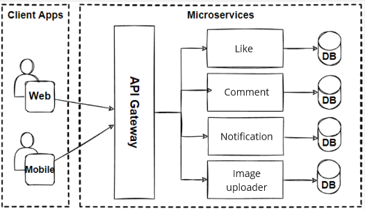
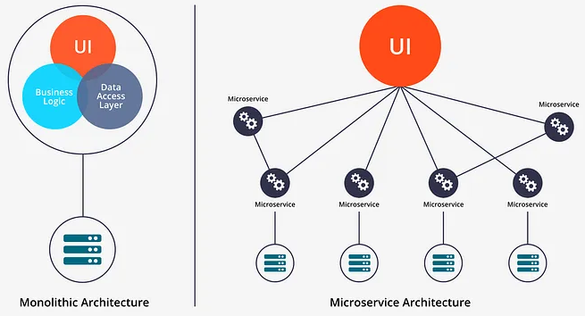

**Main Source :**

- **[What Are Microservices Really All About? (And When Not To Use It) - ByteByteGo](https://youtu.be/lTAcCNbJ7KE?si=9iNSTooup4bKqm5g)**
- **[Advantages and Disadvantages of Microservices Architecture by Joe Nemer - cloud academy](https://cloudacademy.com/blog/microservices-architecture-challenge-advantage-drawback/)**

While [monolithic](/backend-system/monolithic) architecture combine all the software component together, microservice architecture divide it into small component instead. **Microservice** is an architecture where the structure of application is broken down into small service called microservice, each with their own responsibility. Every component are loosely coupled and independent unlike monolithic architecture.

In a microservice architecture, each service is developed, deployed, and scaled independently of other services. This allows for greater flexibility, scalability, and ease of maintenance compared to traditional monolithic architectures. Each service can also be developed using different technologies and programming languages, as long as they can communicate.

A microservice architecture can be implemented in a social media app. The app is organized such that, the feature of the app is broken down as small as possible. For example, while posting a photo, there could be :

- Image upload service, responsible for handling user's image upload
- Image processing service, this one responsible for processing uploaded image
- Like service, handles the management of a like on a post, counting like's count, allowing user to like or unlike
- Comment service, manages the comment of a post such as adding comment, deleting comment, editing comment
- Notification service, the service that sends notification to the user's followers

They can communicate with each other using [messaging systems](/backend-system/message-broker) or using [RPC](/backend-system/rpc). The architecture uses [API gateway](/backend-system/apis-server-logic#api-gateway) as the single entry point to access any microservice, it is responsible to route client request to the appropriate service. Each microservice may have their own database. However, if they will likely share the same data, they can share the database together.

  
Source : https://medium.com/design-microservices-architecture-with-patterns/microservices-architecture-for-enterprise-large-scaled-application-825436c9a78a (with modification)

### Advantages & Disadvantages

Advantages :

- **Scalability** : Microservices allow independent scaling of different components of an application. Scaling heavyweight service won't affect lightweight service, thus allowing for efficient resource utilization.
- **Flexibility** : Different services can be developed using different programming languages, frameworks, and databases as long as they can communicate with each other.
- **Maintainability** : Complex application can be broken down into smaller and self-contained services. Each service can be developed, deployed, and maintained independently, making it easier to add new features, fix bugs, and perform updates without impacting the entire system.
- **Fault Isolation** : If one microservice were to break, the isolation characteristics of microservices will help to prevent impacting other service.
- **Team Development** : Different teams can work on different services easily, as each service should be independent. This allows for faster development cycles and easier team coordination.

Disadvantages :

- **Complexity** : Microservices still need to talk with each other, meaning they should be as general as possible to adapt with other service. The management of distributed systems, inter-service communication, and data consistency between services can be challenging.
- **Operational Overhead** : Each service will require separate deployment, monitoring, and infrastructure management. This can increase the complexity and cost of system operations.
- **Network Latency & Performance** : Microservices rely on inter-service communication, which introduces latency compared to in-process communication in monolithic architectures.
- **Testing & Debugging** : Ensuring all service to work correctly while also having external dependencies if they talk to other services can be quite challenging. Coordinating between each service's logs, events, and data across different services can be time-consuming (distributed debugging)

Overall, microservices architecture are suitable for complex application where each component need to be scaled independently, diverse development team, or frequent update for each component.

  
Source : https://medium.com/hengky-sanjaya-blog/monolith-vs-microservices-b3953650dfd
