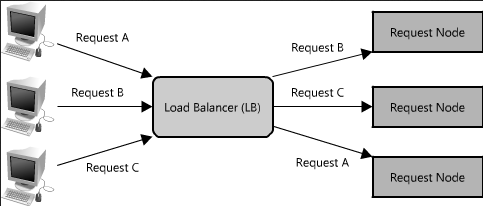
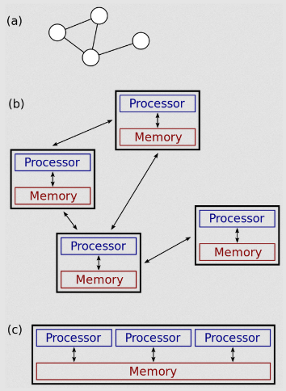
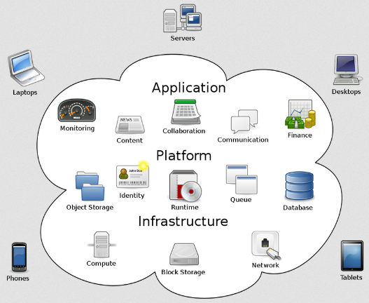

**Main Source :**

- **[Distributed computing - Wikipedia](https://en.wikipedia.org/wiki/Distributed_computing)**
- **[Cloud computing - Wikipedia](https://en.wikipedia.org/wiki/Cloud_computing)**

### Distributed System

**Distributed System** is a system that consist of a collection of interconnected computers (often called **nodes**) that coordinate and communicate to achieve a common goal. In a traditional centralized system, a single computer handles all tasks. On the other hand, distributed systems distribute the workload across multiple computers.

  
Source : https://aosabook.org/en/v2/distsys.html

:::tip
When discussing servers, distributed systems, or cloud computing, we will refer to the entity making a request as a **client**, and the one capable of processing it is called a **server**.
:::

#### Benefits

Benefits of distributed systems :

- **Performance** : A task or problem can be divided into many subtasks, which is assigned to each node in the distributed system. This is useful when the problem is large and can be decomposed into smaller parts. This approach is called **task partitioning** or **task parallelism**, in which one task is distributed to multiple nodes, making the overall execution faster.

- **Scalability** : Another way of distributing load is assigning one task only to one node, this is called **task distribution**. There are [various ways to assign task](/cloud-computing-and-distributed-systems/distributed-systems-communication#coordination) to each node, but the point is to distribute the workload evenly across the nodes. It's useful when dealing with large number of tasks, and each task do not require coordination or communication with other tasks (e.g., a web server serving webpages). This allows the system to be [scaled horizontally](/software-engineering/system-design#scalability), meaning we can increase the number of nodes in the system to scale the overall performance.

- **Fault Tolerance** : In a centralized system, a typical scenario involves a client sending a request to the server, and the server responds to it. However, if the system experiences a failure, it won't be able to respond to clients anymore. All clients relying on that centralized server would be affected.

  Distributed system has the ability to continue functioning properly even in the presence of faults, failures, or disruptions. If one node experiences failure, the system can transfer the load to another node. Furthermore, we can also replicate data across nodes so that if data is lost, we have a backup on other nodes.

#### Distributed vs Parallel System

A distributed system differs with parallel system. A parallel system computes a task by dividing it into smaller subtasks that can be executed simultaneously on multiple processing units (in essence, a node is processing unit). These processing units typically share memory and communicate with each other through shared memory.

On the other hand, a distributed system operates independently (i.e., they have separate memory), and communicate through dedicated [message passing](/cloud-computing-and-distributed-systems/distributed-systems-communication#message-passing) mechanism.

  
(a) and (b) are distributed system, while (c) is a parallel system  
Source : https://en.wikipedia.org/wiki/Distributed_computing#/media/File:Distributed-parallel.svg

### Cloud Computing

The widespread adoption of the internet and the increasing workload on servers created challenges for businesses in terms of managing and scaling their computing infrastructure.

**Cloud Computing** can be thought as a service, in which businesses can rent and utilize computing resources, such as virtual machines, storage, and networking, from dedicated providers known as cloud service providers. These providers specialize in managing and maintaining the underlying infrastructure, including hardware, networking, and data centers.

Their computers are dedicated to handle large workload, high computational tasks, and store huge amount of data. These computers are stored in a place called data centers and distributed across multiple locations. Cloud computing often relies on distributed system principle, it can be considered as an application of distributed system.

Components of cloud computing :

- **Infrastructure** : Infrastructure refers to the underlying hardware and software components. It includes computing powers, physical servers, storage devices, networking equipment, etc.
- **Platform** : Platform is the set of tools, services, and frameworks that developers use to build, deploy, and manage applications. It can be an operating system, development tools, runtime environments, and libraries. Different infrastructure or platform means different way of interacting with the system, the cloud platform will abstract away this issue and provides developers with a ready-to-use environment.
- **Application** : Application represents the actual software applications or services that run on the cloud infrastructure and platform layers. These applications can be custom-developed by developers that buy the service, or provided as pre-built software packages or services by the vendors.

    
  Source : https://en.wikipedia.org/wiki/Cloud_computing#/media/File:Cloud_computing.svg

#### Benefits

Benefits of cloud computing :

- **Cost Efficiency** : Some cloud services offer a payment method based on pay-as-you-go basis. This mean that users only pay for the resources they actually use, rather than making upfront investments in hardware and infrastructure.
- **Flexibility & Agility** : Developers can deploy their application on a server easily with cloud services. They don't need to set up or configure physical servers, as these are the concern of the cloud providers. Furthermore, developers can dynamically change and customize their infrastructure to suit the application needs.
- **Scalability** : Developers can easily scale up or down the resources allocated to their applications based on demand. For example, in weekend, the number of user visiting your website increase. Then, we can add more storage capacity or increase network bandwidth. Cloud providers also offer auto-scaling features that automatically adjust resources based on predefined rules or metrics.
- **Security** : Developers and users don't need to invest or be concerned in security. Cloud providers often have dedicated security teams and compliance certifications, ensuring that applications hosted in the cloud adhere to industry security standards.
