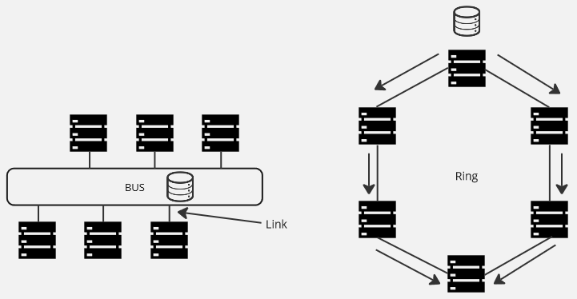
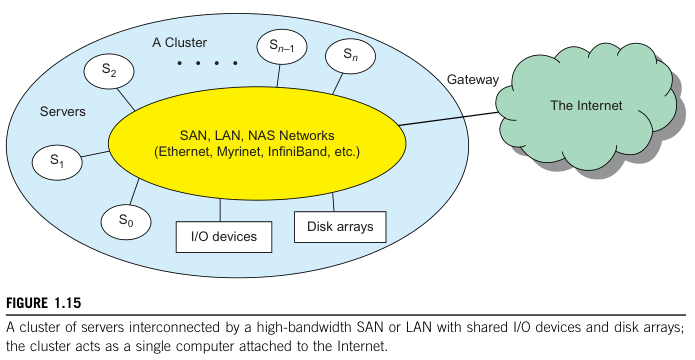
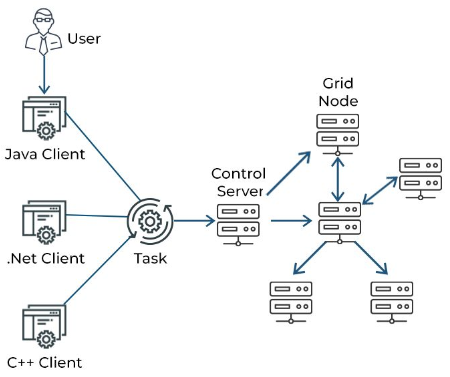

**Main Source :**

- **[Distributed Computing System Models - GeeksforGeeks](https://www.geeksforgeeks.org/distributed-computing-system-models/)**
- **[Distributed algorithm - Wikipedia](https://en.wikipedia.org/wiki/Distributed_algorithm)**
- **[Atomic commit - Wikipedia](https://en.wikipedia.org/wiki/Atomic_commit)**
- **[Consensus (computer science) - Wikipedia](<https://en.wikipedia.org/wiki/Consensus_(computer_science)>)**
- **[Paxos (computer science), Basic Paxos - Wikipedia](<https://en.wikipedia.org/wiki/Paxos_(computer_science)#Basic_Paxos>)**
- **[Leader election - Wikipedia](https://en.wikipedia.org/wiki/Leader_election)**
- **[Bully algorithm - Wikipedia](https://en.wikipedia.org/wiki/Bully_algorithm)**

### Terminology

- **Node** : Node is the individual computer or device that make up the distributed system. Each node has its own processing capabilities and can communicate with other nodes in the distributed system.
- **Link** : A link represent a communication channel or connection between nodes in a distributed system. It can be a physical link, which uses physical medium, such as [Ethernet cables](/computer-networking/ethernet), [fiber optic cables](/digital-signal-processing/signal-transmission-medium#guided-transmission), or [wireless communication](/computer-networking/wi-fi). Or a logical link, which is an abstraction or virtual representation of a communication channel.

  Types of links :

  - **Point-to-Point Links** : Direct communication channel between two nodes.
  - **Broadcast Links** : A channel for simultaneously sending a message to all other nodes connected to the link in the system.
  - **Multicast Links** : A channel for sending a message to a specific group of nodes. Multicast links operate concurrently, thus requiring a specific collision protocol, unlike broadcast links, which facilitate one-to-many communication.

- **Resource** : Resource is anything that is managed or utilized by nodes. It can be computational resources (e.g., processing units), network resources (e.g., [routers](/computer-networking/router), [switches](/computer-networking/switch)), or data resources, which are the data accessed and manipulated by nodes.
- **Topology** : The structure of computers connected together forms a [network topology](/computer-networking/network-topology). The network topology defines the physical or logical arrangement of the nodes and the communication links between them, which can have an impact on factors such as performance, fault tolerance, scalability, and communication patterns within the distributed system.

  For example, a bus topology, in which nodes are connected into a common communication channel can be beneficial for data sharing system. Each node can share data in the common bus. On the other hand, a ring topology, in which nodes are arranged in a ring-like structure may be inefficient, as the data must pass through all the intermediate nodes, causing delays and potential bottlenecks.

  

- **Network Partition** : Network partition is a phenomenon in which nodes are disconnected, making the overall network divided into multiple subnetworks due to a loss of connectivity. In fact, this is a common issues even in modern systems with many factors causing it, such as hardware failures, network congestion, or any other configuration errors. Network partition can impact the running application, such as reducing availability, as explained in [CAP theorem](/software-engineering/system-design#cap-theorem).
- **Types of Failures** : Apart from the general hardware, software, and network failure, other types of failures are follows.
  - **Crash Failures** : A component or process in a system abruptly stops or becomes unresponsive.
  - **Omission Failures** : A component fails to perform a required action or respond to a request, resulting a loss of information.
  - **Timing Failures** : Situations where components or processes in a system do not meet the expected timing requirements, leading to delays and other synchronization issues.
  - **Byzantine Failures** : Situations where components behave in unpredictable ways, such as providing incorrect information, giving conflicting responses, or intentionally attempting to disrupt the system's operation.

### Theoretical Model

We call each computer or device in the distributed systems as a node, in fact we can model a distributed systems as a [graph](/data-structures-and-algorithms/graph).

By modeling the distributed system as a graph, we can utilize graph theory as the foundational model for studying distributed systems. Graph-based models allow us to abstract complex systems and provide various properties and algorithms associated with graph theory.

For example, the network partition explained before can be thought as a [union find](/data-structures-and-algorithms/union-find) data structure, also known as disjoint-set data structure. We can consider each node as an element of set, and the partitions as disjoint sets.

Consider there are three nodes in the network, $1$, $2$, and $3$. Initially they are connected to each other, meaning they are in a common set $A = \{1, 2, 3\}$. When a partition occurs, a node will lose connection with the others, efficiently splitting the set into its own separate set. When the $3$ is partitioned, the set becomes $A = \{1, 2\}$ and $B = \{3\}$.

Let's say we wanted node $3$ to communicate with $1$. We can determine whether they can communicate using the find operation of union find on both nodes to find their respective root representatives.

#### Distributed Algorithms

There are more algorithms related to distributed systems that uses theoretical model under the hood (not limited to graph theory).

##### Concurrency Mechanism

See **[Concurrency Mechanism](/cloud-computing-and-distributed-systems/distributed-database#concurrency-mechanism)**.

##### Consensus

Consensus is a process of reaching agreement or a shared decision on a single value among a group of participants in a distributed system. By making decision, it can be anything from agreeing on specific  configurations, shared state, data value, order of operations, etc. A consensus algorithm must be fault-tolerant and capable of reaching a final decision even in the case of node failures.

Properties of consensus algorithms that must be satisfied :

- **Agreement** : All nodes in the system eventually agree on the same value or decision.
- **Validity** : The agreed-upon value or decision must be a valid option within the defined constraints.
- **Integrity** : No incorrect value should be agreed upon, even in the presence of malicious nodes.
- **Termination** : The consensus algorithm eventually reaches a final decision or value.

###### Paxos

One example of family of protocols for solving consensus is **Paxos**. The one we are discussing is the basic variant of Paxos.

Paxos achieves consistency across multiple nodes by informing them of a value and asking their agreement. The value is only accepted if a sufficient number of nodes agree on it.  It can be thought as candidate proposing and voters that vote the proposal.

It consists of the two phases, divided into another two subphases :

- **Phase 1 - Prepare (1a), Promise (1b)** : (1a): In this phase, a proposer (node) initiates the consensus process by sending a message of **prepare** to a majority of acceptors (nodes). The prepare request includes a proposal number, which uniquely identify the initial message and must be greater than any number used in any of the previous prepare message.

  (1b): Upon receiving the prepare request, each acceptor can make a **promise**. A promise can be made if the received proposal number is larger than the previously requested proposal. Upon promising, it will ignore subsequent proposal with lower number than the currently promised request. After that, the acceptor will return the promise message to the proposer. If an acceptor has accepted a proposal in the past, it must include the previous proposal number and the corresponding accepted value in its response to the proposer.

- **Phase 2 - Accept (2a), Accepted (2b)** : (2a): If the proposer receives promises from a majority of acceptors, it can proceed to the accept phase. The proposer sends an accept request to the same set of acceptors, including the proposal number and the value it wants to propose. If an acceptor receives an accept request and has not promised to ignore requests with lower proposal numbers (a node should promise in phase 1b), it accepts the proposal and broadcasts its acceptance to all nodes.

  (2b): Once the proposer receives acceptances from a majority of acceptors, the consensus is achieved, and the value is considered agreed upon.

Paxos can be designed synchronously with fixed voting time or asynchronously. Both approach tolerate potential node failures or message delays.

##### Leader Election

A leader or coordinator in a distributed system coordinates the activities of other nodes. This includes  allocating resources, distributing tasks, monitoring their workload, detecting other nodes failures, and sometimes routing messages or requests from other nodes to the appropriate destinations.

A leader may also fail, and the type of algorithm used to select a new leader among a group of nodes (also called processes) in a distributed system is called **leader election**.

A leader election algorithm must satisfy following conditions :

- **Agreement** : All processes know who the leader is.
- **Uniqueness** : Only one process can be elected, the rest should be non-elected.
- **Termination** : The algorithm should finish within a finite time once the leader is selected.

Depending on the network topology, size, communication mechanism, the algorithm may vary.

###### Bully Algorithm

One example of leader election algorithm is the bully algorithm. The idea is, a leader is chosen initially. The leader can stay as a leader as long as it does not fail. When the leader fail, a new leader will be chosen dynamically.

The algorithm assumes that :

- The system is synchronous that consist of processes that knows each other ID and address.
- A failure detector which detects failed process.
- Process may fail at any time, including during execution of algorithm.
- When a process fails, it should stop and returns from failing by restarting.
- Message delivery is reliable.

The algorithm :

1. Each process is assigned a unique identifier or process ID. The process with the highest ID is considered the highest-ranked process and assumes the role of the leader initially.
2. When a process detects that the leader is unresponsive or fails, it initiates an election by sending an election message to all processes with higher IDs.
3. Upon receiving an election message, a process with a higher ID responds with an _Alive_ message to acknowledge the election.
4. If a process *does not* receive any response after sending the election message, it assumes that it has the highest ID among the active processes and declares itself as the new leader. Otherwise, it sends no further message and wait for the next steps.
5. The newly elected leader should broadcast a coordinator (victory) message to inform all other processes of its leadership status.
6. If a process receives a coordinator message, it recognizes the new leader and updates its internal state accordingly.

### Physical Model

Physical model is the hardware and infrastructure components that make up the distributed system. It can be physical machines, server, network equipments, storage devices, or power and cooling systems.

Based on the organization, there are two paradigms of distributed computing :

- **Cluster computing** : Cluster computing consist of interconnected computers that work together as a single system called cluster. The nodes in a cluster are typically located in proximity to one another and are connected through a high-speed [local area network (LAN)](/computer-networking/lan-wan).

    
  Source : Book page 28

- **Grid computing** : Grid computing, on the other hand, focuses on the coordinated use of geographically dispersed and heterogeneous resources to solve complex problems or perform large-scale computations. It creates a virtual organization or virtual resource pool by connecting distributed resources over a network, often the internet.

    
  Source : https://www.spiceworks.com/tech/cloud/articles/what-is-grid-computing/

### Architectural Model

Architectural model describe the high-level design and structure of the system, including the arrangement and interaction of its components. Some of architectural model (see other notes) :

- [Client-Server](/cloud-computing-and-distributed-systems/client-server)
- [Event-Driven](/cloud-computing-and-distributed-systems/event-driven)
- [Master-Slave](/cloud-computing-and-distributed-systems/master-slave)
- [Peer-to-Peer](/cloud-computing-and-distributed-systems/peer-to-peer)
