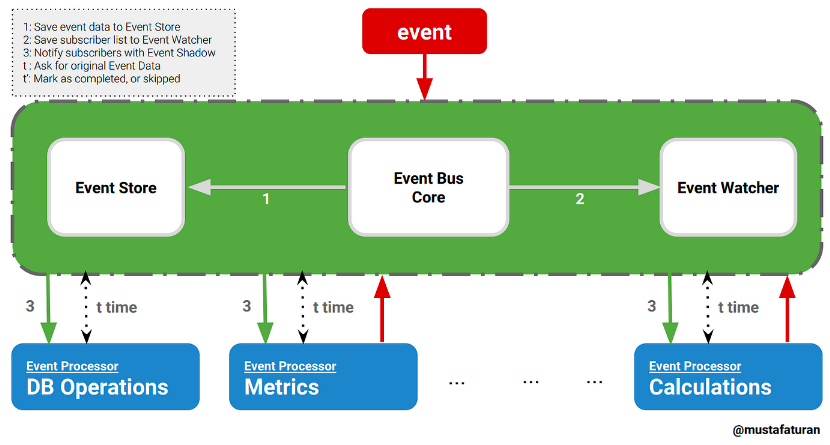
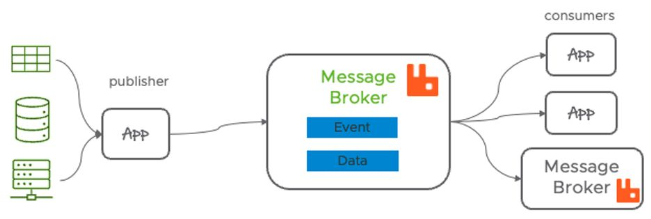

**Main Source:**

- **[Event-driven architecture — Wikipedia](https://en.wikipedia.org/wiki/Event-driven_architecture)**
- **[Previous notes on reactive programming](/computer-and-programming-fundamentals/concurrency#reactive-programming)**

**Event-Driven** is an architecture that structures an application or system around the production, detection, and consumption of events.

Flow of data and the triggering of actions are determined by **events**, which are essentially specific occurrences or changes in the system. Events are considered as notifications or signals.

Events can be generated by various sources such as user interactions, system processes, external systems, or even internal components. These events are typically asynchronous, meaning multiple events can happen at any time.

An example would be a user tapping a button, while at the same time a download has finished. The app should respond to the user tap, such as navigating the screen in the case of tapping a navigation button, and also notify the user that the download has been completed.

### Event Handling

The idea of event-driven architecture is, an entity in the system produces an event, and another entity handles it if necessary.

The entity responsible for generating an event is referred to as a **producer** (or **publisher**, **emitter**). The event is then broadcasted to the system. The entity interested in the event is known as a **consumer** and should **subscribe** to the specific producer to receive notifications whenever an event occurs. Once the event is received, the consumer will then **consume** it.

Broadcast of events are sent to **channel**, which is a medium for publishing and subscribing to events. It serves as a central hub where events are published by event producers and then delivered to the interested event consumers. Channel can be implemented in many ways, such as event bus or [message broker](/backend-system/message-broker).

  
Source: https://medium.com/elixirlabs/event-bus-implementation-s-d2854a9fafd5

  
Source: https://www.vmware.com/topics/glossary/content/message-brokers.html

The characteristics of event-driven architecture that decouple producer and consumer make it scalable. Event producers generate events without needing to know if there is someone interested in them. Consumers do not need to periodically check for the occurrence of events; instead, they can be notified about events they are interested in simply by subscribing to the producer.

:::tip
See also [reactive programming](/computer-and-programming-fundamentals/concurrency#reactive-programming).
:::

### Example

Event-driven architecture is typically used in GUI systems. A user interface has buttons which you can click to trigger some event. A theoretical GUI system that follows event-driven architecture would look like:

```kotlin
class ClickDetector {
    val subscribers = mutableListOf<Button>()

    fun addSubscriber(btn: Button) {
        subscribers.add(btn)
    }

    fun removeSubscriber(btn: Button) {
        subscribers.remove(btn)
    }

    fun didUserClick(): Boolean {
        return true
    }

    fun notifySubscribers() {
        for (subs in subscribers) {
            subs.click()
        }
    }
}
```

`ClickDetector` class is responsible for detecting click and notifying all the subscribers. The `didUserClick` is a simplified implementation of click detection.

```kotlin
class Button {
    private var listener: (() -> Unit)? = null

    fun setOnClickListener(listener: () -> Unit) {
        this.listener = listener
    }

    fun click() {
        listener?.invoke()
    }
}
```

The button class consist of `listener`, which is a lambda expression or function that is initially null. This mean initially button won't do anything if clicked. To actually set an action to do when a button is clicked, we provide the lambda and set it from the `setOnClickListener` method. The `click` method invoke the listener that we have set, which will be called from the `ClickDetector`.

Sample usage:

```kotlin
fun main() {
    val clickDetector = ClickDetector()

    val button = Button()
    button.setOnClickListener {
        println("Button clicked!")
    }
    clickDetector.addSubscriber(button)

    while (true) {
        if (clickDetector.didUserClick()) {
            clickDetector.notifySubscribers()
        }
    }
}
```

The action we set whenever a button is clicked is to print "Button clicked!". Again, this is a simplified implementation, the actual logic of `didUserClick` may involve asking mouse click from OS.

:::tip
See also [observer design pattern](/software-engineering/behavioral-patterns#observer).
:::
