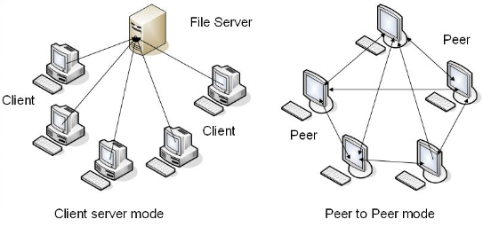
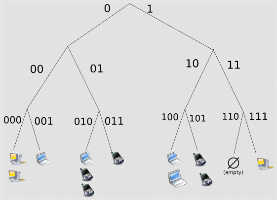
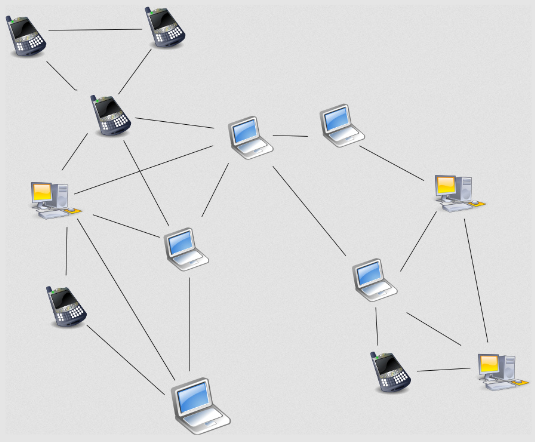

**Main Source :**

- **[Peer-to-peer - Wikipedia](https://en.wikipedia.org/wiki/Peer-to-peer)**
- **Book : Chapter 8 of Distributed and Cloud Computing - Kai Hwang**

**Peer-to-Peer (P2P)** is a decentralized architecture which participants, called **peers**, interact and collaborate with each other directly, without the need for a central server or authority. Each peer can act both as a client and a server, they can request resources, or even serving others request.

  
Source : https://www.researchgate.net/figure/Architecture-of-C-S-and-P2P_fig1_238638509

In contrast to [client-server architecture](/software-engineering/client-server), clients can only request to a single entity in the system.

- **Scalability** : It can be a bottleneck for the server in client-server architecture as the number of clients and the demand for services increase. P2P can more scalable, as the client itself can be the server.
- **Fault Tolerance** : In client-server architecture, if the server goes down or becomes unavailable, clients cannot access the services. P2P architecture is inherently more fault-tolerant, since there can be multiple peers and the failure of one or more peers does not lead to a complete system failure.
- **Flexibility in Resource Location** : In client-server architecture, clients are typically aware of and connected to a specific server. They depend on that server for their requests. In P2P architecture, clients have the flexibility to discover and connect with different peers in the network. They can choose the most appropriate peer based on factors like proximity, availability, or the specific resources or services they require.

:::info
Although client-server architecture can prevent some of these limitations by having multiple servers to handle requests in a balanced manner ([load balancing](/computer-networking/server#server-optimization)) or distribute the server around the world ([CDN](/computer-networking/server#server-optimization)).
:::

### Target & Challenge

Some target and challenge of P2P architecture :

- The lack of centralized server makes it harder to search for certain resources. We will need an efficient discovery algorithm to solve this.
- Need a method to connect peers based on proximity factors. It will be beneficial in terms of reducing bandwidth and time when we prioritize closer peers to share resources together.
- P2P architecture doesn't have consistent computation that can facilitate the network needs. Peers have autonomy and can join or leave the network based on their individual needs and interests. Such peers that don't contribute much to the network are often called as **free-riders**.
- While P2P architecture helps to reduce central computation, the computational capabilities of individual peers can vary. Not all peers in a P2P network will necessarily have strong computational power or resources that can accommodate computing needs.
- Since peers are typically ordinary users, they may be vulnerable to other malicious peers in the network when interacting directly. The system may implement trust system with metric such as reputation based on their past interactions and contributions.

### Architecture

The specific architecture of P2P define how peers are connected to each other. The network topology can be structured, unstructured, or hybrid.

- **Structured** : Peers are organized in a specific structured topology, using a [distributed hash table (DHT)](/cloud-computing-and-distributed-systems/distributed-systems-communication#distributed-hash-tables). Unique identifier is associated to each peer and resources or data onto the identifier space. So, when a peer are looking for particular resource, they will connect to specific peer that stores it.

    
   Source : https://en.wikipedia.org/wiki/Peer-to-peer#/media/File:Structured_(DHT)_peer-to-peer_network_diagram.png

- **Unstructured** : Peers connect to each other in a random or ad-hoc manner, without any specific organization or topology. Peers typically maintain a list of other peers they are aware of, forming a network of connections. This is suitable in the case of all peer own the same resources. If not, the search for resources spread through the network can be expensive, as it requires to find the resource in neighboring peers or by using random walks.

    
   Source : https://en.wikipedia.org/wiki/Peer-to-peer#/media/File:Unstructured_peer-to-peer_network_diagram.png

- **Hybrid** : Hybrid P2P networks combine elements of both structured and unstructured topologies to leverage their respective advantages.

### Network Model

In reality, app or services that uses P2P architecture is not always completely peer-to-peer. Some service that offers [file transfer protocol (FTP)](/computer-networking/ftp) may need a central server to store global information about file sharing.

Overall, there are three variants of P2P :

- **Pure P2P** : A fully P2P model where all peers are equivalent in terms of computation.
- **Centralized** : Centralized in a sense of not a complete [client-server](/cloud-computing-and-distributed-systems/), it may keep track global information to facilitate efficient search and discovery.
- **Hierarchical** : Some peers may be selected to be a _super node_ in the P2P network. It may coordinate or manage the lower-level peers. For example, a host in an online meeting app could keep track some useful meeting information. Super node often have more resources, higher processing power, or better connectivity compared to others.

### Routing

Routing determines the paths or routes through which data or messages can be transmitted between participating peers.

- **Centralized** : With a central server that keeps track global information, it can handle the routing and forwarding of the messages to the intended recipients.
- **DHT** : The use of DHT as explained in [structured architecture](#architecture).
- Three other methods in [computer networking routing](/computer-networking/routing#routing-technique).

### Usage

P2P architectures are used in various applications :

- **File Sharing** : Platforms such as BitTorrent, eMule, and Gnutella utilize P2P architectures to enable users to share files directly with each other, without relying on centralized servers.
- **[Content Delivery](/computer-networking/server#server-optimization)** : P2P architectures are also used in content delivery networks (CDNs) to distribute and deliver content efficiently. P2P CDNs are particularly useful for distributing large media files, software updates, and streaming video content.
- **Communication** : [Real-Time Communication (RTC) protocol](/computer-networking/rtc), such as [WebRTC](/computer-networking/rtc#webrtc) uses P2P architecture under the hood. However, they are not a complete P2P connection, as it relies on servers during the initial connection setup phase.
- **[Blockchain](/computer-security/blockchain)** : Blockchain networks, such as Bitcoin and Ethereum, are built upon P2P architectures. In these decentralized systems, peers (or nodes) maintain a distributed ledger, validate transactions, and reach consensus without relying on a central authority.
