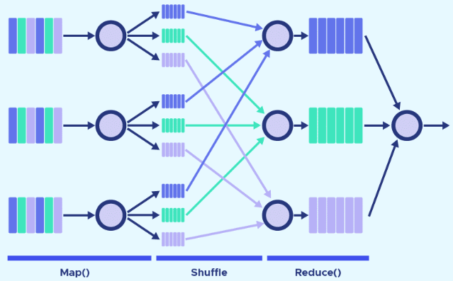

**Main Source :**

- **[MapReduce - Wikipedia](https://en.wikipedia.org/wiki/MapReduce)**

**MapReduce** is a programming model or framework designed for processing and analyzing large-scale data sets in parallel across a distributed cluster of computers. It is also used in Apache Hadoop framework.

### Map & Reduce

MapReduce is inspired from _map_ and _reduce_ from functional programming

- **Map** : A map operation applies a given function to each element of a collection and returns a new collection containing the transformed elements.

  A simple usage of map in Kotlin :

  ```kotlin
  fun main() {
      val numbers = listOf(1, 2, 3, 4, 5)
      val squaredNumbers = numbers.map { num -> num * num }
      println(squaredNumbers.joinToString()) // Output: 1, 4, 9, 16, 25
  }
  ```

  The given function is a lambda, which is defined inside the braces. It takes an input that we call `num`, and it will square that number to produce a result. This is done for each element in the collection.

- **Reduce or Fold** : A reduce combines the elements of a collection into a single value by repeatedly applying a binary function to pairs of elements. As a result, it reduces the collection to a single value.

  Another usage in Kotlin :

  ```Kotlin
  fun main() {
      val numbers = listOf(1, 2, 3, 4, 5)
      val accumulation = numbers.reduce { accumulatedSoFar, nextNum -> accumulatedSoFar + nextNum }
      println(accumulation) // Output: 15
  }
  ```

  The reduce function takes two parameters, the first being value accumulated so far (or initially), and the second being the value we are currently processing. At first, `accumulatedSoFar` will be 0 and `nextNum` is 1, next `accumulatedSoFar` will be 1 (because 0 + 1 = 1), and `nextNum` is 2. This is done until we reach the last element.

### MapReduce Operations

MapReduce system typically consist of three operations or steps :

1. **Map** : Each node in the distributed system owns a subset of data locally, which are possibly messy. Each data will be associated with a key-value pair, with the key being the unique identifier of the data, and the value is the actual data. A map function is applied to the data independently based on the keys and in parallel, producing an intermediate key-value pairs as output.
2. **Shuffle** : The intermediate key-value pairs are partitioned based on their keys and distributed across the cluster. This will make the data with a particular key all contained within the same node.
3. **Reduce** : The reduce function is applied to each unique key and its associated set of intermediate values. The reduce function aggregates, combines, or analyzes the intermediate values for each key and produces final output key-value pairs. The final output key-value pairs are collected and stored in the desired output location (or combined).

     
   Source : https://datascientest.com/en/mapreduce-how-to-use-it-for-big-data

### Benefits

- **Performance** : As emphasized before, MapReduce operation is done in parallel, dedicated to handle large data datasets and complex computations.
- **Scalability** : Allows for horizontal scale, increasing more machines to enhance the parallel processing.
- **Fault Tolerance** : Classic benefits of distributed system, when a node fails during processing, we can redistribute the work to other available nodes, ensuring fault tolerance and continuous execution.
