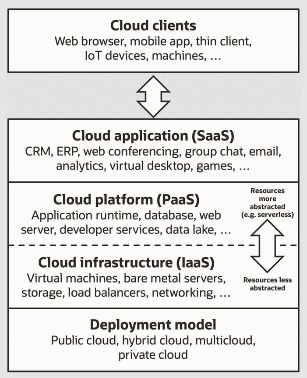

**Main Source:**

- **[Cloud computing, Service models — Wikipedia](https://en.wikipedia.org/wiki/Cloud_computing#Service_models)**
- **Various Google searches**

### Cloud Services Model

Cloud services model are the different types or categories of services that are offered by cloud computing providers. These models define the level of control and responsibility that the cloud provider and the customer have over various aspects of the cloud infrastructure, platforms, and applications.

#### Common Models

The standard and commonly used model of cloud service is classified into three:

- **Infrastructure as a Service (IaaS)**: In the IaaS model, the cloud provider offers [virtualized computing](/cloud-computing-and-distributed-systems/virtualization) resources such as virtual machines, storage, and networking infrastructure. Customers have control over the operating systems, applications, and data running on the infrastructure. They can manage and configure the virtual machines and storage according to their needs while the cloud provider is responsible for maintaining, as well as providing the abstraction for the users to interact with the underlying hardware and infrastructure. Example of IaaS: Amazon Web Services (AWS), Elastic Compute Cloud (EC2), Microsoft Azure, and Google Compute Engine (GCE).
- **Platform as a Service (PaaS)**: PaaS provides a higher level of abstraction compared to IaaS. In this model, the cloud provider offers a platform that includes the underlying infrastructure as well as development tools, runtime environments, and middleware. Customers can focus on building and deploying applications without worrying about managing the underlying infrastructure. The cloud provider takes care of the hardware, operating systems, and runtime environments, while the customer is responsible for developing and deploying their applications. Example of PaaS: Google App Engine and Heroku.
- **Software as a Service (SaaS)**: SaaS is the highest level of abstraction in the cloud services model. In this model, the cloud provider offers fully managed applications that are accessed over the internet. Customers can use the software applications without having to manage the underlying infrastructure, platform, or software stack. Example of SaaS: Gmail, Google Docs, and Zoom.

    
   Source: https://en.wikipedia.org/wiki/Cloud_computing#/media/File:Cloud_computing_service_models_(1).png

#### More Models

- **Function as a Service (FaaS)**: FaaS, also known as [serverless computing](/backend-system/serverless), is a model where developers can execute code in the cloud without having to manage the underlying infrastructure. The cloud provider takes care of the infrastructure provisioning and scaling, and developers only focus on writing and deploying functions or small pieces of code that are triggered by specific events or requests. Example of FaaS: Amazon's AWS Lambda, Google Cloud Functions, and Microsoft Azure Functions.
- **Container as a Service (CaaS)**: CaaS is a cloud service model that provides a platform for managing and orchestrating [containerized applications](/cloud-computing-and-distributed-systems/containerization). CaaS platforms provide runtime environments, handle containerization, deployment, orchestration, and scaling tasks. Example of CaaS: [Kubernetes](/cloud-computing-and-distributed-systems/docker-and-kubernetes#kubernetes) and Amazon Elastic Container Service (ECS).
- **Backend as a Service (BaaS)**: BaaS, also known as **Mobile Backend as a Service (MBaaS)**, is a cloud service model that provides a backend infrastructure and services specifically tailored for mobile and web application development. BaaS platforms offer pre-built features and functionalities, such as user authentication, data storage, push notifications, and social media integration. Example of BaaS: Firebase, AWS Amplify, and Backendless.
- **Disaster Recovery as a Service (DRaaS)**: DRaaS is a cloud service model that provides backup, replication, and recovery capabilities for applications and data in the event of a disaster or system failure. Example of DRaaS: AWS Backup and Microsoft Azure Site Recovery.

### Cloud Deployment Model

Cloud deployment model refer to the ways in which how cloud computing resources and services are made available to users. Some common models are:

- **Private**: Private cloud deployment involves the use of dedicated cloud infrastructure and services exclusively for a single organization. The infrastructure can be located on-premises within the organization's data center or hosted by a third-party provider. Private clouds offer more control, security, and customization options compared to public clouds, but they require significant upfront investment and ongoing maintenance.
- **Public**: Cloud resources and services are provided by a third-party cloud service provider and made available to the public over the internet. Public clouds allow for ease-of-use and cost-effectiveness option but may have limitations in terms of security, as the infrastructure and services are shared among multiple customers.
- **Hybrid**: Hybrid cloud combines the use of both public and private clouds. In a hybrid cloud, certain workloads and data are hosted in the private cloud, while others are deployed in the public cloud. Hybrid clouds may be used by organizations to achieve ease-of-use and cost-efficiency while maintaining control over sensitive data on their private cloud.
- **Community**: Community cloud deployment shares cloud services among multiple organizations or entities with similar interests or requirements. The infrastructure, resources, and services are provisioned and maintained for the exclusive use of a specific community of users, such as government agencies, educational institutions, healthcare organizations, or industry consortiums.
- **Multicloud**: Involve the use of multiple cloud vendors, which can reduce the risk of a single point of failure. When one provider experience failure, workloads can be shifted to another provider. Another benefit is to reduce dependency of cloud provider. When using specific cloud services, they might provide technologies, APIs, or services that we must follow. Switching to another provider becomes challenging and costly in this scenario.

    
  Source: https://www.interhyve.com/what-are-the-cloud-computing-deployment-models/
