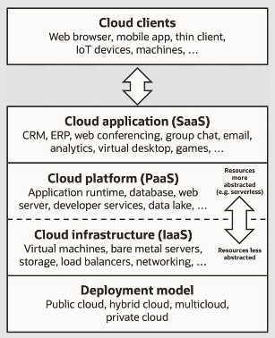

**Main Source :**

- **[Cloud computing, Service models - Wikipedia](https://en.wikipedia.org/wiki/Cloud_computing#Service_models)**
- **Various Google searches**

Cloud services model are the different types or categories of services that are offered by cloud computing providers. These models define the level of control and responsibility that the cloud provider and the customer have over various aspects of the cloud infrastructure, platforms, and applications.

### Common Models

The standard and commonly used model of cloud service is classified into three :

- **Infrastructure as a Service (IaaS)** : In the IaaS model, the cloud provider offers [virtualized computing](/cloud-computing-and-distributed-systems/virtualization) resources such as virtual machines, storage, and networking infrastructure. Customers have control over the operating systems, applications, and data running on the infrastructure. They can manage and configure the virtual machines and storage according to their needs while the cloud provider is responsible for maintaining, as well as providing the abstraction for the users to interact with the underlying hardware and infrastructure. Example of IaaS: Amazon Web Services (AWS), Elastic Compute Cloud (EC2), Microsoft Azure, and Google Compute Engine (GCE).
- **Platform as a Service (PaaS)** : PaaS provides a higher level of abstraction compared to IaaS. In this model, the cloud provider offers a platform that includes the underlying infrastructure as well as development tools, runtime environments, and middleware. Customers can focus on building and deploying applications without worrying about managing the underlying infrastructure. The cloud provider takes care of the hardware, operating systems, and runtime environments, while the customer is responsible for developing and deploying their applications. Example of PaaS: Google App Engine and Heroku.
- **Software as a Service (SaaS)** : SaaS is the highest level of abstraction in the cloud services model. In this model, the cloud provider offers fully managed applications that are accessed over the internet. Customers can use the software applications without having to manage the underlying infrastructure, platform, or software stack. Example of SaaS: Gmail, Google Docs, and Zoom.

    
   Source : https://en.wikipedia.org/wiki/Cloud_computing#/media/File:Cloud_computing_service_models_(1).png

### More Models

- **Function as a Service (FaaS)** : FaaS, also known as [serverless computing](/backend-development/serverless), is a model where developers can execute code in the cloud without having to manage the underlying infrastructure. The cloud provider takes care of the infrastructure provisioning and scaling, and developers only focus on writing and deploying functions or small pieces of code that are triggered by specific events or requests. Example of FaaS: Amazon's AWS Lambda, Google Cloud Functions, and Microsoft Azure Functions.
- **Container as a Service (CaaS)** : CaaS is a cloud service model that provides a platform for managing and orchestrating [containerized applications](/cloud-computing-and-distributed-systems/containerization). CaaS platforms provide runtime environments, handle containerization, deployment, orchestration, and scaling tasks. Example of CaaS: [Kubernetes](/cloud-computing-and-distributed-systems/docker-and-kubernetes#kubernetes) and Amazon Elastic Container Service (ECS).
- **Backend as a Service (BaaS)** : BaaS, also known as **Mobile Backend as a Service (MBaaS)**, is a cloud service model that provides a backend infrastructure and services specifically tailored for mobile and web application development. BaaS platforms offer pre-built features and functionalities, such as user authentication, data storage, push notifications, and social media integration. Example of BaaS: Firebase, AWS Amplify, and Backendless.
- **Disaster Recovery as a Service (DRaaS)** : DRaaS is a cloud service model that provides backup, replication, and recovery capabilities for applications and data in the event of a disaster or system failure. Example of DRaaS: AWS Backup and Microsoft Azure Site Recovery.
