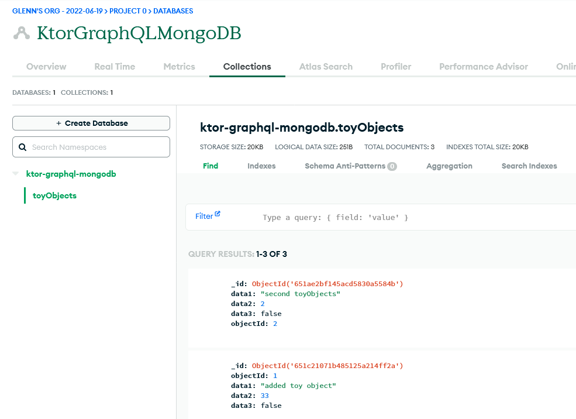

**Main Source :**

- **[Cloud database - Wikipedia](https://en.wikipedia.org/wiki/Cloud_database)**

Cloud Database is a database that runs on cloud computing platform and access is provided as-a-service.

Benefits :

- Similar to reasons of using other cloud services, cloud database help developer to reduce the cost and effort to develop and manage database.
- Cloud databases can easily scale up or down based on demand. Cloud service providers offer the ability to dynamically allocate resources, such as allocating more resources during high traffic time without the need for manual intervention.
- Cloud providers implements features like replication, failover mechanism, and disaster recovery.

### Deployment Models

The two methods to run database on the cloud :

- Cloud provider could provide cloud database by providing a service. The service that provide database as a service is called Database-as-a-service (DBaaS), and is a type of [SaaS](/cloud-computing-and-distributed-systems/cloud-models#common-models).
- Run database by using [virtual machine](/cloud-computing-and-distributed-systems/virtualization) image. The idea is, a pre-configured template that contains an operating system and any required software, including the database system is packaged into format called image. The format will be uploaded to the cloud service provider, where they will execute the image on a virtual machine.

### Usage

Upon deploying the database, user can now configure the service based on their needs. This involves selecting the infrastructure, as well as the location, selecting the desired database type or storage capacity, and selecting the number of database instances.

The database type correspond to how the data are stored within the cloud database. Typically, the data are classified into two model, [SQL database](/database-system/query-language#sql) and [NoSQL database](/database-system/nosql).

To actually use the database, we will use APIs provided by the cloud providers to access it. The APIs vary between provider, and it may use protocols like SQL for relational databases or [RESTful APIs](/backend-system/rest-api) for NoSQL databases.

#### Example

For example, below is how we can connect our application to a MongoDB database in Kotlin.

```kotlin
// Source : https://www.mongodb.com/docs/drivers/kotlin-sync/

import com.mongodb.ConnectionString
import com.mongodb.kotlin.client.sync.MongoClient
import com.mongodb.kotlin.client.sync.MongoDatabase
import com.mongodb.MongoClientSettings

// Replace the placeholder with your Atlas connection string
val uri = "<connection string>"

val settings = MongoClientSettings.builder()
   .applyConnectionString(ConnectionString(uri))
   .retryWrites(true)
   .build()

// Create a new client and connect to the server
val mongoClient = MongoClient.create(settings)
val database = mongoClient.getDatabase("test")
```

And then for the actual query, we can use code like this :

```kotlin
val collection = database.getCollection("myCollection")
val query = Document("name", "John Doe")
val result = collection.find(query)
for (document in result) {
    println(document)
}
```

Getting the collection using `getCollection` method passing in the collection name. A collection is similar to table, but it is not called so because MongoDB is a [document database](/database-system/nosql#document). In this case, we are trying to find specific document, that is someone with field `name` equal to "John Doe". The `find` method takes a query object (in this case, a Document object) that specifies the criteria for the search. It returns a cursor, which we can iterate over to access the retrieved documents.

Furthermore, some cloud provider provide a way to inspect and manage databases hosted on their platforms. We can see what collections and documents are available, monitor traffic, setting up access for security purposes, and adding or deleting a document directly from there is also possible.


