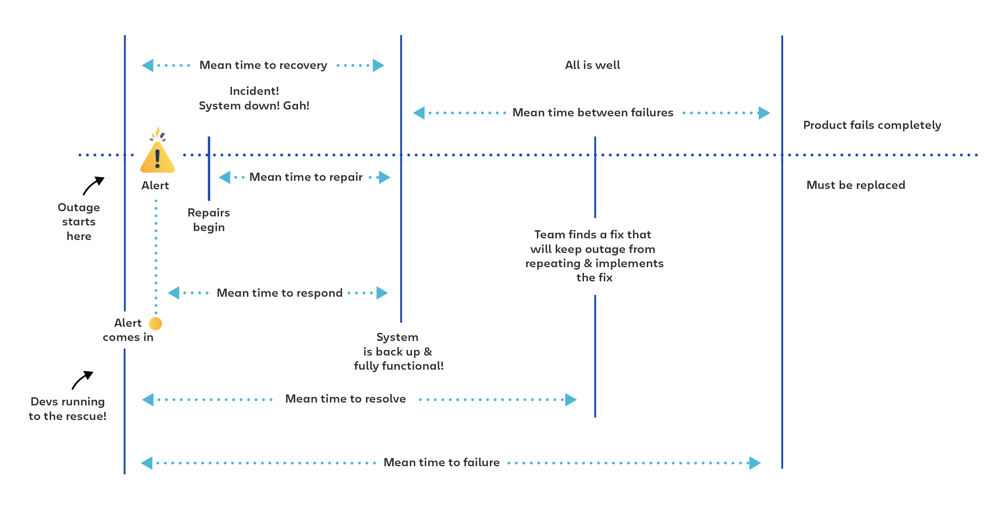

**Main Source :**

- **Various Google searches**
- **[The 25 Most Important Cloud Metrics For SaaS Companies To Monitor - CLOUDZERO](https://www.cloudzero.com/blog/cloud-metrics/)**
- **[MTBF, MTTR, MTTA, and MTTF - ATLASSIAN](https://www.atlassian.com/incident-management/kpis/common-metrics)**

### Terminology & Metrics

The quality of cloud computing services are measured by various metrics. Some common metrics are :

1. **Availability** : Refer to the ability of a system to remain operational and accessible to users.

   - **Uptime Percentage** : The percentage of time that the cloud service is available without interruptions or downtime within a specified timeframe (e.g., 99.9% uptime means the system is up 99.9% of the time).
   - **Mean Time Between Failures (MTBF)** : The average time between system failures.
   - **Mean Time to Repair (MTTR)** : The average time it takes to repair the system.
   - **Mean Time to Recover (MTTR)** : The average time it takes to restore service after a failure or outage.
   - **Mean Time to Resolve (MTTR)** : The average time to fully resolve a failure.

     
   Source : https://www.atlassian.com/incident-management/kpis/common-metrics

2. **Performance** : The speed, responsiveness, and efficiency of the system.

   - **Response Time** : The time it takes for the system to respond to a request or action.
   - **Throughput** : The rate at which the system can process or transfer data.
   - **Latency** : The time delay between a request and the corresponding response.
   - **Transactions Per Second (TPS)** : The number of transactions or operations the system can handle in a second.

3. **Scalability** : The ability of a system to handle increasing workloads and growing user demands.

   - **Vertical Scalability** : The ability to increase or decrease the resources (such as CPU, memory, storage) of a single instance or virtual machine.
   - **Horizontal Scalability** : The ability to add or remove instances or virtual machines to accommodate increased or decreased workload demands.
   - **Auto-Scaling Efficiency** : The effectiveness and efficiency of the auto-scaling mechanisms in responding to workload changes.

4. **Utilization** : The extent to which computing resources are used.

   - **CPU Utilization** : Measured as the percentage of time the CPU is actively executing instructions.
   - **Memory Utilization** : Can be measured by the percentage of available physical or virtual memory that is actively used by running processes or applications.
   - **Disk Utilization** : Measured by monitoring the I/O operations performed on the disk, such as the rate or the number of read or write requests.

5. **Compliance** : The degree of adherence of cloud providers.

   - **Regulatory Compliance** : The cloud provider's adherence to industry-specific regulations and standards, such as HIPAA, GDPR, or PCI DSS.
   - **Certifications** : The attainment of certifications such as ISO 27001 (information security management), SOC 2 (security and privacy controls), or FedRAMP (for government agencies) to demonstrate compliance with specific security and privacy frameworks.

### Pricing Model

Cloud providers offer some pricing model :

- **Pay-as-you-go** : Charges customer based on usage, typically on an hourly or per-minute basis. This model offers flexibility and cost-effectiveness as customers only pay for what they use.
- **Reserved Instances** :

### Configuration

### Examples of Cloud Services

#### Amazon Web Services

#### Google Cloud

#### Microsoft Azure
