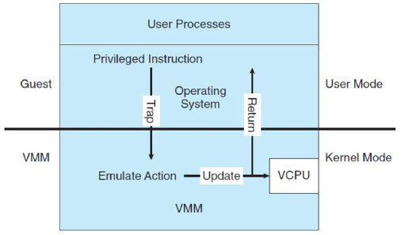
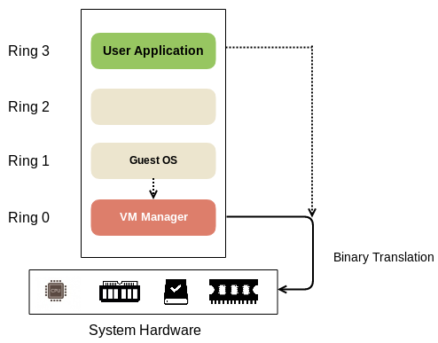

**Main Source :**

- **[Virtualization Explained - PowerCert](https://youtu.be/UBVVq-xz5i0?si=kHYnrYGPjpTsiqYv)**
- **[Virtual Machines vs Containers - PowerCert](https://youtu.be/eyNBf1sqdBQ?si=j4eCUEMDn42GwEpQ)**
- **[Levels of Virtualization Implementation in Cloud Computing - YourTechDiet](https://yourtechdiet.com/blogs/levels-of-virtualization-implementation-in-cloud-computing/)**
- **[Levels of Virtualization Implementation - BrainKart](https://www.brainkart.com/article/Levels-of-Virtualization-Implementation_11329/)**
- **[Virtualization - Wikipedia](https://en.wikipedia.org/wiki/Virtualization)**

**Virtualization** is the process of creating a virtual (rather than physical) version of something, such as an operating system, a server, a storage device, a network resource, or a software system. Virtualization emulates the functionality of a physical computer system by creating virtual machines (VMs) or virtual environments. Virtual machine (VM) has its own memory, CPU, storage, file system, configuration just like a physical machine.

The machine that runs virtualization is called **host** and the virtual machine it is running is called **guest**.

  
Source : https://www.techtarget.com/searchitoperations/definition/virtualization

### Hypervisor

**Hypervisor**, also known as **virtual machine manager (VMM)**, is the software that made virtualization possible that creates and manages virtual machine. In virtualization, it is possible that a single machine could run 3 different OSes and each of the OS run 3 different application which can't be run on other OS expect itself.

The primary use of hypervisor is to abstract and virtualize the physical hardware, presenting it to the virtual machines as if they were running on dedicated hardware. It provides a layer of software that sits between the physical hardware and the virtual machines, allowing the virtual machines to operate independently and securely.

There are two types of hypervisor :

- **Type 1 Hypervisor (Bare-Metal Hypervisor)** : This hypervisor runs directly on the host computer's hardware, without the need for an underlying operating system. Examples include VMware ESXi, Microsoft Hyper-V, and Citrix XenServer.
- **Type 2 Hypervisor (Hosted Hypervisor)** : This hypervisor runs on top of an existing operating system. Examples include VMware Workstation, Oracle VirtualBox, and Microsoft Virtual PC.

  
Source : https://superuser.com/questions/1553794/are-hardware-drivers-needed-to-be-installed-on-the-management-os-of-a-type-1-hyp

### Benefits of Virtualization

Virtualization has several benefits for individuals or data centers.

- **Improved hardware utilization** : Rather than having 3 machines to run 3 distinct operating system, virtualization allows us to utilize a single machine to run it all. This benefit make it possible to scale up the architecture. This mean we can boost the hardware capabilities of a single computer rather than having multiple computer with weaker hardware.
- **Testing in Development & Isolation** : Virtualization creates isolated test environments, allowing developers to test applications and configurations on different system without affecting the production environment. This can be useful for data center, where the computer is used to run multiple program.
- **Templating** : Related to development, templating is the process of creating a reusable template or image of a virtual machine, which is a file or collection of files that contains a complete representation of a virtual machine's operating system, software, configurations, and data. Having a reusable copy of a virtual machine allows us to quickly deploy multiple instances with the same configuration and software setup, which can be useful for computers in data center.
- **Snapshot** : While running a virtual machine, it is possible to capture the current state of a virtual machine (VM) at a specific point in time. By state, this includes the VM's disk and memory state. Taking a snapshot effectively allowing us to revert to that snapshot later if needed.

### Virtualization Level

Virtualization level is the level of how depth is virtualization implemented in an environment.

- **[Instruction Set Architecture Level (ISA)](/computer-organization-and-architecture/isa)** : This is the lowest level implementation that emulates the low-level operations that a processor can perform, such as arithmetic, logic, and memory operations.

- **Hardware Abstraction Level (HAL)** : This level implement the abstraction of hardware components to higher-level interface for software. It implements the device drivers and APIs that allow software to interact with hardware.

- **Operating System Level** : This level implement the [operating system (OS)](/operating-system). The OS manages system resources, provides services to applications, and facilitates communication between software and hardware. It includes components such as the kernel, file system, memory management, process management, and device drivers.

- **Library or API Level** : This level implements software libraries and frameworks that provide pre-built functions and modules to simplify application development.

- **Application Level** : Also known as **process-level virtualization**, this level focuses on virtualizing specific applications or software frameworks. It allows applications to run in isolated environments, separate from the underlying operating system and other applications.

    
   Source : https://www.brainkart.com/article/Levels-of-Virtualization-Implementation_11329/

#### Level Implementation

Virtualization can be implemented in four level :

- **Full Virtualization** : In full virtualization, the virtualization layer (hypervisor) provides complete hardware abstraction, it can run multiple virtual machines to run simultaneously on a single physical host. Each virtual machine operates as if it has its own dedicated hardware resources, including CPU, memory, storage, and network interfaces. Examples of full virtualization hypervisors are VMware ESXi and Microsoft Hyper-V.

- **Para-virtualization** : In full virtualization, the OS is not aware that it is running in a virtualized environment, **para-virtualization** instead modifies the guest operating system to be aware of the virtualization layer. The operating system and the hypervisor (or the virtualization layer) can communicate directly to perform tasks such as memory management and I/O operations.

- **Hardware-assisted Virtualization** : Hardware-assisted virtualization enables full virtualization with the help of hardware capabilities such as Intel VT-x or AMD-V. For example, the hardware may support for **nested page table (NPT)** memory management technique.

  The NPT is a technique that translates guest's virtual address to host physical address. When a virtual machine makes a memory access, it first consults the guest page tables to translate the virtual address to a guest physical address. Then, it looks up the guest physical address in the host page tables to obtain the corresponding host physical address.

  :::info
  More about [memory management](/operating-system/memory-management) and [virtual memory](/operating-system/memory-management#virtual-memory).
  :::

- **Operating System-level Virtualization/Containerization** : Operating system-level virtualization, also known as containerization, is a lightweight form of virtualization where the virtualization layer runs on a single host operating system. Instead of virtualizing an operating system, it creates multiple virtual machines (VMs) isolated in the OS. Each of the component is called **container**, and they share the host operating system's kernel, libraries, and other resources.

### Virtualization Implementation

Virtualization can be implemented using three technique explained below. Most of the technique uses the concept of **virtual CPU (vCPU)**.

vCPU is a virtualized representation of a physical CPU within a virtual machine. A physical CPU is supposed to execute instruction from program. When a virtual machine is assigned CPU resources, it doesn't mean it is given a portion of CPU, like a core.

Instead, the virtualization software manages the distribution of CPU resources among the VMs running on the host machine by creating a virtual CPU. The virtual CPU will be executed by the actual CPU, it will use [scheduling algorithms](/operating-system/process-management#scheduling-algorithms) to allocate CPU time to each VM.

#### Trap-and-Emulate

Computer system run in two modes, user and kernel mode. The user mode is run by user, it has restricted access to the system. The kernel mode is run by system, in which it has full control over system resources and can perform privileged operations.

Implementing virtualization will involve implementing the user and kernel mode for the guest machine. The **trap-and-emulate** technique is used in virtualization to handle privileged instructions executed by a guest operating system.

When a guest operating system attempts to execute a privileged instruction, it triggers a **trap**. The trap transfers control to the hypervisor, which emulates the behavior of the privileged instruction, performs the necessary operations, and then returns control to the guest operating system. This allows the guest operating system to run unmodified while still providing isolation and control to the hypervisor.

  
Source : https://slideplayer.com/slide/15680322/ (cropped)

#### Binary Translation

**Binary translation** is a technique to execute code compiled for one architecture on a different architecture. It is typically used in cases where virtualization is not feasible due to architectural differences. It is when the kernel mode operation on the guest machine is not possible to be executed on the hypervisor.

This technique involves dynamically translating the machine code of the guest operating system or application from the source architecture to the target architecture at runtime. The translated code is then executed on the target architecture, which can be directly within the host machine.

  
Source : https://www.oreilly.com/library/view/enterprise-cloud-security/9781788299558/e301e0ae-2518-4b8f-82c3-b073b4ee8732.xhtml

:::info
An example of a system that uses binary translation is QEMU, which is an emulator that emulates a computer's processor through dynamic binary translation.
:::
