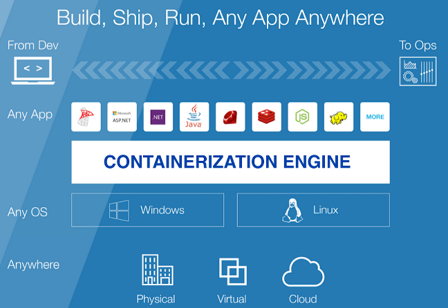

**Main Source :**

- **[Containers - Explained in 4 Minutes - Accelerate Rediscover In 4 Minutes](https://youtu.be/pR-cGS6IGvI?si=LOqZkrsmbzDJE7l9)**
- **[What Is Containerization? - AWS](https://aws.amazon.com/what-is/containerization/)**

### Containerization

During application development, developers often use various libraries and modules, each with its own dependencies, this can become complex as the app gets larger. The server will need all the required dependencies, including libraries, frameworks, runtime environments, packages, and operating system requirements in order to run the application, managing them can be challenging. Another conflict called **dependency conflict** may arise when different libraries require different versions of the same dependency. For example, library A may need version 2.0 of library C, while library B requires version 1.0.

**Containerization** is a technique used to bundle an application along with all its required packages into a single unit known as a **container**. A container is isolated and self-contained, which helps prevent dependency conflicts. All the necessary dependencies are specified within a **container image** (not an actual image file).

These containers are executed in isolated instances using a **container engine**. The container engine is responsible for managing and running containers on a system. It achieves this by leveraging virtualization techniques, where the container engine sits on top of the operating system (OS) and provides OS-level virtualization.

Multiple virtual machines (VMs) are created, with each VM associated with the dependencies of the application. These VMs are isolated, meaning each VM has its own file system, networking, and storage. The container engine will then interact with the OS to execute the libraries and application in the container.

  
Source : https://bito.ai/blog/containerization-a-beginners-guide-to-its-impact-on-software-development/

In summary, when an application has a lot of dependencies, they can be bundled together within a container. A container encapsulates all the necessary dependencies and runtime environment required for the application to run consistently across different environments. To manage and run containers, a container engine is used. The container engine, such as [Docker](/backend-development/docker-kubernetes#docker), utilizes virtualization techniques to create and manage isolated instances of containers on a host system. Inside the VM, the required dependencies are installed based on the specifications in the container image. The container engine interacts with the OS to facilitate the execution of libraries and applications within the container.

  
Source : https://medium.com/hackernoon/what-is-containerization-83ae53a709a6
