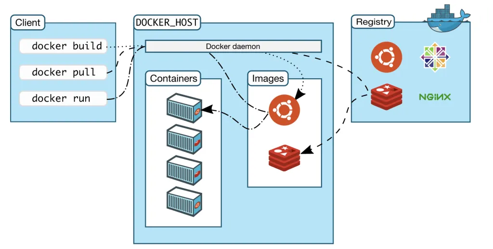
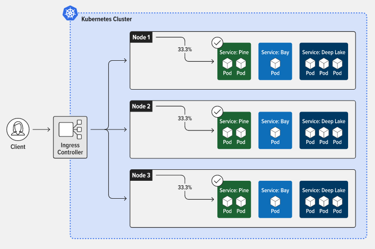

This is the same note as :

- [Web Development > Docker & Kubernetes](/web-development/docker-and-kubernetes)

**Main Source :**

- **[Wikipedia Docker (software)](<https://en.wikipedia.org/wiki/Docker_(software)>)**
- **[Wikipedia Kubernetes](https://en.wikipedia.org/wiki/Kubernetes)**

While developing a web app, developers uses various library, module and this creates a complex dependency. Running the web app in another machine such as server can have some issues, because the dependencies may not included in every server.

### Docker

**Docker** is a platform that allows developers to package their applications and dependencies so that it can be easily distributed and run on any system that supports Docker. Docker uses the idea of "containers" these are isolated environment of our code. Docker container is able to simulate a system that is able to run our application, this technology is called [**Virtualization**](/cloud-computing/virtualization).

A Docker container is made using a Docker images, the "images" doesn't refer to images we see everyday. An images is a set of instruction to build a container, images can be thought as a template of making container.

#### How containers are made :

- **Dockerfile** : A Dockerfile is a textfile that contains dependencies and configuration needed by the application. Dockerfile typically require a base image, this is a pre-built image that serves as the starting point for building a Docker container. It contains a minimal operating system and other basic components needed to run an application.

- **Build Command** : Docker provide a CLI to perform various operations, such as building Docker images, running Docker containers, and managing Docker networks and volumes. Once the Dockerfile is created, you can use the Docker CLI to build the image.

- **Image Registry** : Once the image is built, it can be stored in a registry, a registry can be thought as the repository for storing and distributing Docker images. There is also Docker Hub, which is a public repository for distributing many Docker images. For example there may be a Docker images that is able to run an app with some specific dependencies.

**Container Creation & Management** : A Docker container is created from a Docker image using the run command. The run command creates a container based on the image, and starts the container in a Docker environment. Once the container is running, you can use the Docker CLI to manage the container, such as starting, stopping, and deleting it.

  
Source : https://itnext.io/getting-started-with-docker-facts-you-should-know-d000e5815598

### Kubernetes

While Docker is used to build containerized applications, **Kubernetes**, on the other hand, is a platform that helps manage and automate the deployment, scaling, and management of containerized applications.

Kubernetes organizes containers into Pods, a smallest deployable unit in Kubernetes and can contain one or more containers. Containers within a Pod share the same network namespace and can communicate with each other.

One or more pods grouped together and run on a machine is called a **Node**. Node is responsible for running a Pods of container and provide resources like CPU and memory for the Pods running on it.

When there is a set of nodes that run containerized applications, these are called **Kubernetes cluster**. A cluster can be managed from a control plane which is the component that is used to manage the state of the cluster and provide the API interface for managing and deploying containerized applications.

#### Component of Control Plane

- **API Server** : The API server is the front-end for the Kubernetes control plane and provides a REST API for managing and deploying containerized applications. It processes REST API requests, validates them, and updates the etcd datastore with the desired state of the cluster.

- **etcd Datastore** : The etcd datastore is a distributed key-value store that stores the desired state of the Kubernetes cluster. It serves as the single source of truth for the cluster's configuration, state, and metadata.

- **Controller Manager** : The controller manager is responsible for managing the state of the cluster by running a set of controllers that watch the etcd datastore for changes and take actions to ensure that the actual state of the cluster matches the desired state. For example, the replication controller ensures that the desired number of replicas of a Pod are running, and the node controller monitors the health of Nodes and takes action if a Node becomes unhealthy.

- **Scheduler** : The scheduler is responsible for scheduling Pods to run on Nodes in the cluster based on factors like resource availability, node affinity, and anti-affinity. The scheduler selects the most suitable Node for each Pod and assigns it to that Node.

  
Source : https://www.nginx.com/resources/glossary/kubernetes/
