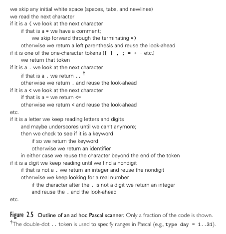

**Main Source :**

- **Book 1 chapter 3**
- **Book 2 chapter 2**

[This note on programming language theory](/compilers-and-programming-languages/syntax) discuss how syntax is specified. After writing source code in certain syntax, the next process is [parsing](/compilers-and-programming-languages/parsing). It is the process of analyzing if the structure of a sequence of symbols follows the rules of a formal grammar correctly.

Before parsing, a step called **scanning** occurs. This involves dividing the sequence of characters (e.g., source code) into meaningful units called **tokens**. Each token is then identified according to its category (e.g., keyword, identifier, literals), and parsing occurs afterwards.

:::info
Scanning is the first step in [compilation process](/compilers-and-programming-languages/cpl-fundamentals#compilation-process), while [parsing](/compilers-and-programming-languages/parsing) is the second step.
:::

The purpose of scanning is to reduce the input complexity by removing meaningless comments for the parser and eliminating whitespace (e.g., spaces, tabs, carriage returns, newlines), while only preserving the important tokens for the parser.

  
Source : Book 2 page 48

Above is the outline of scanner algorithm in Pascal programming language. Although it is from a specific language, the similar approach can be used for others. In general, the algorithm should ignore any white spaces. If it encounters unique symbols, it checks the symbol table if it is meaningful for the language. If some keywords are not from the language, it could be user-defined identifier, the compiler will also keep track of this.

The deterministic behavior of scanner can be described with a [finite automaton](/theory-of-computation-and-automata/finite-automata) like [DFA](/theory-of-computation-and-automata/finite-automata#dfa). Deterministic means the system will always know what to do when it encounters any input. The automaton starts with an initial state, then it transitions to other state depending on the symbol encountered. If it reaches a final state, it means it has recognized some token.

  
Source : Book 2 page 49

A typical behavior of scanner is :

1. If it is unnecessary characters like comments and white lines, ignore them.
2. If it is single character token, such as operator like `=`, `+`, `-`; literals, punctuations, save it as token.
3. With multiple character token, it should check the character right after it. For example, `>` and `>=` may be interpreted differently. The scanner must check if there is `=` right after it sees `>`, and interpret the token depending on the context.
4. If it is digit, keep saving it until the sequence ends. If it encounters token like `.`, it may indicate the start of a floating-point number literal instead of just integer.
5. If it is a letter, keep saving it until the sequence ends. If the string is a known keyword, then save it as a keyword token, else as an identifier token.

[Regular expression](/compilers-and-programming-languages/syntax#regular-expression) is used to define the lexical rules or patterns that a scanner should recognize. This is why earlier we mentioned that regular expressions are helpful in defining tokens, as they are used to specify the patterns that scanner recognizes.

Since a scanner reflects a finite automaton, creating a scanner specified with a regular expression involves converting the regular expression into an equivalent finite automaton. The regular expression is converted into an [NFA](/theory-of-computation-and-automata/finite-automata#nfa) first, then converted into a DFA. Optionally, we may [minimize the DFA](/theory-of-computation-and-automata/finite-automata#minimization) to reduce the number of states.

:::tip
See [regular expression to finite automata](/theory-of-computation-and-automata/regular-languages-part-2#regular-expression-to-finite-automata) for an abstract example.
:::

One way to make a scanner is through **scanner generator** (e.g., with a program called Lex). We specify our own regular expression, then the program take it and generate the scanner code in specific language. A scanner generator will generate the logic to tokenize the input source code based on the defined lexical rules. The generator may generate switch statement and nested loop to simulate an automaton behavior.

  
Source : Book 1 page 29-30

This is an example of using Flex to generate scanner. Flex takes a specification in `.flex` file to generate `yylex()` function, which acts as the scanner. We will need to create our own `main` function which actually call the `yylex`, and it will save encountered tokens in `yytext` file. The `token.h` header file specify available token that we can use in the scanner. During the build process, the scanner exist in distinct `.c` file and will be linked to create final executable.

Obviously, potential error will occur during scanning, this is called **lexical error**. It can arise from invalid characters, unrecognized character sequences, or violations of the language's lexical rules. The scanner may stop the scanning and report the error to user or ignoring the invalid token and continuing the scanning process.

Although using generator sounds easy and reduce efforts, making it manually is actually trivial. Furthermore, generator often doesn't provide helpful error message based on the actual context. Handwritten scanner allows for better control, customization, optimization, etc.
