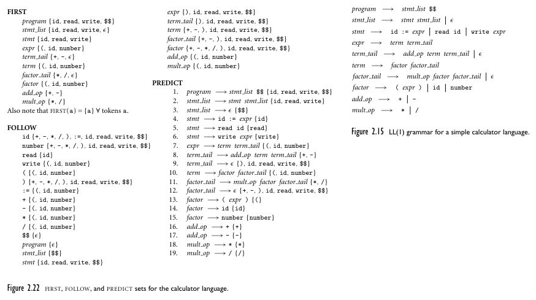
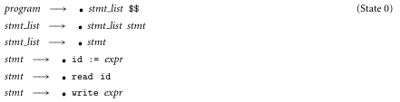

**Main Source :**

- **Book 1 chapter 4**
- **Book 2 chapter 2**
- **[Introduction to Parsers - Neso Academy](https://youtu.be/OIKL6wFjFOo?si=iRFE0__ImeaKu38n)**
- **[LL(1) Parsing - Neso Academy](https://youtu.be/clkHOgZUGWU?si=-z878_LOxoCrsdBP)**
- **[What is the difference between LALR and LR parsing? [duplicate] - stackoverflow](https://stackoverflow.com/questions/19663564/what-is-the-difference-between-lalr-and-lr-parsing)**

The parser takes sequence of tokens produced in the [previous step](/compilers-and-programming-languages/scanning). The objective of parser is to analyze whether source code (now in stream of token) is correct syntactically. Parser does this by finding out if it is possible to create a parse tree with given the input and the language grammar.

:::note
Recall that parse tree represent the hierarchical structure of how code is derived using various grammar's production rules. If a parse tree can be created without encountering any errors, it implies that the code is syntactically correct.
:::

### Parsing Example

  
 Source : Book 2 page 62

This is a grammar for a programming language to create a list (or array). Typically, a list is created by including the elements and then separating each of them with a comma, along with a semicolon and square brackets if the language requires it (e.g., `arr = [1, 2, 3, 4]`).

The grammar signifies a list with `id_list` rule. The rule describes that list must contain
some identifier `id` (terminal symbol), and an `id_list_tail` (non-terminal symbol). Because `id_list_tail` is a non-terminal, we must replace it. There appear to be two rules for `id_list_tail`, which are `id_list_tail → , id id_list_tail`, used to include more element for the list, and `id_list_tail → ;`, used to end the list.

This tail is often used to define grammar production rule. They are recursive non-terminals, which are used to generate potentially infinite sequences of symbols.

For instance, this is a valid derivation from `id_list` :

1. `id_list` → `A id_list_tail` (by `id_list → id id_list_tail`)
2. `A id_list_tail` → `A, B id_list_tail` (by `id_list_tail → , id id_list_tail`)
3. `A, B id_list_tail` → `A, B;` (by `id_list_tail → ;`)

Where `A` and `B` are identifiers. This results in the final list `A, B;`.

This particular derivation technique is called **top-down parsing**.

### Top-down Parsing

The top-down parsing generates parse tree starting from the language grammar. By starting from the grammar, it means that the parser analyzes the grammar rules to create the parse tree. This is in contrast with another technique called [bottom-up parsing](#bottom-up-parsing), where the parser create parse tree based on the tokens it encounters.

In the list example, the `id_list` is the start symbol for any derivation. The parser analyze how can `id_list` be derived (or replaced) according to the production rule of the grammar. Parser does this for all non-terminals it encounters during derivation.

  
Source : Book 2 page 63

This image illustrates the parse tree generation of input `A, B, C;`.

1. Starting from the `id_list`, it turns out that it can only be replaced with `id id_list_tail`. So, the parser will replace `id_list` with `id id_list_tail`.
2. We see that this production rule asks for an identifier. The parser assumes that the identifier exist in the input tokens. The `A`, being the first token in the input stream is assigned as the identifier.
3. The next step, `id_list_tail` is a non-terminal that we must replace. We see that there are two choices to replace. The first choice replaces it with another `id id_list_tail`. The parser will choose this if there's still token available. If not, then we should replace it to semicolon, ending the parse tree generation.

   In the input, we see there is a comma and `B`, so `id_list_tail` must not end yet. Then, parser chose to replace `id_list_tail` with `, id id_list_tail`, and assigning `B` as the `id`. This process continues until there are no more tokens, making only the possible rule `id_list_tail → ;`, which doesn't have anymore non-terminals.

:::note
Notice that the top-down approach somewhat predicts what will happen next. In other word, it predicts what most likely the code is going to be according to the grammar rules.
:::

It will scan through the input tokens as needed. When an unexpected situation occurs, such as the parser expecting a token but finding no more tokens available, it may raise a **syntax error**, indicating that the input is incorrect.

### Bottom-up Parsing

Bottom-up parser starts from the input instead of the grammar. The parser keeps track a token [stack](/data-structures-and-algorithms/stack), which will be used to store the symbols it has encountered so far.

  
Source : Book 2 page 63

Using the same input, `A, B, C;`.

1. It first encounters `A`, which is an identifier. We see that there are no direct rule that can replace an identifier. This mean the parser will just add the symbol to the stack.
2. Keeping on, it encounters `,`, `B`, `C`, and then a semicolon `;`.
3. After the semicolon, the parser recognizes that there exist a rule in the grammar, where a non-terminal is replaced with a semicolon. The rule is `id_list_tail → ;`. From this point, the parser starts building up the tree. It replaces the encountered semicolon with a non-terminal `id_list_tail`.

   Recall that the parser keeps track a token stack. Right now, the content of the stack will be something like `A, B, C;`. From the stack standpoint, the replacement is done by popping the `;`, then pushing `id_list_tail` onto the stack. The stack becomes `A, B, C id_list_tail`.

4. Going back to the stack, it now realizes another pattern. The two previous tokens are `C` and `,`. The parser recognizes that there exists a rule for this, which is the `id_list_tail → , id id_list_tail`, where `C` is the `id` and `id_list_tail` is what we just pushed before. The parser pops the last three symbols, and pushes another `id_list_tail`. The stack becomes `A, B id_list_tail`.
5. This process continues until the point identifier `A` is encountered without a comma, making the only possible rule is `id_list → id id_list_tail`. This leaves the stack with just `id_list`.

More regularly, the bottom-up parsing is also known as **shift-reduce parser**. It consists of two main actions, shifting and reducing.

- In shifting, the parser reads the next input token and shifts it (push) onto the parsing stack. The parser maintains the stack to keep track of the symbols it has seen.
- When a specific pattern of symbols on the top of the parsing stack matches the right-hand side of a production rule, the parser reduces (pop) and shifts (push) those symbols with the corresponding non-terminal symbol on the left-hand side of the production rule.

:::note
The objective of a bottom-up parser is to reach the starting symbol (root of the parse tree) by scanning through input tokens, effectively progressing from bottom to top. In contrast, a top-down parser starts from the starting symbol and continues expanding it until the full parse tree is constructed.
:::

#### Choice

Depending on the grammar, top-down or bottom-up parsing may or may not be efficient. In a large program with this list grammar, the bottom-up parsing can take up many spaces. This is because it keeps shifting tokens and will only reduce until a semicolon is reached. The conclusion is, grammar affects how parser performs.

  
Source : Book 2 page 64

The above is an optimized list grammar for bottom-up parser. It allows for bottom-up parser to reduce the space of stack if needed. It doesn't need to encounter a semicolon in order to reduce them. For instance, we may choose to reduce it in the middle of parsing.

  
Source : Book 2 page 65

However, this grammar can't be parsed top-down. When we have `id_list_prefix`, we can't be sure whether to replace it with `id` or another `id_list_prefix`. If we chose the first rule, we assume that there are multiples `id` ahead. If we chose the second rule, we assume that we are encountering the last `id`. Both are option which may not be valid in all cases. The former will potentially result in an infinite loop, while the latter potentially result in incorrect parsing.

This grammar is said to be **left-recursive**, because there is non-terminal that appears as the first symbol on the right-hand side. Top-down parsing is often implemented as recursive function (i.e., [recursive descent parser](#recursive-descent-parser)). Whenever the parser encounter a non-terminal on the left, it will call the particular recursive function to expand that non-terminal. The parser will continue to expand this indefinitely, without actually constructing the parse tree.

Surely we can implement a mechanism for the parser to check if it should stop expanding. The mechanism to stop expanding is also known as **lookahead token** and the particular top-down parser included with this mechanism is called [predictive parser](#predictive-parsing). However, the amount of lookahead token vary between input. We can't use a fixed number lookahead token for any input, which mean it may be infeasible considering other constraint like memory.

### Type of Parser

There are many types of parser. One way to categorize them is based on where it starts to derive.

- **LL (Left-to-right, Leftmost derivation)** : The top-down parsers are also known as LL parsers. It reads the input from left-to-right and derive starting from the leftmost non-terminals.

  LL parsers parses LL grammar, which we need :

  1. Remove [ambiguity](/theory-of-computation-and-automata/context-free-grammar#ambiguity), we can modify the grammar by either rephrasing the production rules or introducing additional non-terminals.
  2. Eliminate [left-recursion](#choice) by introducing new non-terminals. One example is shown at [Greibach Normal Form step 5](/theory-of-computation-and-automata/context-free-grammar#greibach-normal-form).
  3. Eliminate common left prefixes, in which multiple production rules has common sequence of symbols, such as :

     ```
     A -> abcX
     A -> abdY
     A -> abeZ
     ```

     We can factor out the common prefixes into separate production rules.

- **LR (Left-to-right, Rightmost derivation)** : Bottom-up parsers are known as LR parsers. Similar to LL, it reads the input from left-to-right, but instead derives the rightmost non-terminal, resulting in the construction of the parse tree bottom-up.

With **lookahead token**, the parser keep information about the next token or input symbol in the input stream used to make better parsing decisions.

The number of lookahead token is denoted with number and parenthesis after the parser type. For example, LL(0), LL(1), LL(k) refers to LL parser with 0, 1, and k many lookahead tokens. As the value of lookahead token increases, the complexity of the parsing algorithm also increases exponentially. Even the single lookahead token in LR(1) makes it significantly larger than LR(0).

:::note
The grammar needs to be adapted with different type of parser, including different numbers of lookahead token.
:::

### More Detail

#### Recursive Descent Parser

Recursive descent is the **top-down parsing** technique that works by recursively applying production rules of a grammar to parse an input string. Recursive descent parsers can be handwritten for a relatively simple language.

This technique works by associating each non-terminal in the grammar with a function that handles them individually based on every possible production rule.

  
Source : Book 2 page 66

This is an LL(1) grammar for a calculator language, below are the pseudocode for each of the function.

:::note
"$$" is an end symbol.
:::

  
Source : Book 2 page 67, 68

And the input program as well as its top-down parse tree. The $\epsilon$ denotes an empty string.

  
Source : Book 2 page 66, 69

Similar to the [list example in top-down parsing](#top-down-parsing), it predicts which production rule to use to replace certain non-terminals based on the input stream. Initially, it chooses to replace `stmt_list` with `stmt stmt_list` rather than an empty string because it sees an input ahead. Then, `stmt` is replaced with `read id` because it encounters `read` and an `id`. The behavior of this parser, which observes the next input, is what makes it an LL(1) parser, as it considers the next token count as one lookahead token.

After parse tree is constructed, it is implied that the input is syntactically correct. The parser can save important information for the next compilation step. The information of parse tree can be represented as node-link data structure such as [graph](/data-structures-and-algorithms/graph), [linked list](/data-structures-and-algorithms/linked-list), or [tree](/data-structures-and-algorithms/tree).

:::info
Sometimes parser doesn't create full parse tree explicitly, it may create an abstract syntax tree, which is the simpler version of parse tree that omits certain nodes and details that are not relevant to the syntax analysis.
:::

#### Predictive Parsing

Predictive parsing is another **top-down parsing** technique that uses a **parsing table** to guide the parsing process. The parser predicts the next production rule to apply by consulting the parsing table based on the current input symbol and the top of the parsing stack.

The parser maintains an explicit stack (rather than a recursion call stack) to keep track of the non-terminals and terminals encountered so far. The stack initially contains the start symbol of the grammar.

The parser will generate three sets that provide information about the grammar. These will be used for prediction and error recovery. The three sets are :

- **First** : First set of a non-terminal contains the possible first (starting) symbols that can appear when we use a particular non-terminal in a production rule.
- **Follow** : Follow set of a non-terminal contains the possible terminals that can appear immediately after occurrences of that non-terminal in the grammar.
- **Predict** : Union or combination of first and follow set.

  
Source : Book 2 page 75

For example, the first, follow, and predict set of the previous calculator language is above.

- The first set of `stmt`, typically denoted as `FIRST(stmt)` contains `id`, `read`, and `write`. This is because they are the first symbol that appears in every production rule of `stmt`.
- The follow set of `stmt`, `FOLLOW(stmt)` contains `id`, `read`, `write`, and `$$`. This is because `id`, `read`, `write` appear first, and they are also terminals. When there are no terminals in the production rule, `$$` or end marker is included in the set.

Afterwards, parsing table will be constructed. Typically, it is represented as a two-dimensional table (or data structure) with rows corresponding to non-terminals and columns corresponding to terminals.

  
Source : Book 2 page 72

The table is constructed by assigning certain production rules of non-terminals to each of their terminals in the first or follow set. For example, the predict set of `program` contains terminals like `id`, `read`, `write`, and `$$`. Then, all the associated cell on the table, such as (program, id), (program, read), (program, write), and (program, \$\$), are assigned the production rule for `program`, that is `program → stmt_list $$`.

Now, the parser can just look at the table given the non-terminal and current input token (also called lookahead token) to choose which action to take. For constructing the parse tree and saving the information, the parser may use additional data structure such as tree.

The action can be one of the following:

- **Predict** : If the table entry specifies the number of production rule, the parser applies the rule by replacing the non-terminal on top of the stack with the right-hand side of the production rule. For example, if `program` is on top of the stack, and current input token is `id`, then the rule `program → stmt_list $$` is applied. This is done by popping the left-hand side (`program`) and pushing the right-hand side of the rule (`stmt_list $$`).
- **Match** : Match happens when the topmost symbol on the stack matches the current input token. This indicates the parse tree we are constructing doesn't have children. In other word, we won't expand the particular symbol on the parse tree, the branch ends there.
- **Error** : If the table entry is empty or undefined (denoted by `-` on the image), the parser detects an error and takes appropriate error recovery actions, such as error reporting or error synchronization. We don't say the parser simply halts and returns an error to the user, because it is possible that the parser catches more errors that need to be reported as well.

##### Another Example

  
Source : https://youtu.be/clkHOgZUGWU?si=gEQ3mf3ZhNwzNQsC&t=467 (modified)

The above image is a help for visualization from a video example. Starting from the start symbol `S` that act as the root of the tree, the grammar rule is `S → aABb`. The tree is created with four branches from the right-hand side of the rule. The symbols from the right-hand side of the rule is also pushed into the stack (the stack is `$bBAa`, with `$` acting as the boundary element of the stack).

At some point, the current input symbol and the topmost symbol on the stack matches, that is when _match_ action occurs. The `a` symbol in the input matches the topmost stack symbol. When _match_ action occur, we stop expanding the branch and designate it as a leaf node. Also, `a` symbol is popped from the stack.

On the next step, `A` is topmost symbol on the stack, and `d` is our current token. Because they don't match, the action _predict_ occur, and we should consult the table. Turns out the table want us to replace the `A` with `ε`. On the constructed tree, this indicates we have to expand a branch.

The end result of this parsing is the constructed parse tree. All the leaf nodes, if combined, will resemble the input stream.

:::note
In summary, the parsing table in predictive parsing helps us to know which rule to use to replace certain non-terminal in order to create the parse tree.
:::

#### LR Parsers

For review, bottom-up parser adds tokens to the stack until it recognizes a production rule, and then constructs the tree. The parser incrementally constructs the tree and joins them together.

  
Source : Book 2 page 81

Mostly, bottom-up parser uses a parsing table for parsing. Below are the modified calculator grammar for LR(1) parser, as well as the input program.

  
Source : Book 2 page 82

If top-down parsing creates a table and consults it to decide what to do based on the non-terminal on top of the stack and input token, a bottom-up parser instead consults the table based on the current input token and a **parser state**. The parser state is actually determined by the configuration of the stack.

There are two actions : **shift and reduce**. Shift pushes current input token on the stack, while reduce applies a production rule by popping the part of symbols on the right-hand side of the rule and replacing them (by pushing it onto the stack) with the non-terminal symbol on the left-hand side of the rule. After shifting or reducing happens, the state may also be updated accordingly.

This process continues until the entire input sentence is recognized, that is when _accept_ action is encountered on the table. Error that indicates a parsing error or a syntactical mistake in the input string may also occur.

##### LR Parsing Table

The steps to make parsing table is below. We will make the table from the given grammar above and a concrete example.

  
Source : Book 2 page 83

The parsing process starts from an empty stack, and from the starting symbol `program`. The `program` rule is `program → stmt_list $$`. We typically denote the parsing progress within a rule with a dot `.` on the right-hand side of the production rule. We call anything that is indicated with dot, or currently being processed as **LR item**. Any symbol beyond the dot is considered as the lookahead token, which the parser expects to see next in the input in order to continue parsing.

Currently, we only have a single LR item in our list. The list is nothing but all the possible parsing configurations or states. If we encounter a non-terminal in the right-hand side of the production rule, the rule should be added to the list. We will keep adding LR item to the list until no more LR item can be added, that is when a terminal is encountered.

In the example, we encountered the non-terminal `stmt_list` from the `program`. The `stmt_list` has two rules that replaces to `stmt_list stmt` or `stmt`. So, we will add both of the rule to the list. Our list now :

  
Source : Book 2 page 83

Then, the `stmt_list` has another non-terminal `stmt`, it can either be replaced into `id := expr`, `read id`, and `write expr`. Once again, add these to our list.

  
Source : Book 2 page 83, 84

Now that we don't encounter non-terminal anymore, we can stop adding item to the list.

The parser can now consumes input tokens. Based on the program on [top](#lr-parsers), the parser encounters `read`. When we encounter a terminal, we have to shift a token (i.e., push `read` to stack) and similarly, move the dot (now becomes `stmt → read . id`). Continuing, parser will consume the token `A`. It will be shifted and the dot is also moved.

  
Source : Book 2 page 84

When dot reaches the end of the production rule, this indicates that the entire right-hand side of the production rule has been successfully matched, thus we have to reduce it. This will involve popping the two symbol (`read` and `id`), and then replacing them with the left-hand side symbol `stmt`.

Since `stmt` is reduced, the dot on rule `stmt_list → . stmt` has to be moved.

  
Source : Book 2 page 84

The dot on `stmt_list → stmt .` is at the end, so we have to reduce it again. We will pop `stmt`, and replace it with the left-hand side of the rule, `stmt_list`.

  
Source : Book 2 page 84

All of this will change the state of `program` earlier. One `stmt_list` is now gone since it has just been reduced. The reduction of `stmt_list` will cause the other `stmt_list` dot to be advanced (from `stmt_list → . stmt_list stmt` to `stmt_list → stmt_list . stmt`).

Token is still available in the input, so the parser will consume another token from the input (the next is `read B`). This will be repeated until we have reached the end of the input.

:::note
The parsing pattern is like :

- Read tokens until the dot is on the rightmost side.
- Once the dot is on the rightmost side, we reduce the left-hand side of the production rule.
- By reducing, we update the other rules by moving the dot whenever the symbol immediately following the dot is the one we just reduced. For instance, if we reduced `stmt`, we move the dot if the next symbol after the dot is `stmt`. For example, in `stmt_list → . stmt_list stmt`, we do not move the dot because the symbol after the dot is `stmt_list`, which is not the one we reduced.
  :::

Notice that sometimes we will encounter the similar state. In other word, if we encounter `read` again, the dot on `stmt → read id` will goes from the start to the end again. Then, we will reduce again similar to the previous state. The dots all over the production rule represent the states of the LR parser's parse stack.

The state behavioral of bottom-up parsing makes it depict a [finite automaton](/theory-of-computation-and-automata/finite-automata), it's called **Characteristics Finite State Machine (CSFM)**. This is same for any LR parser, such as SLR and LALR.

For each different state encountered (i.e., the position of the dot on the stack), we can assign them numbers.

  
Source : Book 2 page 83

For example, when all the dot position are like above, it is considered as state 0. State 0 typically represent the starting point of the parsing before any input is encountered. The dot will all be in the beginning.

The table is populated as more input is encountered. For example, because `read` is first encountered, we number it as the state 1. The dot position will be `stmt → read . id`, where the remaining is the same as state 0.

  
Source : Book 2 page 83, 84

In the bottom-up grammar, we did a little modification in the `stmt_list` rule, from `stmt_list → stmt_list stmt | ` to `stmt_list → stmt_list stmt | stmt` (see [this](#recursive-descent-parser)). We will change it back to the previous rule.

  
Source : Book 2 page 86

The full state machine included with all the stack's state should look like below.

  
Source : Book 2 page 89

Then, this is the table representation.

  
Source : Book 2 page 89

- `s2` indicates shifting and move to state 2.
- `r7` indicates reduce and move to state 7.
- `b3` indicates shift, reduce, and move to state 3.
- `-` indicates a syntax error.

:::tip
In LR parsing, there are terms called action and goto tables. The table above shows the action table, which tells parser what to do when encountering specific state and input token. The goto table, representing on which state to transition next after reduction, is not shown.
:::

:::info
In this table we are considering only the one token next, that is the current input symbol. With more lookahead token being used, the table is expanded to include all the possibility. This expansion results in more states in the LR parsing automaton.
:::

##### Bottom-up Algorithm

With the constructed table, we can now look at it every time we parse a program. The general process of bottom-up parsing of LR parser :

1. The parser starts with an empty stack and the input sentence to be parsed. The initial state of the parser, usually denoted as state 0, is pushed onto the stack.
2. The parser reads the next input symbol/token from the input sentence. Based on the current state of the parser and the input symbol, the parser consults the parsing table. If the parsing table entry indicates a "shift" action, the input symbol is pushed onto the stack, and the parser transitions to the state indicated in the entry. The process of shifting continues as long as there are input symbols remaining.
3. When the parser encounters a point where a reduction is possible, it checks the parsing table entry for the current state and input symbol. If the parsing table entry indicates a "reduce" action, the parser applies the corresponding production rule. The parser pops the symbols on the right-hand side of the production rule from the stack and replaces them with the non-terminal symbol on the left-hand side of the rule. After the reduction, the parser consults the parsing table again, using the non-terminal symbol on top of the stack and the current state to determine the next action.
4. If, after applying a reduction, the parsing table entry indicates an "accept" action, the parsing process is complete.

##### Conflict

When consulting the table, two conflict situations may happen. In the visualization of automaton, conflict occur when there are two transition arrows, making the automaton nondeterministic.

1. **Shift-Reduce conflict** : It is when a cell in the table has both shift and reduce action. The parser could either shift the current input symbol onto the stack or reduce a portion of the stack using a production rule. We can resolve this conflict by modifying the table based on some precedence or associativity rule defined for the conflicting grammar symbols.
2. **Reduce-Reduce conflict** : This is when multiple reduce are encountered on the table cell. It is when there are multiple production rule to be applied for the same non-terminal at a particular point of the parsing process. This will occur when the grammar is ambiguous. So, one way to resolve this conflict is by applying a grammar modification to eliminate the ambiguity.

### Parser Classification

We can now classify different types of parsers.

  
Source : https://youtu.be/OIKL6wFjFOo?si=1JD7d0vdyh7BR5hA&t=775

- **Top-down Parsers** : Also known as LL parsers, they are classified into with and without backtracking. With backtracking, the parser follows the grammar rules until they encounter issues, such as when the grammar is ambiguous. In such cases, the parser may need to backtrack, i.e., undo certain decisions and try alternative paths to resolve the ambiguity or find a valid parse.

  - **Brute forcing** : This is not covered, but this approach is straightforward. The idea is, the parser will generate all the possible parse tree from a particular grammar. It then checks if any of the parse tree produce the same language as the input program.
  - **Recursive Descent Parsers** : A top-down approach without [backtracking](/data-structures-and-algorithms/backtracking), where each non-terminal is associated with a recursive function that expands all production rule according to the next input token.
  - **Predictive Parsers** : It is recursive descent parser without backtracking. They incorporate lookahead tokens and use a sophisticated parsing table to consult what action to take next when constructing the parse tree.

- **Bottom-up Parsers** : Typically more powerful than top-down parser, but also more complex and harder to write by hand.

  - **Operator Precedence Parsers** : This is not covered. The technique basically assigns precedence levels to operators and use these levels to guide the parsing process. Based on the precedence comparison, the parser determines whether to shift the operator onto the stack or reduce previously encountered operators.

        
        Source : https://www.slideserve.com/yael/bottom-up-parsing

  - **LR** : Also known as **CLR (canonical LR)**, they are a bottom-up parser that uses parse table from the CFSM automaton. LR(1) is larger than LR(0) due to incorporating a lookahead token. LR(1) has more state, due to each state included with different lookahead information.
  - **SLR (Simple LR)** : LR(0) can suffers from conflicts, SLR resolve it by using FOLLOW set to distinguish between shift and reduce actions during the dotting process.
  - **LALR (Look-Ahead LR)** : LALR(1) is more powerful than LR(0), but less than LR(1). It simplifies automaton of LR(1) such that the size is close to automaton of LR(0), but still included with lookahead information.

The strength of each parser can somewhat be described as follows: $\text{LL}(1) < \text{SLR} < \text{LALR} < \text{LR}(1)$. We can also describe it in terms of the languages it can parse: $\text{LL}(1) ⊂ \text{SLR} ⊂ \text{LALR} ⊂ \text{LR}(1) \subset \text{CFG}$, where the rightmost parser represents a larger subset of the languages it can parse.

When creating a parser, the choices are similar to those when making a [scanner](/compilers-and-programming-languages/scanning). We can use a parser generator (e.g., with programs like Yacc and Bison), which typically generate bottom-up parsers like LALR(1) and LR(1). Similarly, these tools work by generating a parser from the specifications we provide, and we need to integrate the generated parser as well as a scanner (which may be generated as well) with our main function.

Alternatively, we can choose to make it manually, as we may not have full control over the generated parser, such as not being able to provide the best error messages or finding it harder to understand and modify because we didn't create it. When we make a parser manually, we typically create a top-down parser, with a common implementation being the [recursive descent parser](#recursive-descent-parser). If we were to create an LR parser, we would have to create a table to reflect the correct automaton, which could have a large number of states, resulting in a significantly large automaton.
