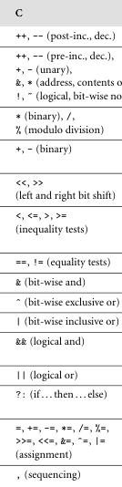

**Main Source :**

- **Book 2 chapter 6**
- **[What is a jump table? - stackoverflow](https://stackoverflow.com/questions/48017/what-is-a-jump-table)**

In programming languages, control flow specifies how statements or instructions are ordered, executed, and evaluated. Some statement can be executed first before the other, perhaps through the use of conditional if-statements. Some statement can be evaluated following certain order defined by user, through the use of parentheses.

There are 7 categories of control flow : sequencing, selection, iteration, procedural abstraction, recursion, concurrency, and nondeterminacy.

### Expression Evaluation

Expression consists of object (e.g., literal constant, variables) and operators, which can be a function. Operators take operand similar to how function take argument to perform computation. Some language like C++ use operator as a shorthand for calling a function. For example, `a + b` is same as `a.operator+(b)`, indicating `a` is added with `b`.

There are three notations to specify operator and operands order (operator invocation) :

- **Prefix** : Also known as **Polish notation**, the operator is placed before its operands. For example, `+ a b` (with operator `+`, operands are `a` and `b`), it's the same thing as `a + b`. With nested expression `(+ 2 (* 3 (- 4 1)))`, the innermost expression is evaluated first, and the results are used as operands for the outer expressions.
- **Postfix** : Also known as **Reverse Polish notation**, place operator after its operands. For example, `a b +` or `5 3 >`.
- **Infix** : It is the most common way of writing operators, where the operator is placed between its operands. For example, `a + b`, `5 * 3`, or `x > y`. A more complex expression is found in programming language like C++ for ternary operator. The syntax of ternary is `condition ? expression1 : expression2`, it is a category of three-operand infix operator.

#### Precedence & Associativity

Infix notation can sometimes lead to ambiguity. Even a simple expression like `2 + 3 * 5` (without parenthesis) is ambiguous. To avoid that, two concepts called **precedence** and **associativity** are used. Precedence defines the priority of operators, while associativity determines the order in which operators of the same precedence are evaluated.

Precedence is specified by the language grammar, and is different across languages. Associativity can either be two, left-associative or right-associative, where the former needs to be evaluated from left-to-right, and the latter needs to be evaluated from right-to-left.

Subtraction are example of left-associative operator, `(10 - 5) - 2 = 5 - 2 = 3` is different with `10 - (5 - 2) = 10 - 3 = 7`. On the other hand, operator like exponentiation is right-associative, `2 ^ 3 ^ 2` is evaluated as `2 ^ (3 ^ 2) = 2 ^ 9 = 512`.

  
Source : Book page 237

#### Assignments

Assignment is form of `variable = expression`. Under the hood, assignment of a variable is complex. Sometimes it's just evaluation the right-hand side expression, but it can be more complex like assigning reference, deep copy, type conversion, etc.

##### Reference & Value

More specifically, assignment is denoted as `l-value = r-value`. **L-values** are any expression that leads to a location (such as memory address) of a value, while **r-values** represents a value or a temporary result that does not have a persistent address.

- `d = a` means we are taking the value of `a` and assigning it (by copy) to the location of `d`. After the assignment, the value of `d` will be the same as the value of `a`.
- `a = b + c`, the `b + c` is an r-value expression that will not have persistent address after the evaluation. The value is then assigned to `a`.

This will make expression like `2 + 3 = a` not possible, considering `2 + 3` is just an r-value expression.

Overall there are two ways to handle variables.

- **Value model** : In the value model, variables directly store values. When we assign a value to a variable or pass it as an argument to a function, a copy of the value is made. Any modifications to the variable or the value do not affect other variables holding the same value.
- **Reference model** : In the reference model, variables hold references to memory locations where the actual data is stored. When we assign a variable to another variable or pass it as an argument to a function, a reference to the same underlying data is used. Modifications to one variable will be reflected in other variables holding the same reference.

  
Source : Book page 240 (with my own code example)

:::info
In equality testing, the process of comparing two values to determine if they are equal or not, equality can be determined through reference or value. If we consider two objects equal when their reference is the same, this is called **shallow comparison**. We only check if two objects are referring to the same object. On the other hand, when we consider the internal structure of objects to determine their equality, this is called **deep comparison**. Deep comparison may be complicated to determine in a complex structure like [graph](/data-structures-and-algorithms/graph).
:::

When r-value is expected, yet l-value is received, the l-value needs to be **dereferenced**. L-value holds location of a variable, in a language that supports pointer or reference, l-value can be pointer (variable that holds memory address).

```cpp
int x = 42;
int* ptr = &x;
int value = *ptr;
```

C++ supports pointer and reference, dereferencing a pointer is achieved through putting `*` symbol before the pointer.

:::tip
See also [pointer & reference](/computer-and-programming-fundamentals/memory#pointer--reference).
:::

:::info
Languages that use value model for primitive types require a concept called **boxing**. It is the process of wrapping a value type in some object to convert it to reference model. This will enable them to participate in scenarios that require reference types, such as storing them in collections or passing them as method parameters that expect reference types.
:::

##### Assignment Operators

Assignment operators are shorthand operators in programming languages that combine an arithmetic or bitwise operation with assignment. They are operators like `+=`, `-=`, `*=`, etc. They are commonly used to improve readability and conciseness, especially if the involved variable are too long or complex.

- `a = a + 1` -> `a += 1`
- `*(*(p + 1) + 2) = *(*(p + 1) + 2) + 20` -> `*(*(p + 1) + 2) += 20`

##### Multiway Assignment

Multiway assignment allows for assignment in parallel. For example, in Python `a, b = 1, 2`, assigning `a` and `b` to `1` and `2` respectively.

It is also useful to unpack a data structure with multiple values (like tuple).

```python
person = ("John", 30, "New York")

# name = person
# age = person
# city = person

name, age, city = person
```

#### Initialization

Initialization is the process of assigning an initial value to a variable or data structure when it is first created. It can be beneficial for data structure that can be allocated during compile-time (i.e., global variables) or preventing potential error like uninitialized variables.

- **Constructors** : Used in OOP to initialize objects of a class. We can specify initial values or attributes of an object and use keyword like `new` to initialize the object.
- **Definite Assignment** : Some languages allows declaring variable without giving a value like `int a;`. Definite assignment is a rule to enforce programmer to always assign a value to variable, even if they are not using it.
- **Dynamic Checks** : Dynamic checks are runtime checks performed by programming languages to catch error during runtime. Some languages assign default values to data types (e.g., `NaN` for floating-point number). While these values are invalid and can't be used, they can prevent errors that are unlikely to occur.

#### Ordering Within Expressions

When evaluating expressions, sometimes the ordering within them can affect overall results.

- **Side effect** : Consider the expression `a - f(b) - c * d`. Calculating `c * d` first then use the result as operand from the subtraction is a valid way to evaluate this. It is also valid to calculate `a - f(b)` first then subtract it with the result of `c * d`. However, it is possible that calling function `f(b)` causes a side effect that affects final result. It may change the value of `d`, which mean computing `c * d` will be different before and after calling it.
- **Code improvement** : The order of instructions can impact execution speed. Sometimes, it's more efficient to load data into memory before it's actually needed rather than waiting until it's required. This is because the CPU can perform computations faster than memory can be fetched. In such cases, [prefetching](/computer-organization-and-architecture/cpu-design#out-of-order-execution) the data by rearranging instructions or expressions to ensure that memory loading occurs first can be beneficial.

One improvement the compiler can make is applying mathematical identities.

For example, expression like follows.

```
a = b + c
d = c + e + b
```

Can be rearranged to

```
a = b + c
d = b + c + e
```

Then reuse the same value

```
a = b + c
d = a + e
```

So, we can reduce redundant operations.

#### Short-Circuit Evaluations

Some logical expression (such as AND) requires _all_ condition to be true in order for the overall expression to evaluate to true. In such cases, we don't need to evaluate all condition if the first condition or any other is already false. Similarly, in two option of OR expression, only one condition needs to be true.

This is called **short-circuit evaluation**, where evaluation of a logical expression stops as soon as the final outcome can be determined without evaluating the remaining subexpressions.

```
if x == 0 and long_running_computation(x) == 0
```

We don't need to evaluate the result of `long_running_computation(x)` if `x` is already not 0.

```
if x != 0 and y / x > 10
```

Not only reducing instruction, short-circuit evaluation make it possible for programmer to prevent side effects or potential error, such as dividing by 0. If compiler were to not make this optimization, then `y / x` will still be computed even when `x` is 0.

### Structured and Unstructured Flow

Structured and unstructured flow are mechanisms used to control the flow of a program or algorithm.

Structured flow control constructs, such as if-else statements, while loops, for loops, switch statements, or exception handling, provide clear control over the execution flow within a program or algorithm. In contrast, unstructured flow, commonly encountered in old languages, including construct like jump or goto statements may have lack of clarity.

```python
while condition:
    # Code executed while condition is true
```

A while loop is structured flow, it repeatedly executes a block of code as long as a given condition remains true.

In contrast, unstructured flow may combine if-statement and goto to achieve this.

```c
if (condition) {
    goto label;
} else {
    // Code executed when condition is false
    // Main loop code is here
}

label:
// Code executed when condition is true
```

`goto` statement are discouraged in modern languages as it can make code harder to understand, especially in bigger codebase (hard-to-follow code paths).

### Sequencing

Statements are executed sequentially, one after another, following the order in which they appear in the program (top-to-bottom). Sequencing is a fundamental feature of imperative programming languages that are made default.

```
statement1
statement2
statement3

# Start of block
{
    statement4
    statement5
    statement6
}
# End of block
```

Some languages allow to construct a temporary block which we could use to treat a sequence of instruction as a single unit.

### Selection

Selection (or alternation) involves making decisions based on conditions. It includes constructs like if-statements, switch statements, or case statements.

```python
if condition:
    # Code executed when condition is true
else:
    # Code executed when condition is false
```

Python itself relies on indentation as part of its syntax, interpreter knows that blocks of code is associated with the if and else clauses when they have different indentation level.

```cpp
switch (expression) {
    case value1:
        // Code executed when expression matches value1
        break;
    case value2:
        // Code executed when expression matches value2
        break;
    default:
        // Code executed when expression doesn't match any case
        break;
}
```

C++ analyze the switch statement from top-to-bottom, matching expression with each case. When one case is matched, it executes the expression under it. However, it won't stop afterwards, it will keep matching the subsequent case. This is called **fall-through behavior**, and it relies on `break` keyword to actually stop the switch matching.

:::info
Compiler can make optimization by making **jump table**. It is a data structure constructed by the compiler to efficiently map a set of input values to corresponding actions or code blocks, typically through pointers or goto statements. It is useful for state machine as it eliminates the need for conditional checks when encountering a specific state, allowing actions to be executed directly upon encountering that state.
:::

### Iteration

Iteration allows a block of code to be repeated multiple times. The two types of loops are enumeration-based (e.g., for-loop) and conditional-based loop (e.g., while-loop and do-while loop).

The number of repetition in enumeration-based loop can be controlled in advance, it typically iterates over a range of values or elements using a counter or index variable. In contrast, conditional-based loop are used when the number of iterations is not known in advance and depends on a specific condition.

With a for-loop like `for (int i = 0; i < 5; i++)`, under the hood, the compiler is actually keeping up the variable `i` and check for the condition `i < 5` in every iteration. If it's true, execute the loop body, and also modify the variable `i`; in this case, we are incrementing it.

#### Loop Behavior

Let's say a for-loop syntax is like `for (i = start; i < end; i += step)`

For-loop can introduce some unusual usage :

- **Loop variable modified inside loop** : Some languages don't allow the modification of loop variables, including the `start`, `end`, and `step`. Modification involves assigning a value to them directly or through reference, or using an external source for their value (e.g., reading from a file and the value inside the file is changed by other program). Modifying loop variables in languages that allow it could potentially cause unexpected behavior, such as loop terminating too early.
- **Empty bounds** : A situation where the first iteration already terminates the loop. A compiler may translate loop code into lower-level instruction like :

    
   Source : Book page 274

  It uses `r1`, `r2`, and `r3` to store loop variables, with `L1` acting as the loop body and `L2` acting as the code outside the loop. Before executing the loop body, including the first iteration, the condition is always checked first. This will prevent the loop body to be executed even in the first iteration.

- **Loop variable used outside loop** : Languages prevent this by making the loop variables as local variable, with the loop body being the scope.

:::tip
A problem can arise when incrementing the loop variable, be aware of data type overflow. For instance, a common mistake is using small data types with a large loop condition, such as `for (short i = 0; i < 100000; i++)`. This code will result in an infinite loop because a `short`, or a 16-bit integer, has a range value of -32.768 to 32.767. Before it reaches 100.000, it will wrap around to the minimum value, -32.768, making it impossible to terminate the loop.
:::

:::tip
Another subtle problem that can arise in compilers (and for programmers as well) is when the compiler adds the `start` value with the `step` value and data overflows occur. This can lead to unexpected behavior since the loop may be executed more times than expected due to the wrap-around behavior of data overflows.
:::

#### Iterators

An alternative method of iteration is through the use of iterator objects. These can be considered as abstractions of loops, capable of traversing and manipulating the elements of a collection (such as an array, list, or other container) in a controlled manner. Such iterator objects become even more useful when implemented in complex data structures like [trees](/data-structures-and-algorithms/tree) or [graphs](/data-structures-and-algorithms/graph). Iterator for tree data structure may be implemented to traverse in pre-order, in-order, or post-order.

See [iterator](/software-engineering/behavioral-patterns#iterator) for example.

### Procedural Abstraction

The use of functions or procedures (subroutines) to encapsulate a block of code. See [subroutines](/compilers-and-programming-languages/subroutines).

### Recursion

[Recursion](/data-structures-and-algorithms/recursion) itself doesn't have special syntax or convention, because it is a concept of a function that calls itself. It is useful to "automatically" create an iteration, especially in recursive data structure like [tree](/data-structures-and-algorithms/tree) or [linked list](/data-structures-and-algorithms/linked-list).

Recursion is commonly found on functional language, while iteration is found on imperative language, although modern languages combines them both.

Recursion doesn't involve changing variable, because essentially variables are copied onto the call stack on each recursive call. Functional programming languages often emphasize immutability, where variables are not meant to be changed once assigned. In such languages, recursion is commonly used to achieve repetition and control flow, as it avoids explicit mutable state.

#### Tail Recursion

Often argued that iteration is more efficient and easier to implement in some cases, recursion can be optimized. A recursive function can be optimized by moving the recursive call to the last operation in the function, this is called **tail recursion**.

Non-tail recursive :

```python
def fact(n):
    if n == 0:
        return 1
    else:
        return n * fact(n - 1)
```

This is not tail recursive because there is `n *` before the recursive call.

A function to calculate factorial of `n`. If starting from `fact(6)`, recursive call will happen until `fact(0)`. Once the recursive call `fact(0)` is reached and the base case is satisfied, the recursive calls start returning to `fact(6)`.

Tail recursive :

```python
def fact(n, accumulation):
    if n == 0:
        return accumulation
    else:
        return fact(n - 1, accumulation * n)
```

We remove the `n *` and modify the function's structure to make it work in tail recursion. Instead of `fact(n)` depending on the result of `fact(n - 1)` and so on until `fact(0)`, we introduce an `accumulation`. This `accumulation` is calculated not after, but before the recursive call. This way, we don't need to return the value all the way to `fact(n)` from `fact(0)`, as they are calculated along the way (i.e., the expression `accumulation * n` depends on the current recursive call argument, which is available at any time).

  
Source : https://maxglassie.github.io/2017/08/24/tail-recursion.html

This optimization reduces the amount of memory used in runtime for call stack.

:::info
Sometimes, arguments to subroutine is not always evaluated when function is called. When arguments are evaluated before function call, we call this **applicative-order evaluation**. It is possible that evaluation is deferred until the argument is actually used. This evaluation is called **normal-order evaluation**, and it can avoid unnecessary computation where argument is passed but not used (even avoid some runtime error).

Normal-order evaluation is safe to use if the expression doesn't cause side effects because it might change one argument, leading to a different result when evaluated earlier.
:::

### Concurrency

The execution of multiple tasks or instructions simultaneously. See [concurrency](/compilers-and-programming-languages/concurrency).

### Nondeterminacy

Nondeterminacy is a situation where the order of execution is not predetermined or predictable. It is commonly associated with concurrent or parallel execution; or probabilistic, where the execution order can vary each time the program runs.
