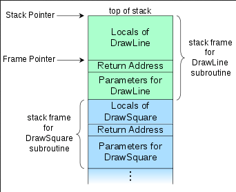

**Main Source :**

- **Book 2 chapter 8**
- **[Call stack - Wikipedia](https://en.wikipedia.org/wiki/Call_stack)**
- **[Continuation - Wikipedia](https://en.wikipedia.org/wiki/Continuation)**

Subroutines can abstract away a piece of code that perform a specific task or carry out a sequence of operations. They are feature like functions, procedures (typically refer to function without return statement), and methods.

Subroutine typically needs parameter (also known as formal parameter), which is the data it takes as input. The caller provide argument (also known as actual parameter) for the subroutine.

### Call Stack

Programmers can call subroutines as needed. Upon calling subroutines, the program will keep track all the active subroutine in a data structure called **call stack**. The call stack is divided into several sections called **stack frames** (also known as activation records or activation frames). Each stack frame correspond to a single subroutine call.

  
Source : https://en.wikipedia.org/wiki/Call_stack

When a subroutine is called, the program transfers control from the current execution point to the subroutine's code. A stack frame is created, which includes parameters, local variables, and a **return address**. This return address is the memory address of the next instruction after the function call, allowing the program to continue its execution after the subroutine is finished. After a subroutine is finished, its stack frame will be removed from the call stack. If it returns some value, it will be saved on the stack, in some register, or in a specific memory location.

Within the call stack, there are two pointers used for managing the stack frames : the **stack pointer (SP)** and the **frame pointer (FP)**. SP keeps track the top of the stack, while FP is the reference point within a stack frame.

:::info
When a function is being called many times (e.g., in recursion), a potential error called [stack overflow](/data-structures-and-algorithms/recursion#call-stack) may occur. It happens when the call stack becomes full or exceeds its allocated size.
:::

### Calling Sequences

Calling sequences are instructions executed before and after subroutine call. The code executed at the beginning is called **prologue**, while the code executed at the end is called **epilogue**. Calling sequence is responsible for executing task like passing parameters, saving return address, returning function values, deallocating call stack, etc.

During the execution of program, registers are used to store the current execution context. When a subroutine is called, it may need to use registers to perform its operations. Therefore, it is required to save the registers value before calling the subroutine. There are two approach of saving the register :

- **Caller-saves** : In this case, the responsibility of saving register is given to the caller. It saves all the register that are used before subroutine call and restore them afterwards.
- **Callee-saves** : In this case, the callee or the subroutine being called is responsible for saving and restoring the registers it will overwrite.

#### Static Chain

In nested subroutine, it is possible that there is a need to access variables from outer scopes within inner scopes.

- Case one, when nested subroutine is directly inside the caller, then the caller passes its own position on the call stack (using frame pointer) to the callee for it to access it directly. This passing of frame pointer establish a link called **static link**. The static link will be considered as "hidden argument" to the callee.
- Case two, when nested subroutine and caller is both nested in another subroutine, then it's the caller responsibility to follow its own **static chain** (a series of static link) a certain number of times to reach the appropriate scope.

#### Example

We can then conclude a typical calling sequence, what will happen during a subroutine call :

1. Caller (prologue) :
   - Save registers if using caller-saves register.
   - Evaluate the arguments to be passed to the subroutine.
   - Compute static link if needed.
   - Push the return address onto the stack.
2. Callee (prologue) :
   - Allocates a stack frame.
   - Save the caller's frame pointer for later.
   - Save registers if using callee-saves register.
3. Execution of subroutine code.
4. Epilogue :
   - Moves return value to register or any preserved location.
   - Restore callee-saves register if needed.
   - Restore frame and stack pointer.
   - Jumps back to return address.
5. Caller (after the function call) :
   - Restore caller-saves register if needed.
   - Access the return value.

### Parameter Passing

#### Parameter Modes

There are different ways of how parameter is passed to subroutine.

- **Pass-by-value** : The value of the arguments are copied and passed to the callee. The callee maintain a local copy of the parameter value, which means any modifications doesn't affect the original arguments. It is a simple approach, but it may not be preferred when to copy large object.
- **Pass-by-reference** : A reference of the arguments is passed to the callee. As a result, the callee can directly access and modify the original parameter in the caller's scope. Pass-by-reference is more efficient when the passed object are large.

  Some languages allow for read only pass-by-reference. This approach allows us to avoid copying large object, while also keeping the original value immutable.

- **Pass-by-pointer** : Also known as **call-by-sharing**, this approach creates a pointer, which callee can dereference to obtain the actual value. It can be used when the subroutine needs to modify the structure of the parameters directly (e.g., modifying a linked list).
- **Pass-by-name** : This approach simply passes the name of the parameter. It is done in a way similar to a macro, where the name of the parameter is substituted with the actual value. It allows for lazy evaluation of parameters, which are dynamically evaluated.

Some languages may use multiple approach. A common combination is using pass-by-value for primitive objects (e.g., integer, char, boolean) and pass-by-pointer for complex object.

Function can also be passed as parameters. It is typically passed by reference or as a reference to the function object. For example, in C++, function as parameter is achieved through function pointer.

```cpp
void apply_operation(void (*operation)(int), int x) {
    operation(x);
}
```

`void (*operation)(int)` denotes a function that we call as `operation` which takes an `int`, and return `void` (nothing). We can simply use the passed function as usual.

#### Special Parameters

Some parameter that are considered special :

- **Conformant Arrays** : Conformant arrays are array whose size are determined at runtime. When passing them as parameter, we will need to provide additional information about the array's size.
- **Optional / Default Parameter** : When parameters are optional, the compiler will set a default value for them. The compiler handles the task of substituting default values for missing arguments during the function call.
- **Named Parameter** : Some languages (e.g., Python) allow us to denote which argument correspond to which parameter in the function call. It may look like this `set(key=2, value=12)`, which will improve readability and clarity for function call. The compiler will map the named arguments to the correct parameters based on their names.
- **Variable Number of Arguments** : Function may accept variable number of argument, often specified with ellipsis notation (e.g., ...). Internally, the arguments are usually stored in a collection such as an array or a list, which the compiler iterates through.

#### Returns

Return is the mechanism to finish the execution of subroutine immediately, and possibly return a value to the caller. The typical syntax for return statement is `return expression`.

Some languages allow functions that don't return anything to omit the `return` keyword. Regardless, the function may still use return statement as early termination.

In static typed language, the function return typically has a defined type, indicating what type of value the function is expected to return. Obviously the function needs to return value whose type is same as specified, otherwise a compile-time error may occur.

### Generic Subroutines

Generic subroutine refer to subroutine which can operate on different types of data. It could be function that find a maximum value of a container, the container can vary between array, list, sets, etc. This can be achieved through [parametric polymorphism](/compilers-and-programming-languages/data-types#polymorphism) (also known as generics).

One implemention of generics is through code generation. The compiler generates specialized versions of the generic code for each type used with the generics. This means that for each different type parameter, a separate copy of the generic code is created.

For example, we can create a generic function in C++ using template.

```cpp
template <typename T>
void swap(T& a, T& b) {
    T temp = a;
    a = b;
    b = temp;
}
```

To use generics, one needs to specify a type and how that type is used within the implementation of the generic code. The template takes a type parameter `<typename T>`, which indicates that `T` is a placeholder for a type. The function body then operates on objects of type `T`, which can be any type that is passed as arguments when the function is invoked.

To actually use a template function, we need to provide information about the concrete type we are going to use.

```cpp
// call like this
swap<int>(2, 3);

// generated by compiler
void swap(int& a, int& b) {
    int temp = a;
    a = b;
    b = temp;
}
```

### Exception Handling

**Exception** is an event or condition that occurs during program execution, which interrupts the normal flow of the program. Exceptions can be caused by various factors, such as invalid inputs, resource unavailability, semantic error from the language etc.

Without exception handling, there are three ways to handle error :

- Return a value which is invalid. This can work in some cases, but not in general. For example, it is common for language to return -1 when it can't find specific element in a container.
- Return a status value to the caller or modify a global variable that acts as a state indicator. For instance, one might define an enum like `DIVIDE_BY_ZERO` or `INPUT_CANNOT_BE_NEGATIVE`, which the caller will check for each status and handle accordingly.
- Pass a function which will be called whenever an error occur (callback mechanism).

When an exception occurs, the program throws or raises an exception, generating an exceptional event. This is done using a `throw` or `raise` keyword, which can be triggered by the programming language or the programmer's code itself.

The purpose of exceptions is to alert the program when something unusual occurs. Ideally, the subroutine causing the exception should be able to handle and recover from it. If it can't handle it, at least, the subroutine should know that it needs to clean up any local resources. If the subroutine cannot handle the exception, it will be propagated to the calling code or higher-level subroutines that may have the ability to handle it. This propagation continues until an appropriate exception handler is found, or until the program terminates if no handler is available.

Exception can be defined by the language or by the programmer. It is common in OOP language to create exception as a class hierarchy. Each exception would inherit a more general or higher-level exception. For example, `FileNotFound`, `NoNetworkConnection`, `FileSystemException` would be a subclass of `IOException`. Furthermore, exceptions are typically parameterized, meaning they can be associated with additional information, such as error details.

#### Try-Catch

Programming language provide an exception handling construct for handling exception. It is typically called **try-catch** or sometimes **try-except**.

Exception will propagate up the call stack until it is caught by an appropriate try-catch block. The structure of a try-catch block looks like this :

```java
try {

} catch (err_1) {

} catch (err_2) {

} finally {

}
```

The `try` block contains the code we are executing. The `catch` block specifies the type of exception we are catching, and its body contains the code to handle that exception. Multiple `catch` blocks can be added to handle different types of errors. The `finally` block contains code that will always be executed regardless of whether an exception is thrown or caught. It is useful to perform resource clean up or execute some destructor function.

In the case of exceptions defined as a hierarchy, it is possible for the type of exception in the `catch` block to catch a subclass of that exception. Sometimes, a higher-level exception is placed in the `catch` block, acting as a wildcard error handler. This is done to prevent the program from crashing.

#### Implementation

The two ways to keep track exception handler :

- Maintain a linked list of handlers. Each time a protected block (i.e., `try` block) is encountered, it is added as a handler to the linked list. The purpose of this is to keep track of available handlers and determine which one can handle the exception. When an exception is thrown, the program traverses the linked list to find a handler that can catch the error.
- Maintain a table of handlers. The idea of this implementation is that a part of source code tend to be translated into contiguous block of machine instruction. The relationship between the actual code and the handler can be captured within the table.

  The table is constructed with two fields, the starting address of the block of code, and the address of the corresponding handler. The table is sorted based on the first field. We can perform binary search on the table to find appropriate handler for the current block.

### Coroutine

[Coroutine](/computer-and-programming-fundamentals/concurrency#coroutine) is feature that enables cooperative multitasking. It allows a program to have multiple independent execution flows, that can be paused and resumed at specific points.

Coroutine can be implemented using **continuation**. It is a representation of the program's control flow stored in a data structure accessible within the programming language, rather than being hidden in the runtime environment. A continuation may contain the current point of execution, variable values, and the program's call stack state.

A continuation is considered a snapshot of the current execution context, which remains unchanged. This differs from coroutines, where multiple execution flows can have their own states and can be modified over time. The characteristics of coroutines allow them to be paused and resumed independently of the main program flow. Therefore, coroutines are sometimes referred to as independent execution contexts that execute one at a time and transfer control to each other explicitly.

The transfer from one coroutine to another involve a context switch (i.e., saving program state, program counter (PC), other register values, etc.).

Below is an example of coroutine in Kotlin programming language :

```kotlin
suspend fun coroutine() {
    println("Coroutine started")
    delay(1000) // Simulate some asynchronous operation
    println("Coroutine resumed")
    delay(2000) // Simulate another asynchronous operation
    println("Coroutine finished")
}

fun main() = runBlocking {
    launch {
        coroutine()
    }

    println("Main thread continues")

    delay(3000)

    println("Main thread resumed")
}
```

In Kotlin, the transfer of control between coroutines is handled implicitly rather than explicitly. Kotlin coroutines use suspension points, such as `delay()` or `await()` call to transfer control.

1. A function declaration is included with `suspend` keyword to denotes that it can be suspended at any point of time. `coroutine()` is a suspending function, meaning it can suspend without blocking the underlying thread.
2. In the `main()` function, we create a coroutine scope using `runBlocking`. A coroutine scope is needed to launch a coroutine, it captures the execution context. `runBlocking` is a coroutine builder that creates a coroutine scope and blocks the current thread until all coroutines launched within it are completed.
3. Within the coroutine scope, we launch a new coroutine using the `launch` builder. The `launch` builder starts a new coroutine asynchronously. In this case, we launch the `coroutine()` function as the coroutine.
4. After launching the coroutine, the execution continues in the main thread. We print "Main thread continues" to indicate that the main thread is still running and not blocked by the coroutine.
5. We then suspend (pause) the main thread for 3 seconds using `delay(3000)`. This allows the launched coroutine to execute its suspended operations.
6. After the delay, the main thread resumes, and the coroutine code is suspended again. We printed "Main thread resumed" to indicate that the main thread has been resumed and completed right after. If the delay were faster, it is possible that the coroutine code may not have completed yet. However, it will still finish its execution when the main thread ends.

#### Stack Allocation

In a traditional sequential program, each function call creates a stack frame on the call stack, and each time a function returns, the stack frame is removed. The behavior of coroutine that can be suspended and resumed at specific points makes this traditional approach not possible.

There are four approaches :

- Statically allocate stack frames in fixed sizes, which cannot be changed at runtime (any attempt to do so is considered an error).
- Allocate the stack frames on the heap instead of the call stack.
- Allocate stack frames in chunks, one subroutine could have multiple chunks. If the chunk is not needed anymore, then it will be removed from the subroutine.
- In scenario where multiple coroutine is possible in single scope, then we can allocate a shared stack frame for the coroutines.
