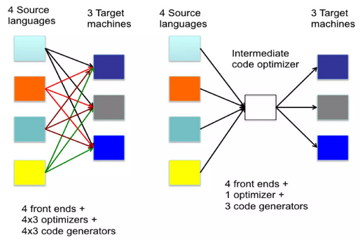
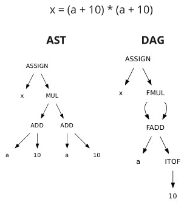
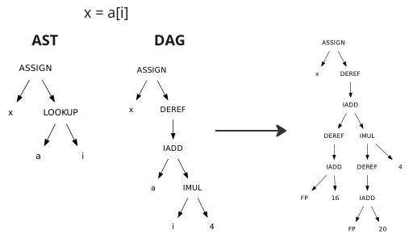
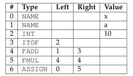
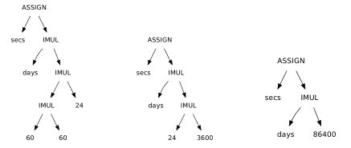
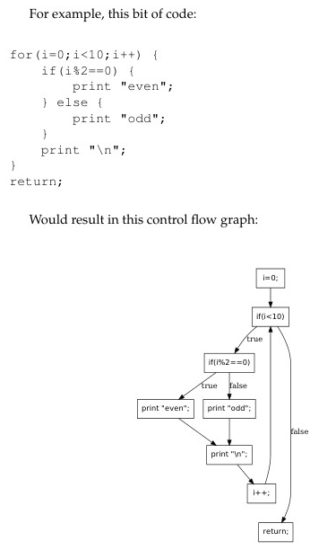
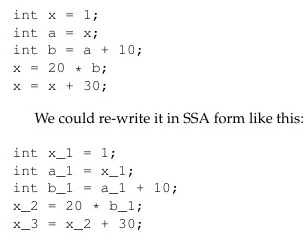
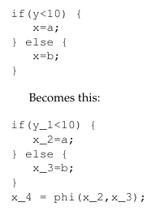
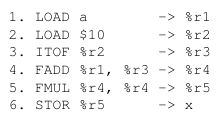
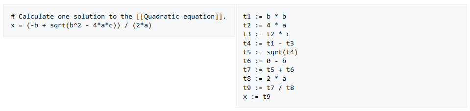

**Main Source:**

- **Book 1 chapter 8**
- **[Intermediate representation — Wikipedia](https://en.wikipedia.org/wiki/Intermediate_representation)**
- **[Three-address code — Wikipedia](https://en.wikipedia.org/wiki/Three-address_code)**

After semantic analysis decorates AST or syntax tree, compiler may choose to generate an intermediate representation (IR) before it goes to optimization and target code generation process.

An instruction in IR is typically designed to be simple and fundamental. By simple, it means that the instruction is made as basic as possible, avoiding complex operations that involve multiple steps within a single instruction. For example, some processor may combine shifting (bitwise shifting of bits in a register) and adding in a single instruction. These kinds of operation may be avoided.

The purpose of IR is to provide uniform yet simple representation of source code. Some IR is closer to source code, allowing it to capture high-level constructs of the program, while some are closer to machine code, to take advantage of specific feature of the target machine.

  
Source: https://www.slideshare.net/DrKuppusamyP/intermediate-code-generation-in-compiler-design

IR provides abstraction between the front end and the back end of the compiler. With an IR, it is possible for the front end of multiple source languages to output a common IR. These standardized IRs (e.g., LLVM IR, JVM bytecode) provide a common representation that can be targeted by multiple compilers, each of which may output to a different target language and optimize the code on their own. External tools can also use the IR to perform additional analyses or transformations.

:::info
Abstract syntax tree (AST) or syntax tree can be considered as an IR. It can be suitable if the code only goes through simple optimization. It is not the best IR for optimization, because as seen in [AST in example program](/compilers-and-programming-languages/semantic-analysis#example-program), it contains much irrelevant information that increases it complexities (i.e., an expression is option of many operations, such as integer addition, floating-point, or even string). Such structure makes certain transformations and code generation tasks challenging.
:::

### Directed Acyclic Graph

A [directed](/data-structures-and-algorithms/graph#directed) [acyclic](/data-structures-and-algorithms/graph#acyclic) graph (DAG) can be used to represent simplified AST. While AST strictly captures the syntactic structure, a general DAG adapted for this can retain similar information but with a reduced amount of details. Nodes in DAG represent a value, which depend on its edges. The edge that represent dependency between values can be used multiple of times.

  
Source: Book 1 page 121

For example, multiple addition of `a + 10` can be simplified to a multiplication that takes common operand (referencing to same node). It may also provide more detail about the operation, such as compatibility of types. If `a` is assumed to be a floating-point number, then the multiplication and addition operations performed are adapted into floating-point operations instead. Also, the integer `10` is converted into a float first.

  
Source: Book 1 page 122

Some DAGs can even introduce more nodes into the AST to provide greater detail about the computation. Accessing array elements may be described in detail: adding a given index with the value produced by multiplying the size of the array data type by the index value, and finally dereferencing that. It could even be expanded to include address computation of variable `a` and `i`. It could include calculation of addresses relative to the frame pointer.

The DAG can be constructed using the **value-numbering method**. It works by traversing the AST in [post-order](/data-structures-and-algorithms/traversal#postorder-traversal), then storing the type of each node in an array. The array is used keep track the DAG information about each node. This enables us to reuse certain node by checking if such node exists in array or not.

  
Source: Book 1 page 123

#### Optimization

One optimization that could be made with DAG representation is [constant folding](/compilers-and-programming-languages/compiler-optimization#constant-folding). It is an optimization made by compilers to evaluate expressions with constant operands at compile time.

For example, programmers often emphasize clarity in calculations. There is a reason to make this expression `secs = days * 24 * 60 * 60` instead of `secs = days * 86400`, to make it clear that a day consists of 24 hours, each consisting of 60 minutes, and finally each consisting of 60 seconds.

  
Source: Book 1 page 125

The algorithm would traverse the DAG to determine if the left and right nodes are constants, meaning they can be evaluated directly and replaced with one new node that contains their result.

### Control Flow Graph

DAG mostly represent expressions of code. For example, a DAG, by definition, is acyclic and cannot represent loops. To represent control flow of the program, a control flow graph is used instead.

A control flow graph can be [cyclic](/data-structures-and-algorithms/graph#cyclic), and a node represent a sequential statement.

  
Source: Book 1 page 126

It clearly captures the program flow through edges of the graph.

### Static Single Assignment Form

**Static single assignment (SSA) form** is a property of IR that enforces each variable to be assigned only once throughout the program, and each assignment creates a new variable.

The property of single assignment makes many compiler optimizations easier. One advantage is, it simplifies **dataflow analysis**, which is a technique to gather information about the possible values of variables at different points in a program. With SSA, the relationships between variables and their values are made explicit through the use of versioned variables. Each assignment to a variable creates a new version, and each use of the variable refers to a specific version.

  
Source: Book 1 page 127

In the presence of control flow structures like if-else statements, different branches can lead to different assignments of the same variable. SSA introduces the **phi function**, which can determine the actual produced value based on the control flow path taken at runtime.

  
Source: Book 1 page 127

### Linear IR

Linear IR is a form of IR which is closer to assembly language. It is a simple and linear representation of code that is structured sequentially. It doesn't have universal standard, but it typically looks like a simplified assembly language like code.

  
Source: Book 1 page 128

In many linear IRs, **virtual registers** are commonly used. They are temporary variables used to store values during the compilation process and are typically assigned to physical registers later. We imagine that there exists an infinite number of registers, and we can use all of them. In reality, this may not be the case, and the process of determining how the value should be stored is determined during [register allocation](/compilers-and-programming-languages/compiler-optimization#register-allocation).

One other commonly used linear IR is the **three-address code (TAC)**. It specifies that an instruction include at most 3 operands, which consist of an assignment and a binary operator (operator that takes 2 operand).

  
Source: https://en.wikipedia.org/wiki/Three-address_code

### Stack Machine IR

This IR model computation as it is performed on [stack-based data structure](/data-structures-and-algorithms/stack). In this IR, instructions manipulate values on top of a stack rather than using explicit registers or operands. It is designed to be executed on a [virtual machine](/cloud-computing-and-distributed-systems/virtualization), which executes stack-based instruction.

:::info
Stack machine code is considered **p-code (portable code)** (also known as **bytecode**), which can be thought as an assembly language of a hypothetical CPU. It is designed to be executed on a **p-code machine**, which is a virtual machine that emulates a CPU. In this case, the hypothetical CPU within the virtual machine execute stack-based instruction.
:::

Stack machine typically has several instructions:

- `PUSH`, takes a value as an operand and pushes it onto the top of the stack.
- `POP`, removes a value and store it in memory.
- Binary operators, such as `FADD` and `FMUL` (floating-point number add and multiplication, respectively) will implicitly pop two values and push back the result.
- Unary operators, such as `ITOF` (integer to float), pop one value and return its converted result.

For example, the code below should result in 4.

```
PUSH 5
PUSH 3
IADD
PUSH 4
ISUB
```

It is same as (5 + 3) - 4.
