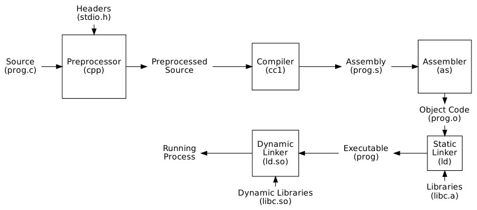
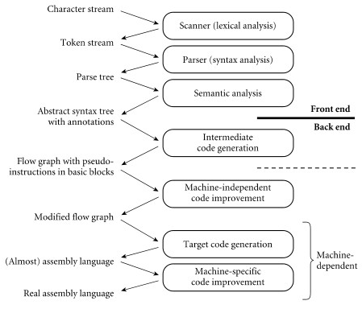
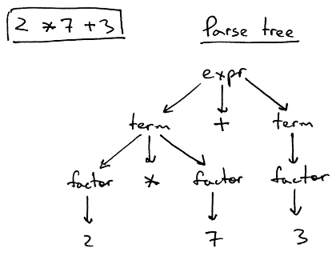

**Main Source :**

- **Chapter 1, Programming Language Pragmatics - Michael L. Scott**
- **[Compiler - Wikipedia](https://en.wikipedia.org/wiki/Compiler)**

Compiler is program that translate computer code from one programming language (source language) to the target language, typically a lower-level language like assembly language, machine code, or bytecode.

### Compiler Toolchain

Toolchain is the collection of software tools that work together to transform source code into a working program. Compilation is just one of the process in a toolchain.

  
Source : Book 1 page 5

Let's assume we are using language like C and C++.

1. **Preprocessing** : Preprocessor prepare the source code before the actual compilation. It handles directives like `#include`, `#define`, and conditional compilation (`#ifdef`, `#ifndef`). For example, it may substitute a macro with actual value defined, including function defined in header files to the main source code, etc.
2. **Compilation** : The main part of the toolchain, explained [below](#compilation-process).
3. **Assembler** : Compilation generates machine code, typically in the form of [assembly language](/compilers/assembly-language). This assembly language is lower-level enough to be considered as machine code, but it is still human-readable. Assembler takes generated assembly code to produce **object files**.
4. **Linking** : The object file contains real machine code to be executed on the CPU, but it is not yet complete. The linking process is required to resolve external references used in our program to create a complete executable. For example, the function `printf` is provided by the C standard library. Our source code, which is already in the form of machine code, should locate and load the definition of the function. The linker, divided into static and dynamic linker, loads and links together all object files and library files into memory.

   - **Static Linker** : Static linker links file by directly including pre-compiled libraries in our program final executable compile-time. Static libraries are identified by file with `.a` format on Unix or `.lib` format on Windows.
   - **Dynamic Linker** : Dynamic linker links pre-compiled libraries during runtime. Instead of including all the library code in the executable, the dynamic linker dynamically loads the required libraries into memory and resolves references to symbols during program execution. Dynamic libraries are identified by `.so` format on Unix or `.dll` format on Windows.

#### Compilation Process

The process of compilation can be broken down further into 6 (or 7) steps. The first 3 steps is the **front end** stage, where the compilers interact with high-level source code (language-dependent). The 3 (or 4) later steps are called **back end** stage, where the compiler focuses on generating code that is specific to the target machine from the output of front end (machine-dependent). The front end stages of compiler is same for any machine, but compiler may have different internal structure during the backend stages.

  
Source : Book 2 page 763

1. **Lexical Analysis (Scanning)** : The first steps filter out unnecessary symbols from the source code, keeping only necessary input that comes from the language (we call it tokens). This includes removing white spaces and comments, while keeping identifier (e.g., variable names, function names), keywords, literals, operators, etc. The compiler may use the **symbol table** for storing global information about the compilation and code.
2. **Syntax Analysis (Parsing)** : This steps analyze code correctness according to defined grammar. A **parse tree** (or sometimes **abstract syntax tree (AST)**) is constructed from the produced tokens from the previous step. The parse tree represents code organization based on grammar rules. For instance, a language may use [context-free grammar](/theory-of-computation-and-automata/context-free-grammar) do define its grammar. The compiler identifies if tokens belong to any valid categories. Compiler will continue constructing the tree whenever it encounters valid grammar, while encountering unexpected tokens gives a **syntax error**.

   If a grammar is defined as `<while_statement> -> while <boolean_expression> <statement>`, it basically means that a while statement must start with the keyword `while` followed by an expression that returns a boolean type, and finally a statement, which performs the actual operation. The boolean expression could be a comparison, equality checking, or other. If the compiler receives `while x = 3`, this may not conform to the grammar since `x = 3` is not a valid boolean expression. It is more like assignment, where the grammar may look like `<identifier> = <literals>` (i.e., `x` is an identifier, a name given by the programmers, and 3 is a literal number).

     
   Source : https://ruslanspivak.com/lsbasi-part7/

   The above is an example of a parse tree. When the compiler sees `2 * 7 + 3`, it recognizes that it is an expression. It knows that expression should be `<term> +|-|*|/ <term>` (i.e., a term combined with one choice of operator and followed by another term). It further recognizes that one of the term itself is nested with the operator `*`. A term can be obtained from a single factor, just like what 3 is, or consist of a factor multiplied by another term (which could be another single factor).

3. **Semantic Analysis** : This step takes parse tree or AST from the previous step. The compiler checks the meaning of the code beyond its syntax. This can include type checking, scoping rules, and other language semantics. It may enforce that an integer type cannot be added to a string, or checking whether a variable is defined before it is used. This step produces a **decorated AST** which contain the semantic information.

   For instance, language like Java won't allow a string to be accessed with square bracket like an array (called string indexing). In contrast, Python allows you to get character at some index like `str[3]`. This will be a compile-time error in Java, as it violates the language's semantics and type system (certain rules may only be checked at runtime).

4. **Intermediate Code Generation** (optional) : Optionally, the AST may be translated into an intermediate language first. In some cases, the AST can be directly subjected to optimization techniques and transformed into target code without the need for an additional intermediate representation.
5. **Machine-independent Optimization** : These optimizations are applied without considering the specific target machine architecture. For example, some function can be inlined, meaning the actual content of a function is substituted to the call site. This can reduce the overhead of calling a function (i.e., reduce [call stack](/programming-language-theory/subroutines#call-stack) and jumps operation).
6. **Target Code Generation** : Compiler translates the decorated AST into target code specific to the target machine architecture. The target code can be assembly language or directly machine code. The target code generation stage involves mapping the high-level constructs of the source language to the low-level instructions of the target machine.
7. **Machine-dependent Optimization** : Once the target code is generated, the compiler can apply additional optimizations that are specific to the target machine architecture. Examples of machine-dependent optimizations include instruction scheduling, [register allocation](/programming-language-theory/target-architecture#register-allocation), and target-specific code transformations.

:::info
Sometimes the process is divided into three-stage, it is called the **three-stage compiler structure**. In short, the 1st-3rd steps is the front end stage (language-dependent), the 4th step is middle end (machine-independent), and the 5th-6th step is the back end (machine-dependent).
:::

### Compilation Example

Suppose we have a hypothetical programming language, and we want to compile these three lines of code.

```
a = 5;
b = 1;
c = a + b;
```

The scanning process removes unnecessary characters, such as whitespace, newline character, and semicolon that acts as end of line. For example, in the first line of code, we will obtain the tokens `a`, `=`, `5`. The `a` doesn't correspond to any keyword of the language, so it is considered as an identifier that comes from the user. The `=` is the assignment operator that indicates right-hand side value is assigned to left-hand side identifier. The `5` is a literal number, suppose it is an integer.

The language will need a grammar to describe what a valid expression is. The grammar for this language is specified with [BNF](/programming-language-theory/syntax#bnf). This will be explained more later at [syntax](/programming-language-theory/syntax).

```
<assignment> ::= <identifier> = <expression>
<expression> ::= <term> | <expression> + <term>
<term> ::= <identifier> | <number>
<identifier> ::= (list of valid character for identifier)
<number> ::= 0 | 1 | 2 | 3 | 4 | 5 | 6 | 7 | 8 | 9
```

The `::=` denotes "can be replaced by" or "is defined as" (i.e., the left-hand side can be replaced with expression on the right-hand side). The `|` denotes an "or", it signifies that the left-hand side can be replaced to any one of the alternatives on the right-hand side.

In the `<assignment> ::= <identifier> = <expression>` rule, it simply says that : for an assignment to be valid, it must consist of an identifier, followed by the `=` symbol right after it, and an expression. For the identifier itself to be valid, it must consist of valid character for identifier, denoted by the `<identifier>` rule. An expression must either be a term (which itself can be an identifier or a number) or can be another expression with the addition operator (+) and a term.

With the expression `a = 5` or `b = 1`, the parser recognize that this conforms to the grammar rule for assignment (i.e., `a` is valid identifier and; `5` and `1` are expression which is replaced into a term and further replaced to number). The `c = a + b` is an assignment, in which the right-hand side expression follows the rule `<expression> ::= <expression> + <term>`.

After all this parsing, the code appear to be correct, therefore an abstract syntax tree (AST) will be constructed. For the three lines of code, the constructed will look something like below.

```
   =          =
  / \        / \
 /   \      /   \
a     5    b     1

   =
  / \
 /   \
c     +
     / \
    a   b
```

Then, the tree is traversed and intermediate representation (IR) of this is created. The IR may look like this.

```
LOAD R1 5
STORE a R1

LOAD R1 1
STORE b R1

LOAD R1 a
LOAD R2 b
ADD R1, R2 R3
STORE c R3
```

For instance, it "LOAD" the integer 5 into R1 (register 1), then store the value on R1 into an identifier `a`. Notice that the first two assignment can be simplified. It is not necessary to load a value into register if we eventually store it back to a variable. The `LOAD R1 5 STORE a R1` can be simplified into `STORE a 5`.

With this IR, we can finally transform the program into assembly code instructions, which a CPU can execute. For example, one may look like below.

```
mov [a], dword 5
mov [b], dword 1

mov eax, [a]
mov ebx, [b]
add eax, ebx
mov [c], eax
```

### Types & Classification of Compilers

Classification on how compiler process source code :

- **One-pass Compiler** : Scanning, parsing, semantic analysis, up to code generation is done in a single pass. Source code can be directly translated into final machine code without intermediate representation. Each step may be interleaved with another. Parse tree may not be generated, so semantic analysis is performed during parsing. It is said one-pass compiler to be smaller and faster, but difficult to make and may not be able to generate program as efficient as multi-pass compiler.
- **Multi-pass Compiler** : Processes the source several of times. This allows for better code generation at the higher cost of time and memory (depending on the number of passes and the algorithm itself).

Types of compilers :

- **Cross Compiler** : Compiler that generates executable code for a target platform different from the one on which the compiler itself runs. For example, compiling code on a Windows machine for execution on a Linux system.
- **Decompiler** : Takes an executable or binary file as input and attempts to reconstruct the original source code from which the executable was compiled. It is the reverse of compilation, going from low-level language to a higher-level language.
- **Transpiler** : Also known as **source-to-source compiler**, it is a compiler that translate source language to an equivalent source code in the same or different language. This includes tools like obfuscator (transform source code into a less readable and more difficult-to-understand form), minimizer (reduces the size of the source code by removing unnecessary characters such as, whitespace, and comments), and optimizer (analyzes source code and optimize it).
- **[Just-In-Time (JIT)](/computer-and-programming-fundamentals/interpreter#jit-compilation) Compiler** : A compiler that compiles code just-in-time it is executed. It dynamically compiles and optimizes code while the program is running.
