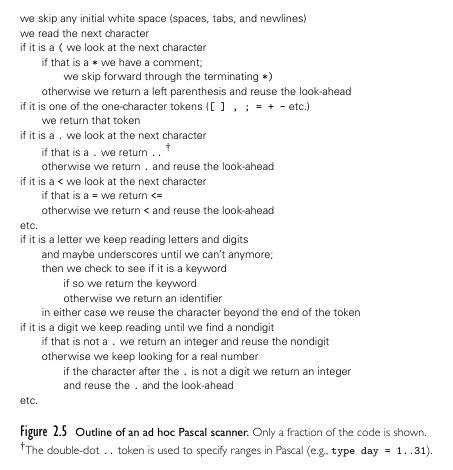

**Main Source :**

- **Chapter 2, Programming Language Pragmatics - Michael L. Scott**

[This note on programming language theory](/programming-language-theory/syntax) discuss how syntax is specified. After writing source code in certain syntax, the next process is [parsing](/compilers/parsing). It is the process of analyzing if the structure of a sequence of symbols follows the rules of a formal grammar correctly.

Before parsing, a step called **scanning** occurs. This involves dividing the sequence of characters (e.g., source code) into meaningful units called tokens. Each token is then identified according to its category (e.g., keyword, identifier, literals), and parsing occurs afterwards.

:::info
Scanning is the first step in [compilation process](/programming-language-theory/plt-fundamentals#compilation-process), while parsing is the second step.
:::

The purpose of scanning is to simplify the input by removing meaningless comments for the parser and eliminating whitespace (e.g., spaces, tabs, carriage returns, newlines) to reduce input complexity, while preserving only the important tokens.

  
Source : Book page 48

Above is the outline of scanner algorithm in Pascal programming language. Although it is from a specific language, the similar approach can be used for others. In general, the algorithm should ignore any white spaces. If it encounters unique symbols, it checks the symbol table if it is meaningful for the language. If some keywords are not from the language, it could be user-defined identifier, the compiler will also keep track of this.

The deterministic behavior of scanner can be described with a [finite automaton](/theory-of-computation-and-automata/finite-automata) like [DFA](/theory-of-computation-and-automata/finite-automata#dfa). Deterministic means the system will always know what to do when it encounters any input. The automaton starts with an initial state, then it transitions to other state depending on the symbol encountered. If it reaches a final state, it means it has recognized some token.

  
Source : Book page 49

[Regular expression](#regular-expression) is used to define the lexical rules or patterns that a scanner should recognize. This is why earlier we mentioned that regular expressions are helpful in defining tokens, as they are used to specify the patterns that scanner recognizes.

Since a scanner reflects a finite automaton, creating a scanner specified with a regular expression involves converting the regular expression into an equivalent finite automaton. The regular expression is converted into an [NFA](/theory-of-computation-and-automata/finite-automata#nfa) first, then converted into a DFA. Optionally, we may [minimize the DFA](/theory-of-computation-and-automata/finite-automata#minimization) to reduce the number of states.

:::tip
See [regular expression to finite automata](/theory-of-computation-and-automata/regular-languages-part-2#regular-expression-to-finite-automata) for an abstract example.
:::

The practical way of designing a scanner is making our own regular expression based on the language syntax, then use a **scanner generator**. A scanner generator will generate the logic to tokenize the input source code based on the defined lexical rules. The actual code for scanner may involve the use of switch statement and nested loop to simulate an automaton behavior.

Obviously, potential error will occur during scanning, this is called **lexical error**. It can arise from invalid characters, unrecognized character sequences, or violations of the language's lexical rules. The scanner may stop the scanning and report the error to user or ignoring the invalid token and continuing the scanning process.
