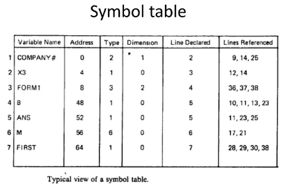
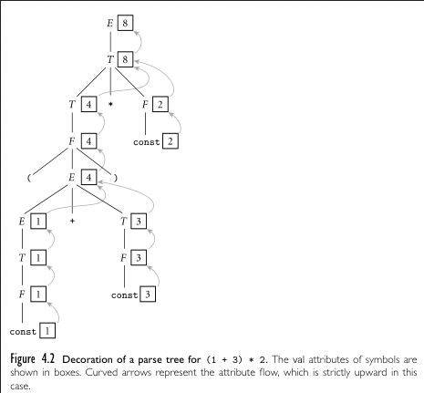

**Main Source :**

- **Chapter 6, 7, Introduction to Compilers and Language Design - Douglas Thain**
- **Chapter 4, Programming Language Pragmatics - Michael L. Scott**
- **[Compilation - Part Three: Syntax Analysis - Computer Science](https://youtu.be/8nBoVjEOCMI?si=wnzyRj8DnkWHiebu)**
- **[Symbol table - Wikipedia](https://en.wikipedia.org/wiki/Symbol_table)**

### Abstract Syntax Tree

**Abstract syntax tree (AST)** or **syntax tree** represent syntactic structure of the input language. It is the simpler and more abstract version of parse tree (also known as concrete syntax tree), both are typically produced after [syntax analysis (parsing)](/compilers/parsing) process. Compiler may choose to directly create AST instead of parse tree.

  
Source : https://ruslanspivak.com/lsbasi-part7/

The AST contains only the necessary information for code generation. It doesn't include explicit grammatical information or unnecessary tokens like parentheses. The tree structure is arranged in such a way that it preserves the same without these.

In the compilation process, the AST is used to keep track of syntactical information. It is a data structure used by the compiler to generate code later on. Sometimes, it is transformed into an intermediate representation first, then into real machine code. The AST is frequently represented as [tree](/data-structures-and-algorithms/tree) or [graph](/data-structures-and-algorithms/graph) structure.

#### AST Representation in Code

##### Declarations

Consider a programming language, below are valid declarations in the language.

```
b: boolean;
s: string = "hello";
f: function integer ( x: integer ) =  { return x * x; }
```

Under the hood, we can represent source code that declare something with a `decl` structure which has several properties.

```c
struct decl {
    char *name;
    struct type *type;
    struct expr *value;
    struct stmt *code;
    struct decl *next;
}
```

It has the variable name, type, value (if an expression), code (if a function), and a pointer to the next declaration in the program. All of them holds reference to another structs. If specific record doesn't hold anything, it should be null.

  
Source : Book 1 page 87

Using this, we effectively created a [linked list](/data-structures-and-algorithms/linked-list) with hierarchical and linked structure of declarations.

##### Statements

Statements can be represented with :

```c
struct stmt {
    stmt_t kind;
    struct decl *decl;
    struct expr *init_expr;
    struct expr *expr;
    struct expr *next_expr;
    struct stmt *body;
    struct stmt *else_body;
    struct stmt *next;
}

typedef enum {
    STMT_DECL,
    STMT_EXPR,
    STMT_IF_ELSE,
    STMT_FOR,
    STMT_PRINT,
    STMT_RETURN,
    STMT_BLOCK
} stmt_t;
```

We also associate statement with type, such as declaration, expression, if-else, for-loop, etc. A statement also has various field, such as its initialize expression, statement body, and an else body for if-else statement. They also hold reference to the next statements and expressions.

  
Source : Book 1 page 89 (added with custom text)

##### Expressions

An expression can be evaluated from left and right based on precedence, so we will need a reference to its left and right.

```c
struct expr {
    expr_t kind;
    struct expr *left;
    struct expr *right;
    const char *name;
    int integer_value;
    const char *string_literal;
};

typedef enum {
    EXPR_ADD,
    EXPR_SUB,
    EXPR_MUL,
    EXPR_DIV,
    ...
    EXPR_NAME,
    EXPR_INTEGER_LITERAL,
    EXPR_STRING_LITERAL
} expr_t
```

An expression have `kind`,

  
Source : Book 1 page 91, 92

These expressions have arguments, which are the operands. The type of function/operator is described in `kind`, such as add operation, subtract, multiplication, etc. An `EXPR_NOT` describe a unary NOT operation, its argument is typically placed on the left. We can also use the left and right argument as a way to put function arguments. They are described by chaining several `EXPR_ARG` nodes.

##### Types

A data type structure contains `kind`, `subtype`, and `params`.

```c
typedef enum {
    TYPE_VOID,
    TYPE_BOOLEAN,
    TYPE_CHARACTER,
    TYPE_INTEGER,
    TYPE_STRING,
    TYPE_ARRAY,
    TYPE_FUNCTION
} type_t;

struct type {
    type_t kind;
    struct type *subtype;
    struct param_list *params;
};

struct param_list {
    char *name;
    struct type *type;
    struct param_list *next;
};
```

A data type should have a field to describe what kind of type it is, a subtype which may be needed for compound types (types that contain another type), like arrays, and is used to describe the function's return type; and a list of parameters which is used by the function.

  
Source : Book 1 page 93, 94

- Primitive types are simply described from the `kind` field.
- An array should have its subtype as the data type of the elements it contains. A nested array would contain another `TYPE_ARRAY` as its subtype, which ultimately has the element data type.
- The `param_list` for function would contain the name of parameter, the type, and a pointer to the next parameter.

##### Example Program

With the code :

```
compute: function integer ( x: integer ) = {
    i: integer;
    total: integer = 0;

    for(i = 0; i < 10; i++) {
        total = total + i;
    }
    return total;
}
```

The AST would look like below.

  
Source : Book 1 page 95

This AST would be constructed during parsing. For example, when a bottom-up parser reduces, it should append a node to the appropriate parent. The node would be a struct it has created beforehand. If it encounters if-else syntax, it would create a statement struct with the `kind` being `STMT_IF_ELSE`, and other fields would be specified depending on the circumstances.

### Semantic Analysis

After a parse tree is constructed in the parsing step, the next step is to analyze the real meaning of the code.

The output of semantic analysis is a decorated AST, where additional semantic information is attached to the nodes to provide sufficient detail for generating intermediate or machine code. Semantic analysis may also involve looking up or adding information to the symbol table. The **symbol table** is a data structure used to store information about identifiers (variables, functions, classes, etc.) encountered in the program. It keeps track of various attributes associated with each identifier, such as its name, type, scope, memory location, and other relevant information.

  
Source : https://www.slideshare.net/DrKuppusamyP/symbol-table-in-compiler-design

The symbol table is frequently accessed throughout the [lexical analysis step](/programming-language-theory/syntax) until optimization. One common implementation of symbol table is a [hash table](/data-structures-and-algorithms/hash-table).

Semantic analysis helps enforce programming language rules, which are typically specific to each language and cannot be captured in parse tree with context-free grammar alone. This process may involve type systems, checking if a keyword is reserved in the language, checking if an identifier has been declared before its use, etc.

Semantic analysis can be categorized into two based on when it applied : **static semantic analysis** and **dynamic semantic analysis**. The former occurs during compile-time and the latter occurs during runtime. Some error, such as the use of identifier without declaring it first can be known at compile-time, while error like division by zero that is based on input can't be guaranteed.

:::info
Although, some tools may do semantic analysis during the time programmer write code (we can say during compile-time) to catch trivial or potential error as well as enforcing certain rules such as coding guidelines. The tools that do this in a way that they predict the runtime behavior are known as **static analyzer**.
:::

### Attribute Grammars

Attribute grammars are formal methods for specifying semantics of programming languages to a formal language like [context-free grammar](/theory-of-computation-and-automata/context-free-grammar).

The production rule of context-free grammar are "decorated" with **attributes**, which are properties or values associated with the nodes (nonterminals and terminals) of the syntax tree. Attributes can represent various information such as types, values, or intermediate results of computations.

Below is an example of a grammar of arithmetic expressions in [LR](/compilers/parsing#bottom-up-parsing).

  
Source : Book 2 page 166

:::tip
`E` : expression  
`T` : term  
`F` : factor
:::

And the attribute grammar for the given grammars.

  
Source : Book 2 page 167

- Each symbol is numbered to be distinguished.
- Attribute grammar is written with equations that describe how can we describe the computation of attribute values. There are two types of attribute rules, **copy rules** and **semantic function**.
- Copy rules are attribute rule where one attribute is just a copy of another.
- Semantic function is a function that describe an attribute value is computed with input of another attribute values. It can be any arbitrarily function the language designer want, and we can associate each non-terminal with a value. For example the $E_1.\text{val}$ describe the value of $E_1$. The function $\text{sum}(x, y)$ may describe the sum of $x$ and $y$.
- The value $.\text{val}$ or function $\text{sum}(x, y)$ doesn't actually have meaning, they are not fixed or standardized, but rather a convention that language designer adopt for clarity.

### Attribute Evaluation

The next step is to decorate the parse tree by evaluating attributes. Attribute values are computed and passed from child nodes to parent nodes or from parent nodes to child nodes during the evaluation process. This is called **evaluation flow**.

#### Synthesizes Attributes

  
Source : Book 2 page 169

For this particular example, the flow of evaluation is bottom-to-up. We call attribute that are computed and passed up the parse tree from child nodes to parent nodes as **synthesizes attributes**.

When all attributes are synthesizes, such as [our example above](#attribute-grammars), we call it **S-attributed**. The property of S-attributed is, left-hand side is always produced by the right-hand side. This is true for all attribute in the attribute grammar. This property makes each node in the decorated parse tree to obtain value from their child nodes, causing the tree to be evaluated bottom-to-up.

#### Inherited Attributes

The opposite, where information is allowed to pass from parent nodes or side nodes are called **inherited attributes**. Below is an example where bottom-up evaluation is not possible due to subtraction, in which its mathematical property is left-associative (i.e., have to be evaluated from left).

  
Source : Book 2 page 169-171

From the left child of `expr` it is passed to its sibling node, namely `expr_tail` and so on until the bottom most node. Then, the result (2) goes back to the root.

When all attributes are evaluated from left-to-right like this example, it is called **L-attributed** grammar.

:::info
An attribute grammar is well-defined if it is unique and unambiguous. This means that each attribute is defined only once and has a clear meaning and computation rule associated with it. It never generates a cyclic parse tree; such a grammar is called **noncircular**.
:::

:::info
We call algorithm that transform a language into an equivalent representation in another language or formalism, such as through attribute evaluation a **translation scheme**.
:::

#### Attribute Evaluator

Just like parsing, there is automated tool that will generate a semantic analyzer from an attribute grammar, these are called **attribute evaluator**. The evaluator is typically associated with specific production rule of the attribute grammar. The associated rule of attribute grammar is called **action routine**. It is included in the parser, such as LL or LR. When the parser encounters a production rule while parsing the input, it may execute an action routine associated with that rule.

  
Source : Book 2 page 176, 180

The left is the original grammar (top-down) and the right is the LL(1) grammar associated with the attribute grammar. For example, when it encounters a form like `E → T TT`, it will know that `TT.st := T.ptr`, and so on.

### Decorating Syntax Tree

Now, we can actually decorate the syntax tree with the attribute grammars. There are two ways for this, modifying the context-free grammar with semantic rules or making changes to syntax tree following a formalism called **tree grammar**.

  
Source : Book 2 page 182, 183

The example is the upgraded [calculator language example](/compilers/parsing#recursive-descent-parser).

- The first approach in the top image modifies the CFG.
- The second approach in the bottom image uses tree grammar. A parse tree is first generated, then transformed into a syntax tree, followed by the decoration. Tree grammar is a form like `A : B → C B`. The `A : B` means that `A` is considered the part (or category) of `B`, and that `B` can be placed around `C`. For example, in `read : item → id item`, `read` is considered as an `item` and an `item` can be placed around `id`.

    
   Source : Book 2 page 185-187

  The above image is the attribute grammar for the second approach (`symtab` may refer to symbol table). One thing to note is, it catches error by making a dummy type called `error`, which is associated with the error message in the symbol table.
