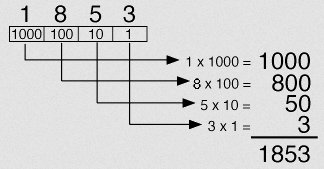
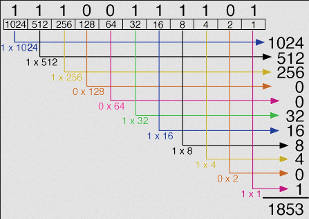
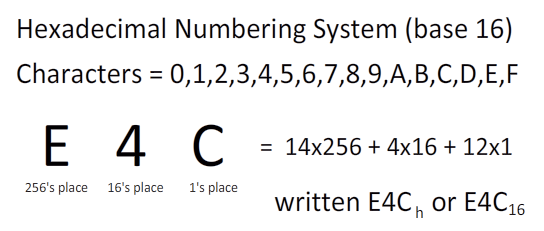
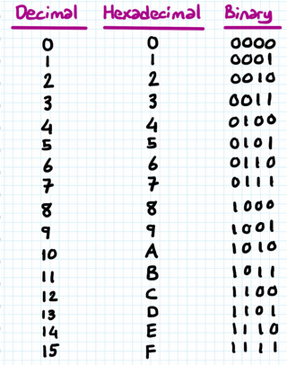

**Main Source :**

- **[Number System - BYJU'S](https://byjus.com/maths/number-system/)**

**Number System** is a system used to represent and express number, it consist a set of symbol or digit and rules to combine those symbols to represent different quantities. A number system has something called **base**, which is the number of symbol used to count and represent different number.

#### Positional Number System

A number system is considered as positional and non-positional. A positional number system means that each digit has different value depending on its position, while a non-positional number system have each digit contributes a fixed value to the overall number.

Decimal number, or the number system we used in everyday life, is considered as a positional number system. For example, in number `3568`, digit `8` is in the rightmost place, representing the units place and the positional value is just 8. While the digit `3` is in the leftmost place, representing the thousands place, the positional value is `3000`.

In positional number system, to determine the value of a number, we will add these positional values, from the example we get the total value of the number: `3000` + `500` + `60` + `8` = `3568`.

On the other hand, in non-positional number system like **Roman numerals**, the representation of `3568` is `MMMDLXVIII`. The basic symbols of Roman numerals are `I (1)`, `V (5)`, `X (10)`, `L (50)`, `C (100)`, `D (500)`, and `M (1000)`. It doesn't matter whether we place `M` at the first, second, or third place, they all will always contribute `1000` to the total value.

### Decimal

The decimal number system is the most widely used number system in everyday life. It is a **base-10 system**, meaning it uses 10 different symbol to write a number, which are 0, 1, 2, 3, 4, 5, 6, 7, 8, and 9.

From the positional number system explanation, we can conclude that each digit represent the product of its value and the base raised to the power of its position.

  
Source : https://www.unm.edu/~tbeach/terms/binary.html

- The digit 8 is in the rightmost position, representing the ones place. Its value is $8$, which is equal to $8 × 10^0$.
- The digit 7 is in the tens place. Its value is $70$, which is equal to $7 × 10^1$.
- The digit 5 is in the hundreds place. Its value is $500$, which is equal to $5 × 10^2$.
- The digit 3 is in the thousands place. Its value is $3000$, which is equal to $3 × 10^3$.

The power of the base (or base-10 here), will increases by 1 as we move from right to left, and decreases by 1 as you move from left to right.

### Binary

The binary number system is a number system widely used in computer systems and digital electronics. It is a **base-2 system**, where numbers are represented using only two digits: 0 and 1 (each digit is often called bit). This system is favored due to its simplicity and its alignment with the characteristics of electronic circuits. Electronic circuits possess two distinct states, namely on and off, or high and low voltage. We can represent the binary digit of 1 as a high voltage level, while 0 is associated with a low voltage level.

Similar to decimal, it is a positional number system, where each binary digit represent the power of its base which is the power of two. It starts from $2^0$ from the rightmost digit and the power increase by 1 as we go to the left.

For example :

- The binary number `1010` represents ($1 × 2^3$) + ($0 × 2^2$) + ($1 × 2^1$) + ($0 × 2^0$), which simplifies to 8 + 0 + 2 + 0, resulting in the decimal value 10.

- The binary number `11100` represents ($1 × 2^4$) + ($1 × 2^3$) + ($1 × 2^2$) + ($0 × 2^1$) + ($0 × 2^0$), which simplifies to 16 + 8 + 4 + 0 + 0, resulting in the decimal value 28.

  
Source : https://www.unm.edu/~tbeach/terms/binary.html

### Hexadecimal

Hexadecimal is a number system in **base-16**, it is also commonly used number system in computer science and digital electronics. It uses a total of 16 digits to represent numbers: 0-9 and A-F, where A represents the decimal value 10, B represents 11, and so on up to F representing 15.

Similar to the decimal and binary systems. The positions are counted from right to left, starting with the ones place, then moving to the 16s place, the 256s place, and so on. Each position represents a power of 16.

For example, the hexadecimal number `2F8` can be expanded as follows :

- The rightmost digit, 8, is in the ones or $16^0$ place and its value is 8.
- The middle digit, F, is in the sixteens or $16^1$ place. In decimal, F represents the value 15, so its value in the sixteens place is 15 multiplied by $16^1$, which is 240.
- The leftmost digit, 2, is in the 256s or $16^2$ place. Its value is 2 multiplied by $16^2$, which is 512.

  
Source : https://drstienecker.com/tech-332/1-numbering-systems-and-conversions/

  
Source : https://kenanhancer.com/2020/08/25/binary-hexadecimal-and-decimal-number-systems/
