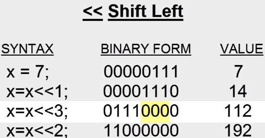
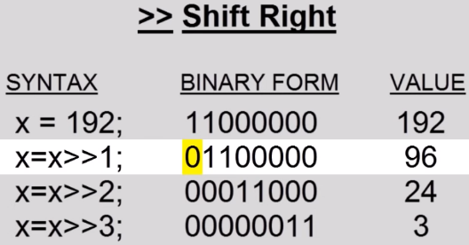

**Main Source :**

- **[Left Shift and Right Shift Bitwise Operator in C Programming - edu-corner.in](https://youtu.be/BKzB6gdRyIM?si=9lZZJs0hlw6x-q5s)**
- **[Bitwise operation - Wikipedia](https://en.wikipedia.org/wiki/Bitwise_operation)**
- **[What are Bit Masks, and how do I use them? (examples in C) - Jacob Sorber](https://youtu.be/Ew2QnDeTCCE?si=3AtK6cdBQIv3yGgi)**

**Bitwise Operations** are operations performed on individual bits within binary representations of numbers. While bitwise operations manipulate individual bits at the lowest level, these operations provide a deeper control for our algorithm, and it can be more efficient for certain tasks compared to higher-level operations.

### Bit Shifting

In binary representation, each binary digits (0 or 1) represent a positional value, starting from $2^0$ from the rightmost, the power will be increased by 1 as we go to the left.

Bit shifting is the process of moving a binary digit either to left (shift left) or to the right (shift right).

#### Shift Left

The shift left operator (often denoted as `<<`), shift a binary digit to left. While shifting a digit to the left, we will discard the leftmost value and add a 0 to the rightmost value. If we calculate our binary representation again after shifting it to the left once, our binary representation will be multiplied by 2. This occurs because each binary digit holds a positional value, and shifting them to the left increases their power by 1.

  
Source : https://youtu.be/BKzB6gdRyIM?si=QxyxFt9htR3Q2OQT

#### Shift Right

The shift right operator (often denoted as `>>`), shift a binary digit to the right. It is the opposite of shift left, it will discard the rightmost value and change the leftmost value to a 0. Also, instead of being multiplied by 2, it will be divided by 2, because the power of two decrease as we go to the right.

  
Source : https://youtu.be/BKzB6gdRyIM?si=XtRX1QwknUl8yhxM&t=205

Bit shifting can be beneficial for multiplying or dividing number by 2, we can turn the decimal number into binary representation and then do the bit shifting operation. This can be more efficient especially on systems that can perform bitwise operations quickly.

### Logical Operation

Logical operations on binary digits are logical operations performed at bit level of binary values. In binary representation, a binary digit of 1 represent a "true" value and a binary digit of 0 represent a "false" value. By logical operations, it means we are evaluating the logical relationship between boolean values and produce another boolean result.

#### NOT

A NOT (often denoted as `~`), perform a logical negation on each bit of binary value. It flips the logical state of a binary, which itself is a boolean value, changing true to false and false to true, or 1 to 0 and 0 to 1.

```
~10000010 (binary)
---------------
 01111101 (binary)
```

#### OR

An OR (often denoted as `|`), will take two binary values and produce another binary where each bit will be set to 1 if either or both of the corresponding bits in the operands are 1 and the result bit is set to 0 only if both corresponding bits are 0.

```
10101010 (binary)
|
11001100 (binary)
----------------
11101110 (binary)
```

#### XOR

A XOR (often denoted as `^`), is similar to OR, however, it is a stricter OR operation. The result of the operation between bit will be 1 if **both** of the bit in the operands are 1 and will produce 0 otherwise.

```
10101010 (binary)
^
11001100 (binary)
----------------
01100110 (binary)
```

#### AND

An AND (often denoted as `&`), takes two binary values and produce a binary digit of 1 if both of the bit are 1, otherwise produce 0.

```
10101010 (binary)
&
11001100 (binary)
----------------
10001000 (binary)
```

### Bit Masking

Bit masking is the process of selectively manipulate or extract specific bits within a binary value using various bitwise operations.

- Extracting specific bits : Consider a binary values, we want to extract first four digits from the right. We will then choose the appropriate **binary mask**, which is the binary values pattern used to manipulate the target binary.

  ```
  Value:   10101010
  Mask:    00001111
  ------------------- AND
  Result:  00001010
  ```

  Given a binary values `10101010`, to extract the first four binary digits from the right, we choose the mask `00001111` and do a bitwise AND operation.

- Setting specific bits : We can perform a bitwise OR operation with a mask that consist of 1 to set the binary values to 1 and use binary digit of 0 to keep other bits unchanged.

  ```
  Value:   10101010
  Mask:    00001111
  ------------------- OR
  Result:  10101111
  ```

- Clear specific bits : By performing a bitwise AND operation between a binary value and a mask with specific bits set to 0, the result will have the corresponding bits in the value set to 0, while preserving the other bits.

  ```
  Value:   10101010
  Mask:    11110000
  ------------------- AND
  Result:  10100000
  ```
