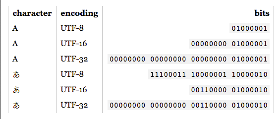

**Main Source :**

- **[Units of information - Wikipedia](https://en.wikipedia.org/wiki/Units_of_information)**
- **[Computer Graphics Images](/computer-graphics/computer-images-part-1)**
- **[Digital Signal Processing](/digital-signal-processing)**
- **[Digital Media Processing](/digital-media-processing)**
- **[What is ASCII - TechTarget](https://www.techtarget.com/whatis/definition/ASCII-American-Standard-Code-for-Information-Interchange)**
- **[How Unicode Works: What Every Developer Needs to Know About Strings and 🦄 by Peter Tasker](https://deliciousbrains.com/how-unicode-works/)**
- **[Base64 - Wikipedia](https://en.wikipedia.org/wiki/Base64)**

Computers store and process data in binary format, using a combination of 0s and 1s, known as bits. These bits are grouped together to form larger units of data. Those bits are combined to represent various data types in computer.

### Units of Data

These are standardized measures to count the amount of information or data stored in computer :

1. **Bit (b)** : The smallest information is a single binary digit (0 or 1).
2. **Byte (B)** : A byte is a group of 8 bits. It is the most common unit used for representing characters and data in computer systems.
3. **Kilobyte (KB)** : 1 kilobyte is equal to 1,000 bytes ($10^3$ bytes). It is often used to describe small amounts of data, such as text documents or small images.
4. **Megabyte (MB)** : 1 megabyte is equal to 1,000 kilobytes ($10^6$ bytes). It is commonly used to measure the size of files, larger documents, images, or short audio recordings.
5. **Gigabyte (GB)** : 1 gigabyte is equal to 1,000 megabytes ($10^9$ bytes). It is used to describe larger files, such as high-resolution images, longer audio recordings, or small videos.
6. **Terabyte (TB)** : 1 terabyte is equal to 1,000 gigabytes ($10^{12}$ bytes). It is used for large-scale data storage, such as hard drives, servers, or high-definition video recordings.
7. **Petabyte (PB)** : 1 petabyte is equal to 1,000 terabytes ($10^{15}$ bytes). It is used to measure large amounts of data, such as data centers or big data analytics.

And many more measurements that follows the same pattern.

There are also measurements such as KiB or MiB. The difference between KB and KiB or MB and MiB differs in their base. KB uses base 10 (decimal) while KiB uses base 2 (binary).

In summary:

- 1 KB = $10^3$ bytes (decimal)
- 1 KiB = $2^{10}$ bytes (binary)

### File Format

In computer, a file is a collection of data or information stored on a storage device such as hard drives. When a file is created, modified, or saved, it is typically represented as a sequence of binary data, consisting of 0s and 1s. The file's contents, along with its metadata (such as file name, size, creation date, and permissions), are stored on the storage device.

A file format defines how a file is structured and organized. A file format describes how data is stored, encoded, and interpreted in a computer file. For example, a document file may include what font used in the document so that the computer that reads it know what to display.

Various amount of file format can be found in [digital media processing](/digital-media-processing), digital media formats section.

### Data Representation

#### Color

In computer, color is represented as number in binary format. Each combination of binary format represent a different color.

- **RGB (Red, Green, Blue)** : RGB is the most widely used color model in computer graphics and digital displays. It represents colors by specifying the intensities of red, green, and blue primary colors. By combining different intensities of these three primary colors, a wide range of colors can be produced.

  RGB contains 3 different color components (also called **color channel**), where each component is typically represented as 8-bit value ranging from 0 to 255. For example :

  - Red : RGB(255, 0, 0) / RGB(11111111, 00000000, 00000000) in binary.
  - Green : RGB(0, 255, 0) / RGB(00000000, 11111111, 00000000).
  - Blue : RGB(0, 0, 255) / RGB(00000000, 00000000, 11111111).
  - Purple : RGB(128, 0, 128) / RGB(10000000, 00000000, 10000000).

    
   Source : https://www.programiz.com/blog/working-of-binary-numbers-in-computers/

- **CMYK (Cyan, Magenta, Yellow, Key/Black)** : CMYK is primarily used in printing and represents colors in terms of the amounts of cyan, magenta, yellow, and black inks required to reproduce a specific color. It uses subtractive color mixing, where the more ink is added, the darker the color becomes. Similar to RGB, CMYK is typically represented as a set of 8-bit.

  - Cyan : CMYK(100, 0, 0, 0) / CMYK(11111111, 00000000, 00000000, 00000000)
  - Magenta : CMYK(0, 100, 0, 0) / CMYK(00000000, 11111111, 00000000, 00000000)
  - Yellow : CMYK(0, 0, 100, 0) / CMYK(00000000, 00000000, 11111111, 00000000)
  - Black : CMYK(0, 0, 0, 100) / CMYK(00000000, 00000000, 00000000, 11111111)
  - Orange : CMYK(0, 50, 100, 0) / CMYK(00000000, 01111111, 11111111, 00000000)

- **HSL/HSV (Hue, Saturation, Lightness/Value)** : HSL and HSV are alternative color models that represent colors based on their perceived attributes. Hue represents the dominant wavelength of the color, saturation represents the intensity or purity of the color, and lightness or value represents the brightness. HSL and HSV values are usually represented as angles for hue (ranging from 0 to 360 degrees) and percentages or decimal values for saturation and lightness.

  - Red : HSL(0, 100%, 50%) / HSL(00000000, 10000000, 01100100)
  - Lime Green : HSL(120, 100%, 50%) / HSL(01111000, 10000000, 01100100)
  - Blue : HSL(240, 100%, 50%) / HSL(11110000, 10000000, 01100100)
  - Light Yellow : HSL(60, 100%, 75%) / HSL(00111100, 10000000, 11001000)
  - Magenta : HSL(300, 100%, 50%) / HSL(10010110, 10000000, 01100100)

- **Hexadecimal Color** : Hexadecimal color is another commonly used representation for colors in computer systems. It uses the [hexadecimal numbering system](/computer-and-programming-fundamentals/number-system#hexadecimal) to represent colors, where each color component is represented by a two-digit hexadecimal value ranging from 00 to FF.

  - Red : #FF0000
  - Green : #00FF00
  - Blue : #0000FF
  - Yellow : #FFFF00
  - Purple : #800080

#### Sound

Sound is a continuous wave in its analog form, in computer, they are represented discretely. To transform continuous wave to discrete data, it will go through a process called sampling. Sampling involves measuring the amplitude of the sound wave at specific points in time. The rate at which these measurements are taken is known as the **sampling rate**. For example, when we say a sound is sampled at 44.1 kHz, it means we are sampling the sound wave at 44,100 times per second.

Each sample represents the amplitude of the sound wave at a particular moment. To convert this analog amplitude into a digital representation, the sample will be **quantized**. Quantization involves assigning a numerical value to the amplitude of each sample. Basically, we will assign binary digits for each different amplitude. However, with the many combinations of amplitude, sometimes they are rounded to the closest interval to reduce complexity of the data, sacrificing the sound accuracy. The number of numerical value we will have is calculated by $2^{\text{bit depth}}$, the bit depth determines the resolution or precision of the quantized representation.

After converting it to binary, we can then store it on a file. Storing and accessing the file will involve coding process which includes encoding and decoding. Simply, they are the process of representing a signal or data in a specific format or code that can be processed, transmitted, stored, or interpreted by digital systems.

As explained before, the stored file will be in a specific file format. In the case of sound or audio file, we can store it in [MP3 format](/digital-media-processing/mp3). By using the MP3 format, audio files can be efficiently stored, transferred, and played back on various digital devices.

  
Source : https://www.teachwithict.com/binary-representation-of-sound.html

:::tip
Know more about wave in computer in [digital signal processing](/digital-signal-processing), especially the signal transmission part. More about [digital media processing](/digital-media-processing).
:::

#### Database

A database is a collection of structured data. A common approach to store database is to organize data into tables consisting of rows and columns. Each row represents a record or entity, and each column represents a specific attribute or field of that record.

A database consists of multiple rows and columns, the structure and organization of the tables, data types used, etc.

A database file is typically divided into fixed-size chunk that contains a specific number of records or a portion of the database file. The database will be stored using a specific file format that defines how the database file is structured. It may consist of header containing important information about the file, the metadata, and the actual database.

  
Source : https://www.javatpoint.com/what-is-rdbms

### Character Encoding

Encoding refers to the process of converting information from one representation or format to another. It involves converting data into a specific format that can be processed, transmitted, stored, or interpreted by digital systems.

Character encoding is specific encoding used to represent characters, symbols, and textual data in computer.

#### ASCII

**ASCII (American Standard Code for Information Interchange)** is one of the simplest character encoding, widely used in the old days of computing. ASCII represent character using a combination of binary digits. A character is represented by 7-bit code, counting all the binary digits' combination, we can represent 128 different character.

ASCII provides a standardized mapping between these characters and their corresponding numerical codes. For example, the uppercase letter "A" is represented by the code 65, the lowercase letter "a" is represented by 97, and the digit "0" is represented by 48.

  
Source : https://learnlearn.uk/binary/text-representation-binary/

The image above did a good job explaining ASCII. For example, letter "g" is defined as 103 in decimal or 01100111 in binary.

#### Unicode

While ASCII provides a simple way to represent character, it has very limited character set, and it focuses on the English language.

Unicode is a widely used universal character encoding standard for text in all writing systems and languages worldwide. It can even represent various kind of emojis. The Unicode version 15.1, which was released in September 2023 is able to produce 149813 different character.

Unicode assigns a unique numerical value, called a **code point**, to each character in its repertoire. The code points are represented using [hexadecimal notation](/computer-and-programming-fundamentals/number-system#hexadecimal), such as U+0041 for the uppercase letter "A" and U+4E2D for the Chinese character "中".

##### UTF

**UTF (Unicode Transformation Format)**, such as UTF-8, UTF-16, and UTF-32, is the character encoding schemes used to represent Unicode characters in binary form.

- **UTF-8** : UTF-8 is a variable-length encoding scheme that represents Unicode characters using 8-bit units, which can be one to four bytes long. In UTF-8, characters from the ASCII character set (U+0000 to U+007F) are represented using a single byte, making it backward compatible with ASCII. Characters outside the ASCII range are represented using multiple bytes.

  UTF-8 uses a specific bit pattern to indicate the start of a multibyte sequence.

  - A single-byte UTF-8 character (ASCII) starts with a '0' bit, followed by the 7-bit ASCII representation.
  - A two-byte UTF-8 character starts with '110', followed by the remaining 11 bits of the character's code point.
  - A three-byte UTF-8 character starts with '1110', followed by the remaining 16 bits of the character's code point.
  - A four-byte UTF-8 character starts with '11110', followed by the remaining 21 bits of the character's code point.

- **UTF-16** : UTF-16 is a variable-length encoding scheme that represents Unicode characters using 16-bit units, which can be one or two 16-bit code units (also known as **surrogates**). Characters from the ASCII character set are represented using a single 16-bit unit, while characters outside the ASCII range are represented using one or two 16-bit units. UTF-16 can handle the entire Unicode character set, including characters outside the Basic Multilingual Plane (BMP), or the most commonly used characters across various writing systems.

- **UTF-32** : UTF-32 is a fixed-length encoding scheme that represents all Unicode characters using 32-bit units. Each character is encoded using a single 32-bit unit, regardless of its Unicode code point value. UTF-32 provides a straightforward and uniform representation for all characters, but it requires more storage space compared to UTF-8 and UTF-16.

###### UTF-8 Example

- ASCII Character "A" : The ASCII character "A" has a Unicode code point of U+0041. In UTF-8, since the code point for "A" falls within the ASCII range (U+0000 to U+007F), it can be represented using a single byte. The UTF-8 binary representation of "A" is: 01000001.

- Non-ASCII Character "中" : The non-ASCII character "中" has a Unicode code point of U+4E2D. In UTF-8, since the code point for "中" is outside the ASCII range, it requires multiple bytes for representation. The UTF-8 binary representation of "中" is: 11100100 10111000 10101101. Here, the first byte starts with three leading '1' bits followed by a '0' bit (indicating a multibyte sequence), while the subsequent bytes start with '10' bits.

  
Source : https://support.absorblms.com/hc/en-us/articles/18014014342291-Outlook-Encoding-for-Special-Characters

### Base Encoding

Base encoding is the process of representing data or information in a specific numerical base. The most common encoding in computing is the base-2 encoding, where we represent data using only two symbols: 0 and 1.

#### Base64

Base64 is an encoding scheme that represents binary data in an ASCII string format. It uses a set of 64 characters from the alphabet (both lowercase and uppercase), numbers, the "+" symbol, and the "/". It also use the "=" symbol as padding, to ensure that the length of the resulting encoded string is a multiple of 4 characters.

Here's how the conversion from binary data to Base64 works (**Base64 encoding**) :

1. Input Binary Data : The binary data will be divided into groups of 3 bytes.
2. Split Into 6-bit Chunks : Each byte that contains 8-bit each will be combined producing 24-bit binary value. It will then be split onto four 6-bit chunks.
3. Map to Base64 : Each 6-bit chunk is mapped to a corresponding character from the Base64 character set.
4. Padding : If the input data is not evenly divisible by 3 (i.e., the last group has less than 3 bytes), padding is added to ensure that the length of the encoded string is a multiple of 4 characters.

The process to get binary data back from a string encoded in Base64 will be the reverse process of this, and it's called **Base64 decoding**.

  
Source : https://en.wikipedia.org/wiki/Base64

For example, consider ASCII characters: "Man", which has 8-bit binary values of `01001101`, `01100001`, and `01101110`, respectively. Each byte will be joined together resulting in `010011010110000101101110`. We will then split it into 6-bit chunk `010011 010110 000101 101110`. Each 6-bit chunk maps to `T`, `W`, `F`, `u`, respectively. Thus, "Man" in ASCII is equivalent to "TWFu" in Base64 encoded.
