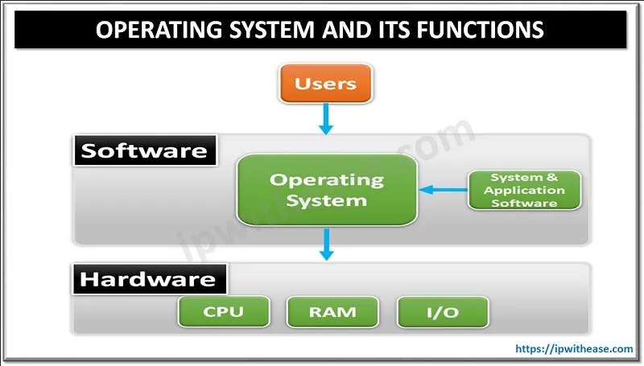

**Main Source :**

- **[Operating system - Wikipedia](https://en.wikipedia.org/wiki/Operating_system)**

**Operating System (OS)** is a software system that act as a bridge between hardware and user that uses application. It provides a platform and set of services that enable the execution of software programs and the management of computer resources.

### Primary Function

In theory, it is possible for a computer to function without an operating system (OS) when it's used by a user to run an application. However, it would be highly complex, time-consuming, and impractical for general-purpose computing. Operating systems provide a crucial layer of abstraction and functionality that simplifies the development and usage of computer systems.

The primary function of OS includes :

- **Process Management** : The operating system manages the execution of software programs, known as **processes**. The OS will schedule when should a program be executed, considering factors like priority, fairness, and resource availability.

- **Resource Management** : An OS allocates system resources, such as CPU time and memory, to different processes, setting up data structures, and initializing the process's execution context.

- **File System Management** : Provide an abstraction layer to handle file in computer including organizing, storing, and retrieving data on storage devices, such as hard drives, solid-state drives.

- **Device Management** : OS provides **device driver**, which is a software that act as an intermediaries between the computer's hardware devices and the higher-level software or applications running on the system.

- **User Interface** : Provides a user interface through which users can interact with the computer system. This can be a simple command-line interface (CLI) or a graphical user interface (GUI).

- **Security and Protection** : The OS implements security and protection to protect the system and user data from unauthorized access. It provides user authentication and isolation between processes to maintain system integrity.

- **Networking** : Provide network protocols, drivers, and network stack implementations for data transmission and network services.

  
Source : https://ipwithease.com/what-is-operating-system-and-its-functions/

### Kernel

The core component of an OS is the kernel. A kernel is lower-level component in OS that directly interacts with the computer's hardware, managing system resources and providing an interface for software applications to access those resources. It handles low-level tasks such as process and thread management, memory management, device drivers, interrupt handling, and security mechanisms.

While an OS is a broader concept that encompasses the entire software package that manages and controls a computer system.

### Program Execution

A program can be run by computer is called an **executable** (EXE file on Windows OS). An executable file contains machine code, which is a set of instructions that can be directly executed by the computer's CPU.

The OS will allocates memory and initializes system resources for the program that wants to be executed. The program will have some entry point, indicating the initial state of the program (e.g., the main function in C/C++ programs).

The OS creates a process to represent the executing program, the process will have important information, such as its memory allocation, execution state, open files, and other relevant details. The OS then executes the program's instructions sequentially, following the logic and flow defined by the programmer.

When the program involves system calls such as writing data to a file, the OS will handle the requested operations on behalf of the program, and returns the results back to the program. When an error occurs in the program, the OS play a role in handling and managing the error. The OS will have some default exception handler to handle the errors, and it may generate error messages for the users to provide information about the error.

### UNIX

UNIX is a portable, multitasking, and multi-user operating system.

Some characteristics of Unix :

- **Multitasking & Multi-user** : Unix is able to run multiple processes concurrently, it also provides a multi-user environment, multiple users can log in and use the system simultaneously, with each user having their own account and privileges.
- **Portability** : Unix separates the kernel or the core of the operating system from the hardware, making it easier to adapt Unix to different computer architectures.
- **Hierarchical File System** : Unix organizes files and directories in a tree-like structure. At the top of the hierarchy is the root directory ("/"), which serves as the starting point for the entire file system. All other directories and files are located within the root directory or its subdirectories. For example, "/home/user/Documents" represents the path to the "Documents" directory located within the "user" directory, which is in turn located within the "home" directory.
- **User Interface** : Unix systems provides a command-line interface, an interface for users to interact with the operating system by typing commands.

Popular operating system such as Linux and macOS are considered as Unix-like, meaning they have similarities with the original Unix operating system.

:::tip
Refer to [operating system](/operating-system) for more detailed explanation
:::
