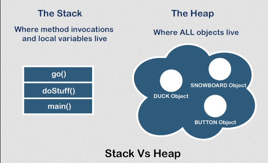
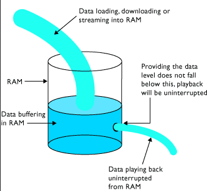
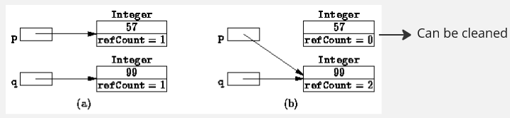
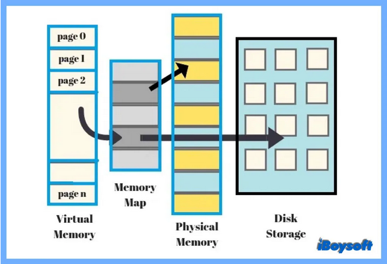
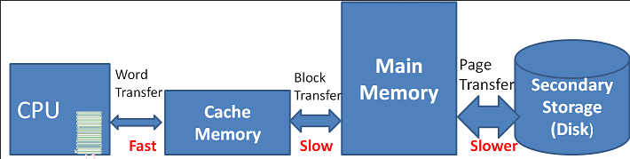

**Main Source :**

- **[What and where are the stack and heap? - stackoverflow](https://stackoverflow.com/questions/79923/what-and-where-are-the-stack-and-heap)**
- **[Data buffer - Wikipedia](https://en.wikipedia.org/wiki/Data_buffer)**
- pointer ref
- **[A quick and thorough guide to ‘null’: what it is, and how you should use it by Christian Neumanns - freeCodeCamp](https://www.freecodecamp.org/news/a-quick-and-thorough-guide-to-null-what-it-is-and-how-you-should-use-it-d170cea62840/)**
- **[Memory management - Wikipedia](https://en.wikipedia.org/wiki/Memory_management)**
- **[What is Virtual Memory? What Does it Do? - Eye on Tech](https://youtu.be/qeOBEOBJREs?si=Ql-qaggCrzP7T8Rt)**

**Memory** is the component in computer that used to store and retrieve data. Computer memory can be categorized into two types: **primary memory** (also known as main memory or RAM) and **secondary memory** (such as hard drives or solid-state drives).

During the execution of program, the program's instructions or code need to be loaded into memory to be executed by the computer's processor. The processor fetches instructions from memory, performs the necessary computations, and stores the results back into memory, the result will then be used by the program.

### Terminology

#### Stack

The stack is a region of memory used for the management of function calls and local variables. It operates on the principle of stack data structure. Each time a function is called, a new stack frame is created and pushed onto the stack. The stack frame contains information such as function parameters, return address, and local variables.

As functions complete their execution, their stack frames are popped off the stack, allowing the program to return to the calling function. This mechanism enables the program to manage the flow of execution and maintain the context of function calls.

The stack size is typically fixed and limited, determined by the compiler or the operating system. However, the stack space is generally small and can be quickly exhausted if the program uses deep recursion or has large local variables.

  
Source : https://stackoverflow.com/questions/32418750/stack-and-heap-locations-in-ram

#### Heap

A heap (not heap data structure) is a free store or a pool of memory used to store resources like data structures, objects, and variables that have a dynamic lifetime. By dynamic, it means those resources are stored in memory based on specific needs and conditions within the program. Those resources may grow larger or shrink depending on the program, therefore they require a flexible memory allocation.

Unlike the stack, where the memory is limited and cannot be dynamically expanded at runtime, the fixed size make it not suitable to store data whose size is not known in advance or can vary significantly such us user's input.

The stack is faster than heap for some reasons :

- Stack is a LIFO structure, most recently allocated memory is at the top of the stack and can be accessed quickly.
- The fixed size of stack makes it easy to allocate memory, we can easily move up or down the size by a fixed amount.

Heap requires additional bookkeeping or it requires maintaining additional information to keep track of allocated and deallocated memory blocks. When a memory block is allocated, the heap manager needs to find a suitable free block of the requested size and update the bookkeeping information accordingly.

  
Source : https://www.javatpoint.com/stack-vs-heap-java

#### Buffer

A buffer is a temporary storage area used to hold data while it is being transferred between different devices or processes. It acts as an intermediate storage space, allowing for smoother and more efficient data transfer.

For example, in video playback, we often hear the term "buffering" when there are delays or interruptions during the playback. The buffering process involves temporarily storing video's frame in the buffer. Playing each individual frame immediately as it arrives will make the playback looks rough, instead the video player video player stores the frames in a buffer until a certain amount of playback time is accumulated.

Another usage for buffer is to improve retrieval efficieny in I/O (input-output) operation. Accessing data stored in the storage (e.g., hard drive) can be slower than accessing to computer's main memory (e.g., RAM). When reading a file, the computer can load a chunk of data from hard drive into the a buffer, then then the application will load the data from the buffer rather than directly accessing the storage device.

  
Source : http://www.planetoftunes.com/computer/caching-and-streaming.php

#### Pointer & References

A pointer is a variable that stores the memory address of another variable. It "points" to the location in memory where the actual data is stored.

Sometimes, when we store data on a variable, the variables doesn't directly hold the data. The variables instead hold a memory address that points to the location in memory where the data is stored. The variable that hold a memory address of a data or another variable is called a **pointer**.

##### Type of References

#### Object

Object is a fundamental concept in [OOP](/computer-and-programming-fundamentals/object-oriented-programming), which mean a particular instance of a data structure or a variable that has its own state (data).

#### Null

Null is a special value that represents the absence of a value. It is often used to indicate that a variable or pointer does not currently point to any valid data.

### Memory Management

#### Memory Allocation

Memory allocation refers to the process of assigning and reserving a portion of the computer's memory for the storage and management of data during program execution. It involves determining the size and location of memory blocks that will be used to store variables, objects, data structures, and other program components.

For example, memory allocation on the heap is typically done explicitly by the program. When we store some data on the memory, we need to specify the size of memory needed, and the system finds a suitable block of memory to accommodate that size. When some data is no longer needed, the program needs to release the memory to avoid **memory leaks**, which a scenario when a memory is allocated but not released, leading to inefficient memory usage.

#### Garbage Collection

Garbage collection is an automatic memory management technique to automatically reclaim memory that is no longer needed by the program. Its primary purpose is to free up memory occupied by objects that are no longer reachable or referenced by the program.

The garbage collector knows a data or an object is no longer needed by the program using a technique called **reference counting**. It is a technique where each object stores a count and keeps track of the number of references or pointers pointing to that particular object. When the reference count of an object reaches zero, it means that no references exist to that object, indicating that it is no longer reachable and can be safely deallocated.

  
Source : https://book.huihoo.com/data-structures-and-algorithms-with-object-oriented-design-patterns-in-java/html/page421.html (with modification)

#### Virtual Memory

Virtual memory is a memory management technique used by operating systems to provide an illusion of having more memory than is physically available in a computer system.

In a computer system, the physical primary memory (RAM) is finite, and programs require memory to store their instructions and data during execution. Virtual memory allows the operating system to allocate memory to programs in smaller, fixed-size units called **pages**, the process is called **paging**. These pages can be stored in both physical memory and secondary storage, such as a hard disk.

Virtual memory logically combines primary and secondary memory to provide large contiguous memory space for programs to access. The OS component is responsible for mapping the virtual address space of a program to the physical memory or disk space, the mapping is stored in a data structure called **page table**.

When a program accesses a memory location using a virtual address and that particular page is not currently present in physical memory (RAM), a **page fault** occurs. It could be possible that the required page is stored on secondary memory. To resolve this, the operating system needs to retrieve the required page and load it into physical memory to allows the program to access it.

  
Source : https://iboysoft.com/wiki/virtual-memory.html

#### Cache

Cache is a small, high-speed memory that is located closer to the CPU (central processing unit) than the main memory (RAM). The purpose of cache is to speeds up retrieval for frequently accessed resource.

When the CPU needs to read data from or write data to the main memory, it first checks the cache to see if the required data is already present. If the data is found in the cache (called **cache hit**), it can be quickly accessed by the CPU without the need to access the slower main memory.

  
Source : https://witscad.com/course/computer-architecture/chapter/cache-memory
