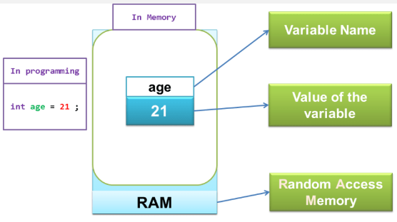

**Main Source :**

- **[Introduction to Programming and Computer Science - Full Course - freeCodeCamp](https://youtu.be/zOjov-2OZ0E?si=_9b2e9EKDXKaVHjw)**

Programming is the process of creating instructions or code that a computer can understand and execute. A code consist of logical and sequential instructions to solve a specific problem.

**Programming Concepts** are the fundamental ideas and principles that form the basis of computer programming. This note explains the basic concept of programming.

### Variables & Data Types

Variable is something that can that hold values and are identified by a name. They act as storage units within a program, allowing values to be stored and manipulated.

Depending on the programming languages, we can't always manipulate or change the value of a variable. Variables can be **mutable** or **immutable**. Mutable variables can have their value changed after assignment, while immutable variables cannot be modified once assigned.

Variable allow programmers to store user input, keep track of program state, and pass values between different parts of the program, etc.

  
Source : https://dev.to/hermitex/what-is-a-variable-in-programming-5990

A variable holds data, the type of data held can vary. Data types determine which kind of operation can be performed on them. For example, we can perform arithmetic on number but not on characters.

When we declare a variable, memory is allocated to store its value. The size of the allocated memory depends on the variable's data type. When we read or modify a variable, the program will access the corresponding memory address for the variable and retrieve or modify the stored value.

Some common data types are :

- **Integer (int)** : An integer variable is used to store whole numbers without decimal points. A value of integer is determined by its [binary representation](/computer-and-programming-fundamentals/binary-representation) (e.g., when we store number 5, the binary representation is `00000101`). The number of binary digits determines the unique values we can store or the range of number we can represent. In the case of `00000101`, which is a 8-bit binary, it can store value ranging from 0 to 255 ($2^8 - 1$). Depending on the programming languages, the number of bits used to store an integer can vary. Typically, an integer has fixed size, such as 32-bit (unsigned integer ranges from 0 to approximately 4 billion) or 64-bit (unsigned integer ranges from 0 to approximately 18.4 quintillion).

  Example of an integer variable : `int x = 5`, a variable named `x` has an integer value of `5`.

- **Float** : A float variable is used to store [floating-point numbers](/computer-and-programming-fundamentals/floating-number#floating-number-representation), which are numbers with a decimal point. The number of bits represents the precision of the floating representation. In most programming languages, float is typically 32-bits or in floating-point representation, it is a [single precision](/computer-and-programming-fundamentals/floating-number#part-of-floating-number--precision).

  Example of a float variable : `float x = 5.4`, a variable named `x` has a float value of `5.4`.

- **Double** : A double variable is similar to a float but has a higher precision, it uses 64-bits, and it achieves [double precision](/computer-and-programming-fundamentals/floating-number#part-of-floating-number--precision)

  Example of a double variable : `double pi = 3.141592653589793238462`, a variable named `pi` has a double value of `3.141592653589793238462` (double is able to store more decimal point than float).

- **Character** : A character variable is used to store a single character. Characters are usually represented using the [ASCII](/computer-and-programming-fundamentals/data-representation#ascii) or [Unicode](/computer-and-programming-fundamentals/data-representation#unicode) encoding schemes. The size of a character variable depends on the character encoding used, for ASCII, it can be represented in 8-bits.

  Example of a character variable : `char alphabet = 'a'`, a variable named `alphabet` has a character value of `a`. A character is typically marked using quotation mark, for a single character, we wrap the character in single quote `''`

- **Array** : An array is a data structure used to store a fixed-size sequence of elements of the same type. When we declare an array, we must specify what data types it's going to store and the size or the number of element we can store inside it. In memory, array is stored in a contiguous block of memory, they are accessed using an **index**, which represents their position within the array. An index starts from 0 and will increment by 1 for each element in the array. The contiguous and indexing characteristics of an array make it easier to access related elements and allows for fast access when the position of the element is known.

  Example of declaring an array : `int numbers[] = {25, 50, 75, 100}`, we are creating array of integers that consist of `25`, `50`, `75`, and `100`. To access or modify an element, we need to know the index or position of the element. For example, to access element at index 0 we can use : `numbers[0]`, which gives us 25. To modify element, we can do it similar as assigning a variable, we will access by index and assign it like : `numbers[0] = 33`, which will modify the element at index 0 to 33.

  Some programming languages provide array that can be resized, also known as **dynamic arrays**. When the array needs to be resized, the computer finds a new empty space in the memory, copy existing element in the array to the new space, and then free up old space used by the array.

- **String** : A string variable is used to store a sequence of characters (a word). Strings are typically represented as an array of characters. They are used to store text or combinations of characters. A size of a string depends on the number of characters it contains and the character encoding used. If we assume each character require 8-bit and we have 10 character, then the string would require 80 bits or 10 bytes of memory.

  Example of a string variable : `str name = "Poe"` (uses double quotation instead of single quote), a variable named `name` has a string value of `Poe`.

    
   Source : https://www.geeksforgeeks.org/what-is-array/

- **Boolean** : A boolean variable is used to represent logical values, it only has two possible value which are **true** and **false**. Boolean are used to control flow of a program based on condition, we can also apply [bitwise logical operation](/computer-and-programming-fundamentals/bitwise-operation#logical-operation) such as OR, AND, XOR, etc. While boolean can be represented as a single bit such as 0 (false) or 1 (true), because the CPU can't read a single bit, a boolean is stored as a byte.

  Example of a boolean variable : `bool correct = true`, a variable named `correct` has a boolean value of `true`.

### Operators

Operators are symbols or keywords that are used to perform operations on data. When an operator is applied to two elements, it performs a specific operation and returns a resulting value. This value can then be stored in a variable or used in further computations. Some common type of operators :

- **Arithmetic Operators** : Arithmetic operators perform mathematical calculations on numerical data type such as integer. Examples include addition (`+`), subtraction (`-`), multiplication (`*`), division (`/`), and modulus (`%`).

  For example, we have two variables : `x = 3` and `y = 2`. When we use the addition operator by `int z = x + y`, this mean we are doing the mathematical addition operation on `x` and `y`, the result of the operation will be stored in new int variable called `z`, which should be `5`.

- **Relational Operators** : Relational operators compare the values of two data and return a boolean result (true or false) based on the comparison. Examples include checking if two elements are equal or not (`==`), not equal to (`!=`), greater than (`>`), less than (`<`), greater than or equal to (`>=`), and less than or equal to (`<=`).

  For example, we have two variables : `x = 3` and `y = 2`. When we compare two values with operator such as `==` by `x == y`, this mean we are checking if `x` and `y` are equal. Because both are not equal, the operator should give us `false`. Whereas if we use the `>` greater than operator and compare with `x > y`, this should give us true because the variable `x` which contain `3` should be greater than value of variable `y`, which is `2`.

### Control Flow

Control flow refers to the order in which statements and instructions are executed in a program. It determines the flow of execution within a program, deciding which statements should be executed next based on certain conditions or criteria.

A program's code typically runs sequentially from top to bottom, following the order in which the statements and instructions are written. By using control flow, we can control how they will be executed, this will allow us to repeat sections of code, or jump to different parts of the program based on specific conditions.

#### Conditional Statement

A conditional statement, is a type of control flow that allows a program to make decisions based on the evaluation of a condition.

The most common type of conditional statement used is the `if-else` statement, which control the program to execute a specific instruction if a condition is met, and if the condition is not met, it executes an alternative instruction. An if statement takes a boolean value and controls the program based on it.

Here is an example of `if-else` statement :

```
if (condition) {
    // Code to be executed if the condition is true
    // do something here...
} else {
    // Code to be executed if the condition is false
    // do other thing here...
}
```

In this example, the `condition` refers to a boolean expression used as the condition.

In real-life scenario, conditional statements are commonly used. For instance, consider a game that determines whether a user can play based on their age. If the user's age is above the minimum requirement, the game will let them play. Otherwise, a notice will be displayed indicating that they are not eligible to play.

#### Loop Statement

Loop is a control flow statement used to repeat a block of code. It allows the program to execute a set of instructions multiple times, either for a fixed number of iterations or until a certain condition is met.

##### For Loop

A for loop is used when the number of iterations is known beforehand. Here is the syntax of a for loop :

```
for (initialization; condition; update) {
    // Code to be executed in each iteration
}
```

Example of a for loop

```
for (iteration = 0; iteration < 10; iteration = iteration + 1) {
    // Code to be executed in each iteration
}
```

:::note
`iteration` is not a keyword required to start a for loop, we can use any name of variable we want.
:::

A for loop will stop until certain condition is fulfilled, however, the condition is typically known beforehand. In the example, the condition is the `iteration < 10`, this mean we will keep executing the code inside the for loop while `iteration` variable is below `10`. The `iteration` variable is set in the initialization before the condition, we set it as `0`. A single loop is executed when all the instruction inside the for loop block is executed. After a single loop is done, a for loop will have an update step, which is the thing we are doing in order to fulfill the condition. In the example, after every loop, we will increase the `iteration` variable by `1`.

So, putting all together, the `iteration` variable act as a counter of the number of times we have executed the loop. The number of time we executed the loop is based on the initialization, condition, and update. In the example, we set the counter to 0, every time a loop is finished we will increment it by 1, and this will be executed for 10 times based on the `iteration < 10` condition.

##### While Loop

A while loop on the other hand, executes block of code inside the loop "while" a condition is met. Here is an example of a while loop :

```
while (condition == true) {
    // code to be executed when condition is true
}
```

The code inside will keep being executed while the `condition` is equal to `true`. We can also make the loop to be executed while the `condition` is `false`.

While loop executes given block of code while the condition is fulfilled, but what if the condition is never fulfilled? This is called `infinite while loop`, it is a loop that continues to execute indefinitely, without a condition that can terminate it naturally.

So, inside the while loop, at some point we will need to make the condition no longer fulfill the loop condition. A while loop can be beneficial when performing tasks without knowing when they will end.

There is also a keyword called `break` that will exit a loop even when the condition hasn't been met.

:::note
In most programming languages, we don't need to explicitly say `== true`, putting the condition inside the bracket like `while (condition)` is enough. To make the while loop execute while the condition is `false`, we can negate the boolean of condition. In some programming language, the `!` is used to negate a boolean, so by using `while (!condition)`, it is the same thing as `while (condition == false)`.
:::

  
Source : https://www.guru99.com/c-loop-statement.html

### Functions

### Debugging & Error Handling

#### Exception

#### Try-Catch

#### Logging
