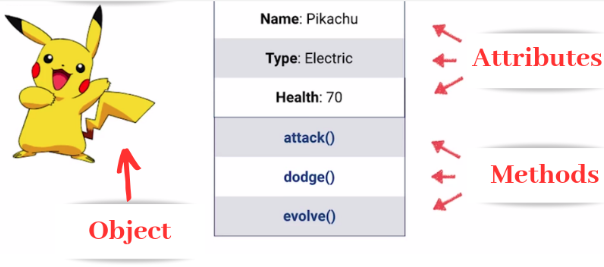

**Main Source :**

- **[Object-oriented programming - Wikipedia](https://en.wikipedia.org/wiki/Object-oriented_programming)**
- **[Object Oriented Programming (OOPs) Concept in Java - GeeksForGeeks](https://www.geeksforgeeks.org/object-oriented-programming-oops-concept-in-java/)**

**Object-Oriented Programming (OOP)** is a programming paradigm revolving around writing code that focuses on organizing it around **objects**.

### Class & Object

#### Object

Objects are the building block of OOP, object is a representation of an entity which has its own characteristics and behavior. The characteristics of an object is called **attributes**, **fields**, or **properties** and the behavior or the action it can perform is called **methods**.

In OOP, we model an object based on real-world entities, consider making a `Bird` object.

A bird can have attributes :

- **Species** : The species attribute represents the specific type of the bird, such as "sparrow," "eagle," or "parrot."
- **Color** : The color attribute represents the color of the bird, such as "red," "blue," or "green."
- **Weight** : The weight attribute represents the mass of the bird. It provides information about the bird's size and physical condition.

Attributes provide a way to store data and represent the state of an object.

A bird can have methods :

- **Fly** : A bird can fly, a fly method simulates the bird's ability to fly.
- **Sing** : The sing method represents the bird's ability to produce sounds or songs.
- **Eat** : The eat method simulates the bird's feeding behavior.

Methods are the procedures or functions associated with an object. They define the behavior or actions that an object can perform.

  
Source : https://blog.glugmvit.com/oops/ (cropped)

#### Class

In OOP, a **class** defines a set of attributes and methods an object can have. A class can be thought as the blueprint or template to make an object. An object needs to created from a class, the using a process called **instantiation**. When an object is instantiated from a class, it is referred to as an instance or an object of that class. Class provide a generalized description of what objects of that class should look like.

##### Class vs Object

Consider a class `Car`, it is a blueprint to create a car object. Car class might have attributes such as model and year, which represent the specific model and manufacturing year of a car. It could also have methods like `start_engine()`, `accelerate()`, and `brake()` to represent the actions a car can perform.

Whereas, an object is the actual content of a class, we should define the actual data and behavior it has. For example, we can make object called `MyCar`, which is the instance of `Car` class. It is created based on the `Car` class blueprint. For instance, the `MyCar` object could have attribute values like `model="Camry"`, and `year=2022`, indicating that it is a Toyota Camry manufactured in 2022. The object will have method defined in the `Car` class, such as `start_engine()` to start the car's engine, `accelerate()` to increase its speed, or `brake()` to apply the brakes.

  
Source : https://techvidvan.com/tutorials/java-class/ (with modification)

### Concepts

The principles and concepts of OOP are designed to mimic real-world objects and their interactions. For example, in a banking system, you can have classes like "Customer," "Account," and "Transaction."

In customer class we might define attributes and methods such as :

- Attributes : name, address, contact information, unique customer ID
- Behaviors : `getCustomerID()`, `getName()`, `getAddress()`, `getContactInfo()`.

By organizing code using OOP, we can achieve a natural and intuitive way to structure and manage software systems.

OOP doesn't only revolve around classes and objects, there are more concepts in OOP.

#### Abstraction

**Abstraction** is the process of hiding the internal details of a system and instead presenting a simplified and high-level view. This allows users (developers) to focus less on the internal workings and rely on what is presented. Not only does it simplify things, but it also reduces the possibility of mistakes made by users, as everything is handled behind the scenes and they only need to interact with the abstraction.

In OOP, abstraction is achieved through many things.

##### Interface

**Interface** is a set of contract that defines a set of attributes and methods that a class must implement. It defines what are the attributes and methods a class should have. An interface doesn't provide concrete example of how a class should look like, it simply provides rules that a class should follow.

For example, an interface `Vehicle` is a set of contracts that defines the attributes and methods that a class considered as a vehicle should implement. Class such as `Car` or `Bike` is considered as a vehicle. A `Vehicle` interface may have a `accelerate()` method, which is used to increase the speed of the vehicle. However, each vehicle may have different behavior on how to accelerate, for instance, car accelerates by adjusting engine power, while a bike accelerate by increasing the pedaling force.

An interface, which doesn't provide any concrete example of a class can't be instantiated directly, an interface must be implemented by a class.

In abstraction, an interface provide a way to focus on the characteristics of a class. We don't care how a car or a bike differs in terms of accelerating, what we care is they must be able to accelerate.

##### Abstract Classes

**Abstract Classes** is similar to interface with some distinctions and additional features compared to interfaces. An interface, can't have any default implementation at all, it can only declare what a class should look like. On the other hand, an abstract class can have default or partial implementation of a class.

Abstract class can't be instantiated directly and is meant to serve as a base for concrete classes. The ability to declare default implementation makes abstract classes have several advantages over an interface. An abstract class can define common behavior and characteristics that are shared across its subclasses.

  
Source : https://www.scaler.com/topics/abstraction-in-oop/

#### Encapsulation

**Encapsulation** is the process of encapsulating attributes or methods of an object. It promotes the concept of **visibility modifier**. The main idea of encapsulation is to hide an object's state or behavior from external code.

##### Visibility Modifier

Visibility modifier is a keyword that determines the accessibility and visibility of class members. A class member refers to the components of a class, including its attributes and methods.

There are typically three visibility modifiers used in OOP :

- **Public** : A public keyword is used to make class members accessible from anywhere. External code can interact and modify the detail of an object.
- **Private** : A private keyword is used to make class members accessible only within the class in which it is declared. It cannot be accessed or modified from outside the class.

By using private modifier, we can prevent external code from making unauthorized changes or accessing sensitive information. For example, in the image below, we make an object attributes to be private and instead define methods to make them accessible to external code. Inside the method, we can define how should the external code interact with it.

  
Source : https://www.crio.do/blog/encapsulation-in-java/

With this concept, it is possible that we have class as high-level as `BankAccount`. We will only present the `deposit`, `withdraw`, `seeBalance` method. All the complexity of handling the system is made private. Programmers won't be able to see or use the internal method (unless checking source code directly).

#### Inheritance

**Inheritance** is a concept in OOP that allows a class to inherit the properties and behaviors of another class. The inherited class is called the **superclass** (also called a **base or parent class**) and the class that inherits is called a **subclass** (also called a **derived class or child class**).

The difference between interface and inheritance lies in their respective functionalities. Inheritance enables the acquisition or "copying" of attributes and methods from a class, while interfaces serve as contracts for classes and are particularly suited for scenarios where classes have distinct characteristics. In situations where a class shares the exact implementation of another class but with additional features, inheritance promotes code reuse and the organization of related classes into a hierarchical structure.

  
Source : https://towardsdatascience.com/how-to-code-inheritance-in-java-beginners-tutorial-in-oop-d0fc0a71be98

For example, in the image below, a `Dog` class may have similar method with the general `Animal` class. The `Dog` class can inherit the `Animal` class, with another method addition, which is the `bark()` method.

  
Source : https://www.programiz.com/cpp-programming/inheritance

With the addition of inheritance and interface concept, we can introduce another [visibility modifier](/computer-and-programming-fundamentals/object-oriented-programming#visibility-modifier) :

- **Protected** : A protected keyword is used to make class members accessible within the class where it is declared, as well as in its subclasses (derived classes). In other word, it is a public modifier which is exclusive to a class hierarchy.

#### Polymorphism

**Polymorphism** is a concept that allows us to treat a single object in different ways. It allows us to have interface with many implementations. Polymorphism is related to the [interface](/computer-and-programming-fundamentals/object-oriented-programming#interface) and [inheritance](/computer-and-programming-fundamentals/object-oriented-programming#inheritance) concept.

We can define a method that will be implemented by its subclasses. For example, a base class called `Shape` and two derived classes called `Circle` and `Rectangle`. Each derived class has its own implementation of a method called `calculateArea()`. Polymorphism concepts enable us to write a single piece of code that can invoke a function responsible for calculating the area of a shape, regardless of whether the shape is a circle or a rectangle. The specific implementation of `calculateArea()` that will be used for our calculation will be determined dynamically at runtime based on the type of the object being used.

There are two types of polymorphism :

- **Compile-time Polymorphism (Static Polymorphism)** : This polymorphism is resolved in compile-time, one of the example is **method overloading**. It is a phenomenon that occurs when multiple methods with the same name, but different parameters are defined in a class. The appropriate method to be executed is determined at the compile-time based on the number, type, and order of the arguments passed.

  For example, a `Calculator` class that has method to add number, there may be two separate method, where each method differ in how many parameters or how many numbers it can take. Here is an example of code in Kotlin programming language :

  ```kotlin
  class Calculator {
      fun add(num1: Int, num2: Int): Int {
          return num1 + num2
      }
      fun add(num1: Int, num2: Int, num3: Int): Int {
          return num1 + num2 + num3
      }
  }
  ```

  In the `Calculator` class, we have two method with the same exact name, when we call the `add()` function, depending on the argument we passed in, the appropriate `add()` function which will be called will be determined at compile-time.

:::note
Compile-time is period in which code is being translated into machine language that computer can understand.
:::

- **Runtime Polymorphism (Dynamic Polymorphism)** : This polymorphism is resolved in runtime, one of the example is **method overriding**, which occurs when a subclass provides a specific implementation of a method that is already defined in its superclass. The decision of which method implementation will be executed determined at runtime (at the program execution) based on the actual type of the object being referenced.

  ```kotlin
  // open indicates a class, attributes, or methods is inheritable
  open class Shape {
      open fun draw() {
          println("Drawing a shape.")
      }
  }

  // The ": Shape()" indicates it is inheriting the Shape class
  class Circle : Shape() {
      // "override" indicates it is replacing the superclass or the Shape class methods
      override fun draw() {
          println("Drawing a circle.")
      }
  }

  class Rectangle : Shape() {
      override fun draw() {
          println("Drawing a rectangle.")
      }
  }

  fun main() {
      // Instantiating a class is similar to calling a function
      val shape1: Shape = Circle()
      val shape2: Shape = Rectangle()

      shape1.draw()   // Calls the draw() method of the Circle class
      shape2.draw()   // Calls the draw() method of the Rectangle class
  }
  ```

  In this example, we have a `Shape` superclass with `Circle` and `Rectangle` subclasses. Both classes inherit to `Shape` and implement their own method using the `override` keyword. The `main()` function is the entry point of a Kotlin program, it is where the program starts being executed.

  In the main function, we created two variables which has the type of `Shape` with their own respective implementation, which is the `Circle` and `Rectangle` class for `shape1` and `shape2`, respectively.

  The `draw()` method has three different implementation, the first in the original `Shape` class, the second in the `Circle`, and the third in the `Rectangle` class. The specific implementation which will be used is determined at runtime based on the actual type of the object. For example, `shape1` has the type of `Shape`, but it actually has the value of the `Circle` class. When `shape1.draw()` is called, it will invoke the `draw()` method of the `Circle` class rather than the one in the `Shape` or `Rectangle` class.

  Under the hood, the program stores information about the actual type of object at runtime. This information is used to determine the appropriate method to call.
