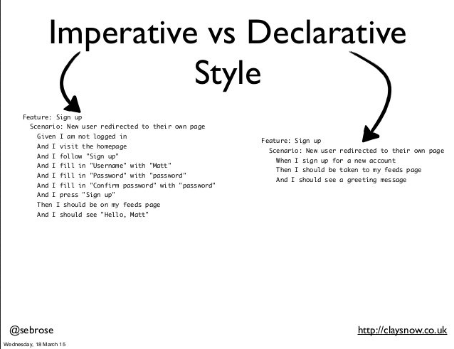
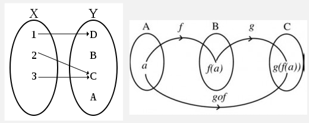
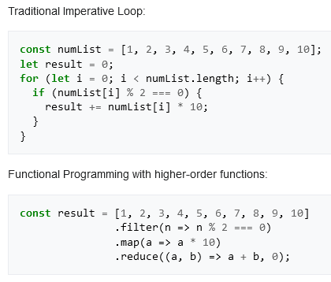

**Main Source :**

- **[Declarative programming - Wikipedia](https://en.wikipedia.org/wiki/Declarative_programming)**
- **[Functional programming - Wikipedia](https://en.wikipedia.org/wiki/Functional_programming)**

### Declarative Programming

**Declarative Programming** is a programming paradigm that focuses on describing what the program should accomplish, rather than specifying how to achieve it. It is the opposite paradigm with the [imperative programming](/computer-and-programming-fundamentals/imperative-procedural-programming#imperative-programming).

The main characteristic of declarative programming is that it emphasizes the "what" rather than the "how" of a computation. This means that instead of writing step-by-step instructions for the computer to follow, we specify the desired outcome or the relationship between inputs and outputs.

Declarative programming works at higher level, it hides the implementation detail, making the code more readable and concise. On the other hand, imperative programming require explicit control flow. The system will decide how to execute the code based on the declaration, it doesn't have to be executed sequentially.

The abstraction of declarative programming makes it seem like magic, this can make it harder to predict how changes in the code will affect performance or behavior, especially if we are not familiar how the system works.

  
Source : https://steemit.com/programming/@nv-vn/getting-started-with-functional-programming

### Functional Programming

**Functional Programming (FP)** is a programming paradigm (type of declarative programming) which treats computation as the evaluation of mathematical functions. Mathematical function is the framework of FP. In mathematics, a function is defined as a relation between a set of inputs (called **arguments**) and a set of possible outputs (called **results**), where each input is related to exactly one output.

  
Source : https://web.cecs.pdx.edu/~antoy/Courses/CS250/slides/2b/Functions_2.html, https://danielpecos.com/2014/06/24/function-composition/ (function relation in math)

Some characteristics of mathematical functions :

- **Deterministic Mapping** : For a given input, a mathematical function must produce a unique and deterministic output (same input should produce same output). The output is solely determined by the input.
- **No Side Effects** : A mathematical function should be pure, meaning it shouldn't have side effects, which mean it doesn't modify external state. For example, producing an output from an input shouldn't change the function output for other input.
- **Referential Transparency** : Referential transparency means that a function's output should be replaceable by its equivalent output.

  Here's an example of referential transparency in Python programming language :

  ```python
  # define function that takes two number and return the sum
  def add(x, y):
      return x + y

  result1 = add(3, 4)
  result2 = 3 + 4

  # Because the 'add' function is referentially transparent,
  # 'result1' and 'result2' will always be equal.
  ```

In order to adhere with the principles of mathematical functions, functional programming has some characteristics :

- **Immutability** : Immutability is a concept where once a variable (or data structure) is assigned a value, that value cannot be changed. In mathematics, a function maps inputs to outputs, the mapping should be deterministic. Immutability provides consistency and reduce side effects to align with the purity of mathematical function.
- **Minimizing Global State** : Mathematical functions are independent of external factors, their behavior is determined solely by their inputs. Functional programming minimize global state to make functions more self-contained and modular.

#### First-Class Citizen

In programming, an entity is called as a **first-class citizen** if it can be treated like other basic data types or values in the programming language. In functional programming, a function is treated as first-class citizen, it has several key characteristics :

- **Assigned to Variables** : You can assign a function to a variable, just like you would with a primitive data type or any other value.
- **Stored in Data Structures** : Functions can be stored in data structures such as arrays.
- **Passed as an Argument** : A function can be passed as an argument to another function, in other word, a function can accept other functions as parameters.
- **Returned from a Function** : Functions can produce other functions as output.

The concept of treating a function as an argument or as an output from another function is also known as a **higher-order function**.

#### Recursion

Because functional languages depend on function, iterating is based on **recursion**. Quick concept, recursion is where a function call itself until some condition is achieved. For example, we could make an illusion of loop in a function like :

```python
def loop_for(n):
    if (n == 0):
        print("loop end")
    print("still looping...")
    loop_for(n - 1)

loop_for(3)
```

When we call the function with `n = 3`, the function will check if the input has reached zero or not. If not, it will print the "still looping..." and will call itself with its own input decremented by 1. This will be done until the `n` reached zero and the "loop end" will be printed.

So, even though there's no explicit loop, recursion provides a way to achieve iteration-like behavior in functional programming languages.

#### Lambda Calculus

**Lambda Calculus** is a concept of expressing computation in mathematical logic and computer science that represents computation based on the concept of **anonymous functions** (functions without names).

A function doesn't have name, it is denoted using the lambda symbol : $\lambda$. A function can take a parameter, it is placed in front of the lambda symbol. A function with parameter $x$ is denoted as $\lambda x$.

After constructing a function, the next step is to apply an expression to the parameter, an expression or the function body is denoted as $M$. Putting all together, a function that takes a parameter $x$ and apply expression $M$ is denoted as $\lambda x.M$, where $.$ is just a symbol to separate the parameter from the body of the function.

##### Example

A function that takes some variable and return the variable incremented by 1, the lambda calculus notation for this is $\lambda x.x + 1$. When we apply this function with the argument of $3$, it would be written as $(\lambda x.x + 1) \space 3$, which is equal to $4$. The variable $x$ is **bound** to the argument $3$ during the function application.

:::note
Overall, lambda calculus serves as the theoretical foundation for many concepts in functional programming languages. It provides a formal and mathematical framework for understanding functions, function application, and the manipulation of functions.
:::

#### Functional Programming Application

In the JavaScript programming language, a lambda expression (or arrow function) can be written as `const addOne = (x) => x + 1`. For example, calling `addOne(5)` will return `6`.

As we can see, the expression `(x) => x + 1` looks similar to the lambda calculus notation. It takes an argument `x` and returns the result of `x + 1`. The function is also assigned to the `addOne` variable (function as first-class citizen).

Another example of functional programming is the `map` function.

```javascript
const numbers = [1, 2, 3, 4, 5];
numbers.map((x) => x * 2);
```

The `map` function is a commonly used function in functional programming that is used to transform each element in a collection with the provided function. Calling `numbers.map()` means we are going to transform each element in the `numbers` with the function given to the `map` function.

The function we provided to the `map` function is defined as a lambda expression, which takes `x` as parameter and return the `x * 2`. The result of the `map` function applied to the `numbers` array will be `[2, 4, 6, 8, 10]`

Here is another example from Wikipedia that compares imperative and functional programming approach to perform some operation to an array of numbers.

  
Source : https://en.wikipedia.org/wiki/Functional_programming#Imperative_vs._functional_programming
