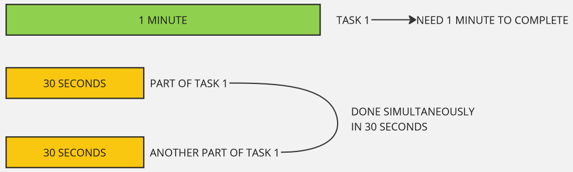
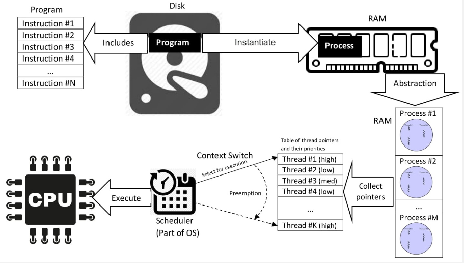
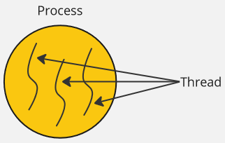
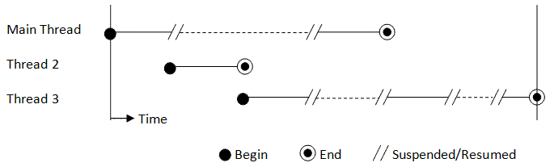
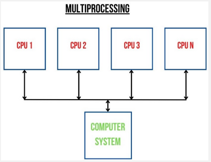
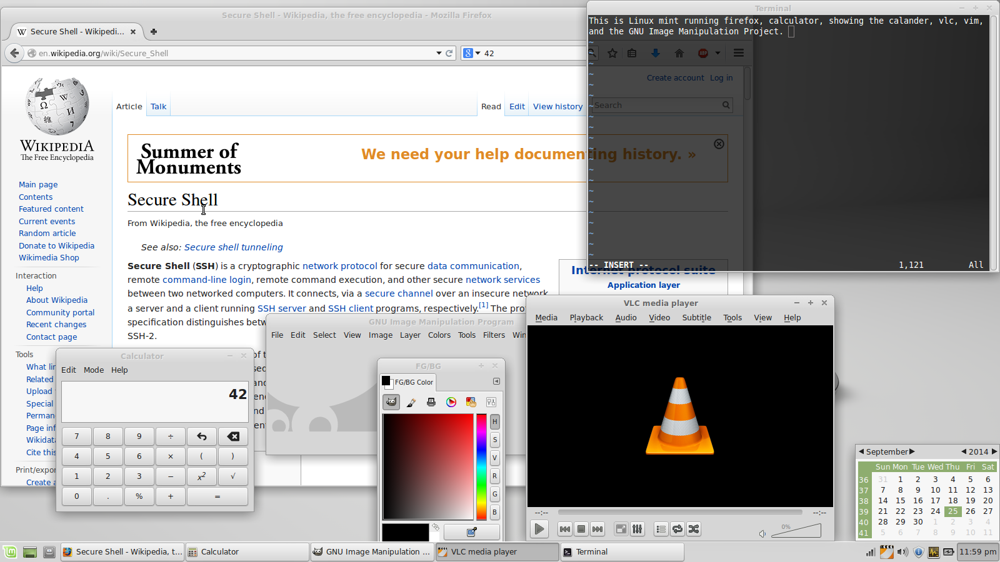
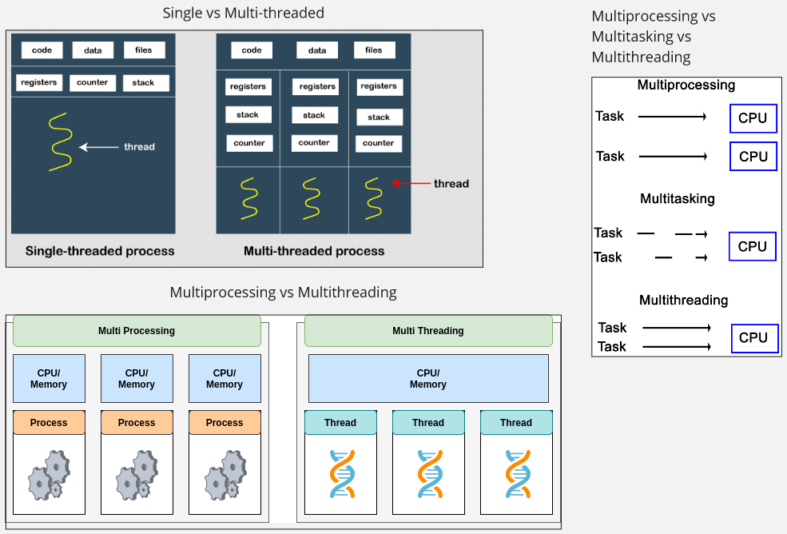

**Main Source :**

- **[Process (computing) - Wikipedia](<https://en.wikipedia.org/wiki/Process_(computing)>)**
- **[Thread (computing) - Wikipedia](<https://en.wikipedia.org/wiki/Thread_(computing)>)**
- **[Multiprocessing - Wikipedia](https://en.wikipedia.org/wiki/Multiprocessing)**

### Concurrency

Computer executes tasks one by one sequentially, often times some tasks require a lot of time to finish. For example, in a web application like e-commerce, our browser will need to load some data from the server to display it to us. If the server takes a long time to process the request or the network connection is slow, it can result in a noticeable delay before the data is available to the browser. Imagine if there are more tasks than just requesting data to server, such as processing and transforming the data. If computer can only execute one task at a time, then it may take a long time.

Many techniques can be employed to mitigate this issue. **Concurrency** is the ability of a system to handle multiple tasks or processes simultaneously. Instead of waiting all the data to be received and then process it one by one, we can download the data and process it simultaneously.

Another example is a mobile app that loads data from the phone's storage. The app is supposed to display loading animation in the screen, without the ability of processing multiple task simultaneously, the screen may freeze because the system is focusing on retrieving data from the storage and can't update the animation.

### Process & Thread

#### Process

A **process** is an instance of a running program. A process encapsulates the running program's code, data, and resources required to execute a program. Each process has its own memory space and system resources. Process is managed by the [operating system](/computer-and-programming-fundamentals/operating-system), and is independent with each other process, they are executed in its own isolated memory space.

Process has its own memory space and system resource, they are not directly accessible or affected by another process. In order to communicate with other processes, a mechanism called **Inter-Process Communication (IPC)** is employed.

Operating system will keep track the state of each process, a process will run through several states :

- **Created** : When a process is created or initialized, the process is being set up by the operating system, allocating resources such as memory and initializing data structures.
- **Waiting** : A process in the waiting state is prepared but is waiting to be executed by the operating system scheduler.
- **Running** : When a process is selected by the scheduler and is executing on the CPU, it is in the running state. In this state, the process is actively using the CPU to execute its instructions. Only one process can be in the running state at a given time on a single CPU core.
- **Blocked** : If a process is unable to proceed further and must wait for an event or resource, it enters the blocked state. For example, if a process is waiting for user input such as selecting file, it will be blocked and temporarily suspended until the required event occurs.
- **Terminated** : When a process finishes its execution or is explicitly terminated by the operating system or a user, it enters the terminated state. In this state, the process is no longer active, and its resources are released by the operating system.

  
Source : https://en.wikipedia.org/wiki/Process_%28computing%29#/media/File:Concepts-_Program_vs._Process_vs._Thread.jpg

#### Thread

**Thread**, on the other hand, is a basic unit of execution within a process. A thread is a single sequence of instruction that can be executed by the CPU. Thread exists inside a process, they share the same memory space and resources of the process that created them.

A single process can have multiple thread to execute multiple task, the technique is called [multithreading](/computer-and-programming-fundamentals/concurrency-and-parallelism#multithreading--multiprocessing). In a process where multiple thread exist, they can work together to complete a task as they share the same memory space.

#### Process vs Thread

The obvious difference between them is that a process is the running program, while a thread is the one that executes tasks within that program. The process owns memory and system resource, while thread do not have their own and access the one owned by the process. Each process has at least one thread, called the **main thread**, which starts executing the program from its entry point.

  
Source myself, inspired by : https://www.java67.com/2012/12/what-is-difference-between-thread-vs-process-java.html

### Concurrency Techniques

In a concurrent system, multiple tasks can be started, run, and completed in overlapping time intervals. Each task progresses independently and may be executed concurrently with other tasks. There are many techniques to achieve concurrency.

#### Multithreading, Multiprocessing, Multitasking

##### Multithreading

A process can have multiple threads, **multithreading** refers to the ability of a program or process to execute multiple threads concurrently within a single process. It allows for the concurrent execution of multiple tasks within the same program, to improve performance and resource utilization.

Threads within the same process share the same memory space. This means they can access and modify shared data and resources, enabling communication and coordination between threads. This make it possible for thread to substitute for each other and continue each other task.

Threads are used in the case where multiple tasks need to be performed, such as the mobile application scenario earlier. One thread may request data to a server, another thread processes the data on the fly, and another thread updates the screen to display animation.

  
Source : https://www3.ntu.edu.sg/home/ehchua/programming/java/j5e_multithreading.html

##### Multiprocessing

**Multiprocessing** is a technique that takes advantages of computer with multiple CPU or processor to execute tasks simultaneously. Unlike multithreading, which involves multiple threads within a single process, multiprocessing utilizes multiple processes that can run independently and concurrently.

In multiprocessing, each process will have different memory and system resource. They are also not able to access each other resource directly, to be able to execute a single task with multiple process, they will need a proper coordination through the **IPC** mechanism.

Multiprocessing can be beneficial for computer that has multiple cores, it can significantly improve performance. However, it can be heavier and tend to consume more power. On the other hand, creating and managing threads in multithreading is generally faster and more lightweight compared to creating separate processes. Thread can also coordinate and communicate with each other easily because they share the same memory.

  
Source : https://www.shiksha.com/online-courses/articles/difference-between-multiprocessing-and-multiprogramming/

##### Multitasking

**Multitasking** refers to the ability of an operating system to execute multiple processes concurrently. The operating system gives each process CPU processing time. The CPU switches rapidly between tasks, each task will have small-time execution. This switching occurs so quickly that it creates the perception of simultaneous execution.

For example, in our desktop, we can run multiple application at the same time. This is actually an illusion, the operating system rapidly switches between these processes, giving each one a small portion of CPU time to make it appear simultaneously.

  
Source : https://en.wikipedia.org/wiki/Computer_multitasking#/media/File:Desktop-Linux-Mint.png

##### Summary

- **Multithreading** : The use of multiple thread within a single process.
- **Multiprocessing** : The use of multiple CPU cores to create multiple process.
- **Multitasking** : The concurrent execution of multiple process.

All of them are technique to concurrently execute task.

  
Source : [Single vs Multi-threaded](https://www.javatpoint.com/process-vs-thread), [Multiprocessing vs Multithreading](https://www.linkedin.com/pulse/demystifying-multithreading-multiprocessing-python-somasundaram), [Multiprocessing vs Multitasking vs Multithreading](https://subscription.packtpub.com/book/programming/9781787121706/2/ch02lvl1sec13/defining-multithreading)

#### Coroutine

#### Callbacks

#### Future, Promise, Async Await

#### Actor-Based

#### Reactive Programming

##### Flow-Based

stream of data or events

##### Event-Driven

click listener in GUI

#### Parallel Computing

### Terminology

#### Thread Safe

#### Thread Pool

#### Deadlock
