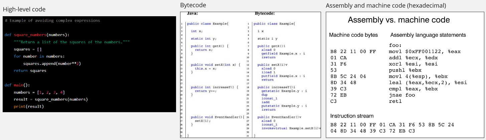
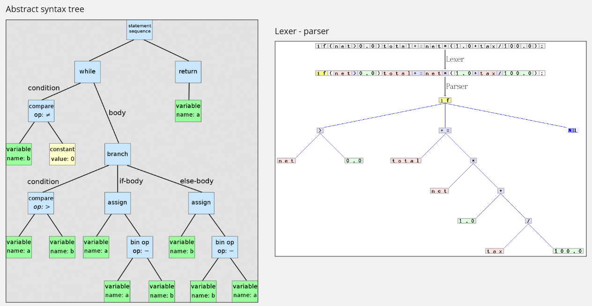
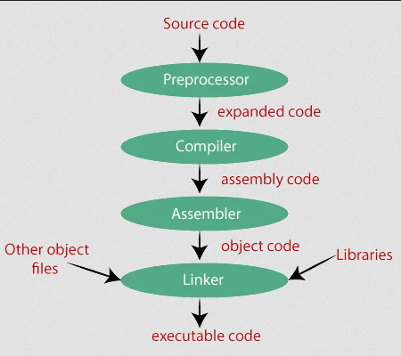

**Main Source :**

- **[Compiler](https://en.wikipedia.org/wiki/Compiler)**
- **[What is the difference between assembly code and bytecode? - stackoverflow](https://stackoverflow.com/questions/1782415/what-is-the-difference-between-assembly-code-and-bytecode)**

When we write code using a particular programming language, it is still in the form of high-level source code. By high-level source code, it means the code is human-readable and involves less direct interaction with the underlying hardware. The purpose high-level programming language is to provide abstraction that make it easier for programmer to make a program.

However, computer doesn't understand high-level code. At the lowest level, computer can only understand binary instructions (1s and 0s). So, writing code in high-level language is just one way to program computer through natural language. The code written in programming language will need to be translated into binary code before they can be executed. The translation process may include more than once, it may be translated into intermediate representation before translated to final binary code. The translation process is done by **compilers** or **[interpreters](/computer-and-programming-fundamentals/interpreter)**.

**Compiler** is a program that translates code written in one language into another, typically converting high-level language code into low-level language code.

### Language Abstraction

Computer executes the lowest-level codes, which is binary instruction, this has gone through many abstractions up to high-level programming language source code. Here are some of different levels of language abstraction :

1. **High-Level Code** : High-level code refers to code written in a high-level programming language, such as Python, Java, C++, etc. These languages provide a high level of abstraction and are designed to be human-readable. High-level code is typically written using some programming constructs like [variables](/computer-and-programming-fundamentals/programming-concepts#variables--data-types), [functions](/computer-and-programming-fundamentals/programming-concepts#functions), or even some [OOP concepts](/computer-and-programming-fundamentals/object-oriented-programming) like [object](/computer-and-programming-fundamentals/object-oriented-programming#object) and [classes](/computer-and-programming-fundamentals/object-oriented-programming#class).

2. **Bytecode** : Bytecode is an intermediate representation of code for certain programming languages. It is a lower-level representation compared to high-level code, and is designed to be executed by a virtual machine. In the virtual machine itself, the code must undergo translation into machine code before being executed. Examples of languages that use bytecode include Java and Python.

3. **Assembly Language** : Assembly language is a low-level programming language that represent machine code instructions in human-readable form. It provides a close representation to machine code and is specific to a particular hardware architecture.

4. **Machine Language & Binary** : Machine language is the lowest level of abstraction in programming. It can be [binary](/computer-and-programming-fundamentals/number-system#binary) code (sequences of 0s and 1s) or [hexadecimal](/computer-and-programming-fundamentals/number-system#hexadecimal) that directly represents the instructions and data that a computer's hardware can execute. Machine language instructions are specific to the hardware architecture and are directly understood and executed by the processor.

Another term that is often encountered is **operation code (opcode)**. Opcode refers to the instruction of machine language that specifies the operation to be performed by the computer's processor. It represents the fundamental operations that the hardware can execute, such as arithmetic operations, memory access, and control flow instructions.

  
Source : [High-level code](https://stackify.com/python-tips-10-tricks-for-optimizing-your-code/), [Bytecode](https://www.sciencedirect.com/topics/computer-science/bytecode), [assembly and machine code](https://www.nayuki.io/page/a-fundamental-introduction-to-x86-assembly-programming)

### Compilation Process

The compilation process typically involves the following stages :

1. **Preprocessor** : The preprocessor is a tool or component that processes the source code before it goes through compilation. It performs preprocessing directives tasks, which is special instructions in programming language like C and C++. The instruction starts with the "#" symbol, basically it provides a way to modify the source code before it is passed to the compiler.

2. **Compiler** : The compiler takes the preprocessed source code as input and translates it into low-level code or an intermediate representation such as bytecode. The compiler checks the syntax and semantics of the code, processes the code, generates optimized code if applicable, and produces output. Compiler does the following process :

   1. **Lexical Analysis** : In this stage, the source code is broken down into a sequence of **tokens**. Tokens are the smallest meaningful units in the programming language, such as keywords, identifiers, operators, and literals. The **lexical analyzer (lexer)** scans the source code character by character and groups characters into tokens based on predefined rules and patterns. The tokens are then passed to the next stage.

   2. **Syntax Analysis** : The syntax analysis, also known as parsing, checks whether the sequence of tokens generated by the lexical analyzer is valid according to the grammar rules of the programming language. It builds a **parse tree** or an **abstract syntax tree (AST)** that represents the structure of the code in a tree-like structure. The parser analyzes the relationships and arrangements of the tokens according to the language's grammar rules and detects syntax errors if the code violates those rules.

   3. **Semantic Analysis** : Once the syntax analysis is complete and the code is determined to be syntactically correct, the compiler moves on to the semantic analysis stage. Here, the compiler checks the meaning and validity of the code in terms of its semantics. It verifies things like checking if variable has been declared before it used, checking if variables types are valid, scoping rules, function calls, and other language-specific rules. The semantic analyzer ensures that the code adheres to the language's semantics and detects potential **semantic errors** or [compile-time error](/computer-and-programming-fundamentals/programming-concepts#type-of-error).

   4. **Code Generation** : After the semantic analysis, the compiler proceeds to generate target code based on the analyzed and validated input. The code generation stage involves transforming the high-level representation (such as the AST) into a lower-level form, which may be assembly language, machine code, bytecode, or an intermediate representation. The code generator translates the code into a format that can be executed by the target platform, while also applying optimizations to improve performance and efficiency.

     
   Source : [Abstract syntax tree](https://en.wikipedia.org/wiki/Abstract_syntax_tree), [Lexer - parser](https://en.wikipedia.org/wiki/Compiler#/media/File:Xxx_Scanner_and_parser_example_for_C.gif)

3. **Assembler** : The assembler is responsible for translating assembly language code into machine code. It takes the output of the compiler and converts it into machine code that can be directly executed by the computer's processor. The assembler replaces the instructions and symbolic representations with their corresponding binary representations (opcodes).

4. **Linker** : The linker is a separate program that combines multiple object files, libraries, and other dependencies to create a complete executable program or a shared library. It resolves external references and ensures that all the necessary components are linked together correctly. The linker also handles tasks like memory address assignment, relocation, and generating the final executable file or library.

     
   Source : https://medium.com/@3681/steps-of-compilation-5c02935a3904

:::tip
Find out more about [compilers](/compilers)
:::
