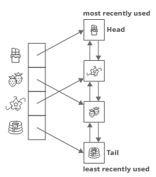

**Main Source:**

- **[Caching Overview — AWS](https://aws.amazon.com/caching/)**
- **[Redis in 100 Seconds — Fireship](https://youtu.be/G1rOthIU-uo?si=ED-VbtEqY25-TZkW)**
- **[Cache Strategies by Moshe Binieli — Medium](https://medium.com/@mmoshikoo/cache-strategies-996e91c80303)**
- **[Cache Replacement Algorithms: How To Efficiently Manage The Cache Storage by Amir Keshavarz — DEV.to](https://dev.to/satrobit/cache-replacement-algorithms-how-to-efficiently-manage-the-cache-storage-2ne1)**

**Caching** is the process of storing data or computation results in storage, typically in a high-speed memory, to improve the performance when the same data is accessed again. The storage can be non-persistent, such as [RAM](/computer-organization-and-architecture/coa-fundamentals#ram), persistent storage, such as database, and stored locally or in a remote server.

When receiving a data retrieval request, whether it's a web server serving webpages, or an image viewer displaying images, caching can improve their performance. Instead of doing the same computation or retrieving data over and over again, we can store its result for future access.

  
Source: https://pressidium.com/blog/browser-cache-work/

### Caching Example

An example of caching in social media application.

In social media applications, there are often feeds containing posts from users and their friends. Each post may include text, images, and the profile photo of the poster. The typical operation for retrieving post information involves the application making a request to a remote server, which then retrieves the requested data from a database.

Instead of repeating this process multiple times, we can store post information in local storage and modify the application logic to check if the data is present before requesting it from the remote server. This approach leads to faster response times, reduced bandwidth usage, and a decrease in the server workload for serving requests.

### Type of Caching

#### Client-side

The caching technique is implemented in the client side, they are typically handled by the web browsers (in the case of web application). This includes caching static resources such as HTML pages, images, files that are loaded when the user visits a website. Web browser also include local storage API, which can be used to store frequently accessed data such as user credentials.

Another use case of client-side caching is, as explained in the [social media caching example](#caching-example).

#### Server-side

Caching technique where the server or the developer is the one who handles it, they are typically implemented on the server to store and serve frequently accessed data or resources.

- **[CDN Caching](/software-engineering/system-design#cdn)**: CDN is a geographically distributed network of servers that are strategically placed in different locations worldwide. The primary purpose of a CDN is to improve the delivery speed and performance of web content to end-users.

  For example, a person connecting from Asia is likely to have a better connection to a server located in Asia compared to a server located in a distant region, such as North America or Europe.

  We may also cache the resource in the CDN itself, which is what CDN caching is, they are considered **distributed caching**, which is the practice of distributing cache around multiple servers to allows efficient data access across different machines or locations.

    
  Source: https://www.wallarm.com/what/difference-between-a-cdn-and-web-accelerator

- **Database Query**: When a common type of query is executed, the result is stored in a cache. If the same query is requested again, the server can return the cached result instead of executing the query again.

### Caching Strategy

- **Cache-Aside**: The application is responsible for managing the cache. When data is requested, the application first checks the cache, if the data is found, it is retrieved from the cache and returned to the requester. If the data is not in the cache (called **cache miss**), the application retrieves it from the data source, stores it in the cache for future use, and then returns it to the requester.

- **Write-Through**: This is a cache writing strategy where, every time data is written or updated, it is written to both cache and data source simultaneously. Write-through caching ensures data consistency but may have higher write latency due to the additional write operation to the data source.

- **Write-Back**: Write-back caching involves writing or updating data in the cache first and deferring the write to the underlying data source. This will reduce latency compared to write-through strategy, however, this approach introduce the risk of data loss.

- **Read-Through**: When data is requested and not found in the cache (a cache miss), the cache automatically retrieves the data from the underlying data source. The retrieved data is then stored in the cache and returned to the requester.

  
Source: https://medium.com/@mmoshikoo/cache-strategies-996e91c80303

### Cache Invalidation

**Cache Invalidation** is the process of removing or marking data as invalid in a cache when the corresponding data in the underlying data source is updated or deleted. It ensures that the cached data remains consistent with the source of truth.

The methods are:

- **Explicit Invalidation**: The application explicitly triggers the invalidation of specific data in the cache when changes are made to the corresponding data in the data source. This can involve calling cache-specific methods or APIs to remove or update the affected data in the cache.

- **Time-Based Invalidation**: Associates a **time-to-live (TTL)** value with each cached item. When the TTL expires, the cached item is considered invalid and is evicted from the cache.

- **Event-Based Invalidation**: Cache is invalidated by observing events or triggers that signify changes in the data source. These events can be [database triggers](/database-system/trigger-and-constraints) or [message queue notifications](/backend-system/message-broker).

### Cache Replacement

**Cache Replacement**, also known as **cache eviction**, is the process of selecting which data should be evicted from a cache when the cache reaches its capacity limit and a new item needs to be stored.

- **Least Recently Used (LRU)**: This policy assumes that recently accessed data is more likely to be accessed again in the near future. The data item that has not been accessed for the longest period is evicted.

- **Least Frequently Used (LFU)**: This policy assumes that frequently accessed items are more valuable and should be retained in the cache. The data item that has been accessed the least number of times will be evicted.

- **First-In-First-Out (FIFO)**: The data item that was inserted into the cache first is evicted when the cache is full. This follows a [queue-like behavior](/data-structures-and-algorithms/queue), where the oldest data is removed.

- **Random Replacement**: This will select a random data item from the cache for eviction. It does not take into account the recency or frequency of access.

    
  Source: https://www.interviewcake.com/concept/java/lru-cache

### Redis

**REmote DIctionary Server (Redis)** is a popular use case for a remote, distributed, in-memory data structure store. It is typically used for distributed caching, particularly its [hash map](/data-structures-and-algorithms/hash-table) data structure.

The reason a hash map is suitable for caching is that, in a hash map, data is stored as key-value pairs. The keys are unique identifiers, and the corresponding values which is where we store our actual data. Given a key, the data structure will return the value. So, as long as we know the key, then an efficient average constant O(1) for read and write speed can be achieved.

More than a hash-map, Redis can be used to store other data structure, such as lists, sets, sorted sets, strings, bitmaps, etc.

One important thing about Redis is, its distributed nature. Redis supports [sharding](/cloud-computing-and-distributed-systems/distributed-database#database-sharding) and [replication](/database-system/logging-and-recovery#replication), it allows developers to distribute data across multiple Redis instances deployed on multiple servers for improved scalability and fault tolerance. This can be beneficial for applications that need to handle large amounts of data or high traffic loads. In contrast, a traditional hash maps typically operate within a single process or machine.

For example, a backend application is deployed across multiple distinct servers. The application is supposed to serve request from anywhere around the world. If the application uses a traditional hash-map for storing data and serving the request, then all the instances would have inconsistent data.

This is because traditional hash maps don't have a synchronization mechanism implemented. Unless we implement a synchronization mechanism across multiple instances of the application, it simply won't work. So basically, Redis makes it easier for developers to handle synchronizing between distributed servers.

  
Source: https://blog.hackajob.com/how-to-implement-redis-in-go/

:::tip
See also [distributed systems](/cloud-computing-and-distributed-systems).
:::

- data locality
- spatial locality
- cpu caching
- client caching
- server caching (cdn, load balancer)
- cache line
- cpu stall
- loop interchange
- matrix mul opitimization
- cache policies
