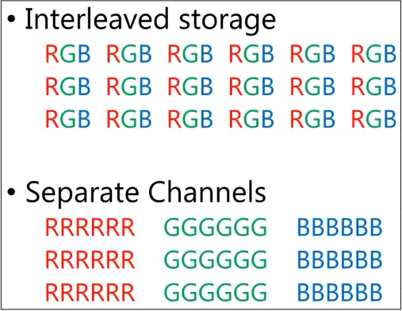
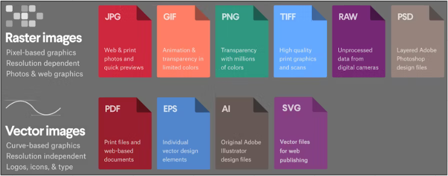
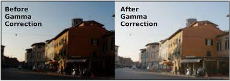
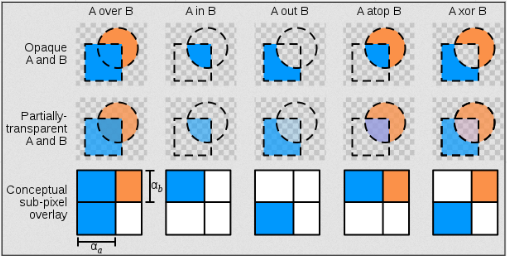
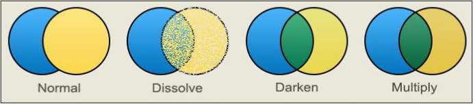

# Computer Images (Part 2)

### Raster Image

An image contains content which is the pixel data, also file header which is contains metadata and information about the image file, such as its format, size, resolution, color space, and compression.

Image pixel data can be stored using 2 types of storage :

  
Source : [https://youtu.be/zllIPDaiOyk?t=1357](https://youtu.be/zllIPDaiOyk?t=1357)

- **Interleaved Storage** : Each pixel are stored in single block of memory.
- **Separate Channel** : Each color channel is stored in a separate block of memory.

### Image Format

**Image format** is file format for digital images. Different image format has their own advantages and disadvantages in terms of quality, file size, compatibility.

Some commonly used format are :

**Raster Image Format :**

- **PNG (Portable Network Graphics)**, a lossless compression also supports transparency.
- **JPEG (Joint Photographic Experts Group)**, lossy compression and doesn’t supports transparency.
- **GIF (Graphics Interchange Format)**, a compressed image format that supports animation.

  
Source : [https://99designs.com/blog/tips/image-file-types/](https://99designs.com/blog/tips/image-file-types/)

### Gamma

Human eye does not perceive brightness in a linear way. Instead, our eyes perceive brightness in a logarithmic way, meaning that small differences in brightness are more noticeable in darker parts of an image than in brighter parts.

**Gamma** is a measure of the contrast between the darker and lighter parts of an image. A higher gamma value means that the darker parts of the image will appear darker, while a lower gamma value means that the darker parts of the image will appear lighter.

**Gamma correction** is used to compensate for this non-linear perception of brightness and 
ensure that images are displayed correctly on a wide range of display devices. One of a common gamma correction is 2.2 and 2.4.

  
Source : [https://doc.stride3d.net/4.0/en/manual/graphics/post-effects/color-transforms/gamma-correction.html](https://doc.stride3d.net/4.0/en/manual/graphics/post-effects/color-transforms/gamma-correction.html)

### Alpha

**Alpha** refer to the transparency or opacity of an image or an individual pixel within an image. Alpha have range from 0 (fully transparent) to 255 (fully opaque).

A usual image would have RGB color channel. If an image supports transparency, there will be one more channel for alpha value. RGB becomes RGBA, alpha can also be stored in separated channel.

A transparent image is able to be combined with the background color. Combining two or more images or layers is called **Alpha Blending** also called **Alpha Compositing.** 

Alpha blending works by interpolating color between both foreground and background color and alpha value.

  
Source : [https://en.wikipedia.org/wiki/Alpha_compositing](https://en.wikipedia.org/wiki/Alpha_compositing)

### Blending

**Blending** is a technique used in computer graphics to combine two or more images or layers by adjusting their color values and transparency.

There are many blending technique that calculate combined image such as adding image color, subtracting, multiplying, etc.

  
Source : [https://www.pinterest.com/pin/7740630584610634/](https://www.pinterest.com/pin/7740630584610634/)