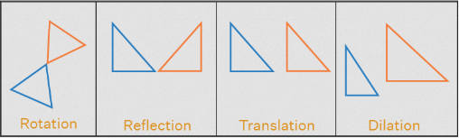
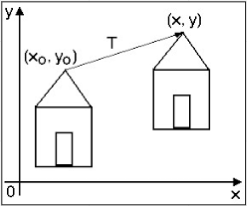

# 2D Transformation

**Main Source : [Intro to Graphics 05 - 2D Transformations](https://youtu.be/EKN7dTJ4ep8)**

**Transformation** is the process of changing the position, size, orientation, or shape of an object or image. This is achieved by applying mathematical operations to the object or image.

Transformation is divided to 2D and 3D depending on the object representation.

### 2D Transformation

2D objects are represented using a coordinate system that consists of two axes, usually labeled x and y. Each point in the 2D space is represented using a pair of coordinates (x, y) and indicate the position in the coordinate system.

  
Source : [https://www.cuemath.com/geometry/transformations/](https://www.cuemath.com/geometry/transformations/)

  
Source : [https://www.cs.iusb.edu/~danav/teach/c481/c481_06_trans2d.html](https://www.cs.iusb.edu/~danav/teach/c481/c481_06_trans2d.html)
