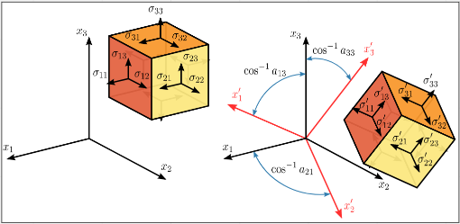
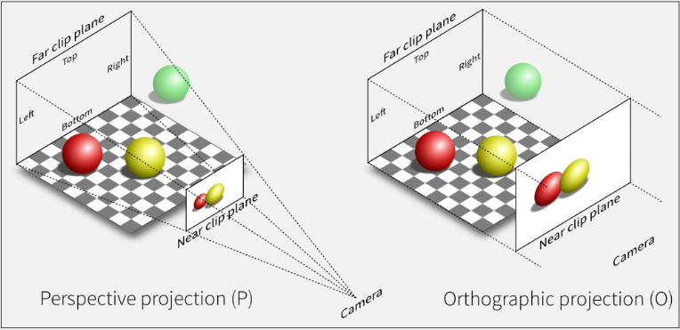

# 3D Transformation

**Main Source : [Intro to Graphics 06 - 3D Transformations](https://youtu.be/1z1S2kQKXDs)**

### 3D Transformation

3D objects are represented with 3 axes instead, labeled with x,y, and z.

  
Source : [https://commons.wikimedia.org/wiki/File:Stress_transformation_3D.svg](https://commons.wikimedia.org/wiki/File:Stress_transformation_3D.svg)

### Viewing in 3D

3D object can’t be mapped directly to the computer screen, these need to be transformed into a 2D scene, this process is called **projection**. Camera is used in 3D scene as the viewpoint or perspective from which the scene is rendered onto a 2D surface.
**View space** is a coordinate system that defines the position and orientation of objects in a 3D scene relative to the camera.

There are several technique for projecting 3D scene onto computer screen, such as :

- **Perspective projection** : It simulates the way that objects appear to the human eye in the real
  world, by creating the illusion of depth and distance. Transformation is applied in view space to better simulate the world.
- **Orthographic projection** : Projection technique that does not create the illusion of depth and distance, but instead creates a flat, two-dimensional image of the 3D scene. In orthographic projection, all objects are projected onto the same plane, regardless of their distance from the camera. Transformation is applied in object space and projected into 2D later.

  
Source : [https://stackoverflow.com/questions/36573283/from-perspective-picture-to-orthographic-picture](https://stackoverflow.com/questions/36573283/from-perspective-picture-to-orthographic-picture)
