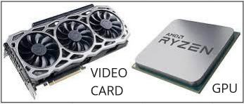
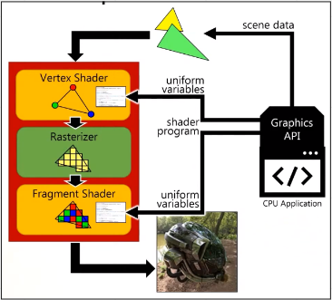
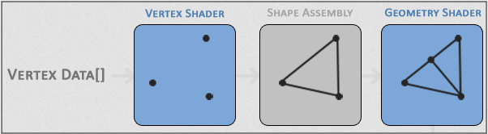
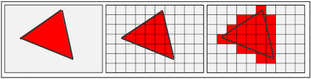
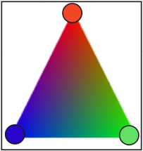

# GPU Pipeline

**Main Source : [Intro to Graphics 07 - GPU Pipeline](https://youtu.be/UzlnprHSbUw)**

### GPU

**GPU (Graphics Processing Unit)**, is specialized cpu designed to do graphics calculation. GPU has many small core and are optimized for parallel processing or performing many calculations simultaneously. Parallel processing are used extensively in graphics where many things happen at once and all need to be updated. The use of specialized hardware components like GPU is called hardware accelaration.

  
Source : [https://www.electronicshub.org/apu-vs-cpu/](https://www.electronicshub.org/apu-vs-cpu/)

### GPU Pipeline

**GPU Pipeline** is a series of stages that a graphics processing unit (GPU) uses to render and display 3D graphics. The 3 main stages are **vertex shader**, **rasterization**, and **fragment shader**.
Out of 3, vertex shader and fragment shader are programmable meaning they can be modified or customized based specific needs.

  
Source : [https://youtu.be/UzlnprHSbUw?t=1704](https://youtu.be/UzlnprHSbUw?t=1704)

### Scene Data

Graphics application interact with graphics API such as OpenGL or DirectX. Graphics API produce a 3D object by modeling the object using primitives such as point, lines, curve, and triangle. These modeling represent the position and connection over objects.

After objects are modelled, they are put into the 3D world and this is called **scene data** which represent 3D environment of the world. Scene data contains geometry, color, materials, lighting, and other properties of the objects in the scene.

  
Source : [https://youtu.be/UzlnprHSbUw?t=2792](https://youtu.be/UzlnprHSbUw?t=2792)

### Vertex Shader

Vertex shader receives 2D / 3D scene data from graphics application. In this stage transformations such as translation, rotation, and scaling are applied to vertices. In addition to transforming vertices, the vertex shader can also perform other operations, such as normalizing vertex coordinates and performing lighting calculations.

After these operations, 3D objects are transformed into 2D to be displayed in computer screen

  
Source : [https://learnopengl.com/Getting-started/Hello-Triangle](https://learnopengl.com/Getting-started/Hello-Triangle)

### Rasterizer

This stage, GPU takes the 2D object and conver them into raster images or in other words it “pixelize” the object. Rasterizer draw pixel on the triangle path and also clips the object if it’s outside of the screen.

  
Source : [https://www.techspot.com/article/1888-how-to-3d-rendering-rasterization-ray-tracing/](https://www.techspot.com/article/1888-how-to-3d-rendering-rasterization-ray-tracing/)  
\* The red color is not the actual color shown

### Fragment Shader

Fragment shader are responsible for coloring each pixel and performs operations such as lighting
calculations, texture mapping, and other effects.

For example in the image below, between the 3 vertices, color interpolation are done to determine the color for any pixel inside the triangle.

  
Source : [https://unsoundscapes.com/slides/2017-06-08-bringing-the-fun-to-graphics-programming/](https://unsoundscapes.com/slides/2017-06-08-bringing-the-fun-to-graphics-programming/)
