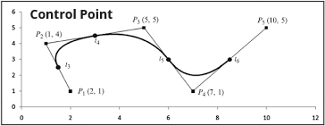
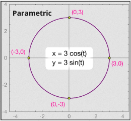
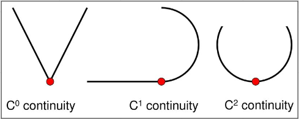
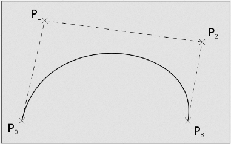
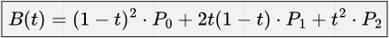
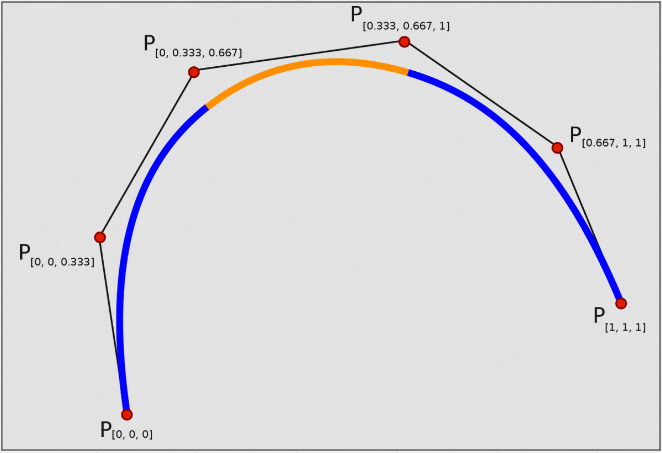
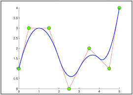
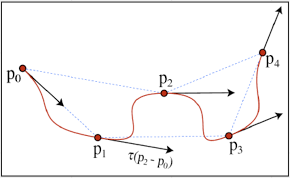
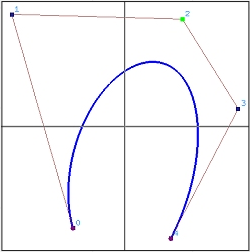
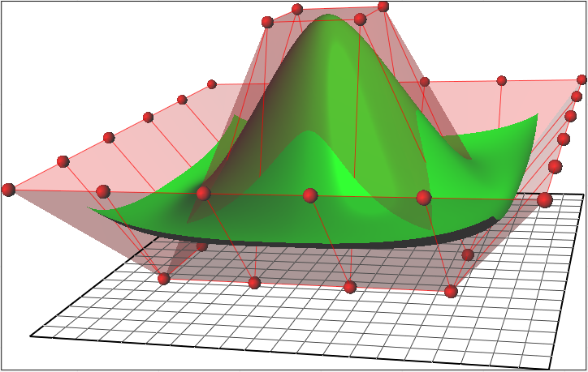

# Curves

**Main Source : [Intro to Graphics 09 - Curves (Part 1)](https://youtu.be/6jjLSkp0Y7I)**

**Curves** is a continuous line or a path that can be defined by a mathematical equation or a set of points. Curves provide a flexible means of representing complex shapes using a limited set of mathematical equations or points.

Curve can be represented in various ways such as :

- **Analytic Representation**, for example, a circle can be represented by the equation $x^2 + y^2 = r^2$. Representing a curve using this may not be suitable for representing complex shapes and curves with irregular shapes.
- **Implicit Representation**, curve is represented as the set of points that satisfy a certain equation or inequality. For example, a circle can be represented implicitly by the equation $x^2 + y^2 - r^2 = 0$. It require more computation to extract the curve itself from the equation.
- **Control Point Representation**, represent curves using a set of set of discrete points, called control points, which determine its shape. Those point are later connected by line that pass and
- **Parametric Representation**, in this method, a curve is represented using a set of parametric equations. Parametric equation are defined using function like $(x(t), y(t))$, where $x(t)$ and $y(t)$ represent position in $x$ and $y$ respectively.

  
Source : [http://what-when-how.com/advanced-methods-in-computer-graphics/curves-and-surfaces-advanced-methods-in-computer-graphics-part-5/](http://what-when-how.com/advanced-methods-in-computer-graphics/curves-and-surfaces-advanced-methods-in-computer-graphics-part-5/)

  
Source : [https://xaktly.com/ParametricEquations.html](https://xaktly.com/ParametricEquations.html)

### Curve Continuity

Curve Continuity refers to the **smoothness of the curve** and how well it connects with the adjacent segments.

- **$C^0$ continuity**, also known as **position continuity**, means that two adjacent segments of a curve meet at their endpoints, but may not have the same tangent direction. This can result in a sharp corner or kink where the two segments meet.
- **$C^1$ continuity**, also known as **tangent continuity**, means that two adjacent segments of a curve meet at their endpoints and have the same tangent direction. This results in a smooth connection between the two segments, without any kinks or sharp corners.
- **$C^2$ continuity**, also known as **curvature continuity**, means that two adjacent segments of a curve meet at their endpoints and have the same curvature. This results in a very smooth and seamless connection between the two segments, with no noticeable change in the curvature of the curve.

There are also higher-order continuity, such as $C^3$, $C^4$, and so on with additional constraint and smoothness.

  
Source : [https://slideplayer.com/slide/12715113/](https://slideplayer.com/slide/12715113/)

### Control Point Representation

Some method to represent curve using control point are :

- Bezier Curve
- Spline
- B-Spline
- Catmull-Rom Spline
- Rational Curve
- Non-Uniform Rational B-Spline (NURBS)

### Bezier Curve

Bezier Curve is generated by interpolating or approximating the control points using a **fixed degree polynomial function**. The first and last control points determine the starting and ending positions of the curve, while the intermediate control points determine the shape and curvature of the curve.

  
Source : [https://en.wikipedia.org/wiki/Bézier_curve](https://en.wikipedia.org/wiki/B%C3%A9zier_curve)

The equation for quadratic bezier curve

  
Source : [https://www.tutorialspoint.com/computer_graphics/computer_graphics_curves.htm](https://www.tutorialspoint.com/computer_graphics/computer_graphics_curves.htm)

### Spline

Unlike Bezier curves, which use a fixed degree polynomial function to generate the curve, splines typically use a **piecewise polynomial function**. This mean quadratic function are joined together over different segments of the function's domain. Meaning that polynomial function may not be continous.

In spline, moving a single point would move the entire curve, this is because polynomial segments are connected end-to-end.

  
Source : [https://en.wikipedia.org/wiki/Spline\_(mathematics)](https://en.wikipedia.org/wiki/Spline_%28mathematics%29)

### B-Spline

B-Spline is a spline that have **local control point**. It uses a set of **basis functions** to generate the polynomial segments. Basis function is a function defined with combination of simpler function. This mean each point and curve in b-spline are **defined locally**. So changing a point doesn’t change the entire curve.

  
Source : [https://www.researchgate.net/figure/A-quadratic-p-2-B-spline-curve-with-a-uniform-open-knot-vector-X-0-0-0-1-2_fig1_277405448](https://www.researchgate.net/figure/A-quadratic-p-2-B-spline-curve-with-a-uniform-open-knot-vector-X-0-0-0-1-2_fig1_277405448)

### Catmull-Rom Spline

It’s a type of **spline that pass through all of their control points**, which means that the path of the spline is connected to all of the points. The uniqueness of Catmull-Rom Spline is used to control the exact path that an object or camera follows.

  
Source : [https://www.researchgate.net/figure/An-example-of-a-Catmull-Rom-spline_fig1_50838845](https://www.researchgate.net/figure/An-example-of-a-Catmull-Rom-spline_fig1_50838845)

### Rational Curve

A curve that is defined by the **ratio of two polynomial functions**. Rational curve uses the nature of rational function to represent more complex shapes and function that has asymptote, such as conic sections like ellipses and hyperbolas.

  
Source : [https://pages.mtu.edu/~shene/COURSES/cs3621/NOTES/spline/NURBS/RB.html](https://pages.mtu.edu/~shene/COURSES/cs3621/NOTES/spline/NURBS/RB.html)

### Non-Uniform Rational B-Spline (NURBS)

This is a type of **B-Spline which is rational curve and also non-uniform**. Non-uniform means that unlike a uniform B-spline, where the knots are evenly spaced, in a non-uniform the knots can be placed at arbitrary positions along the curve or surface.

The rational which involves the use of weights in the function make curve smoother and more continuous curves and surfaces, compared to non-rational B-splines. It also has the ability to represent conic section shapes.

  
Source : [https://en.wikipedia.org/wiki/Non-uniform_rational_B-spline](https://en.wikipedia.org/wiki/Non-uniform_rational_B-spline)
